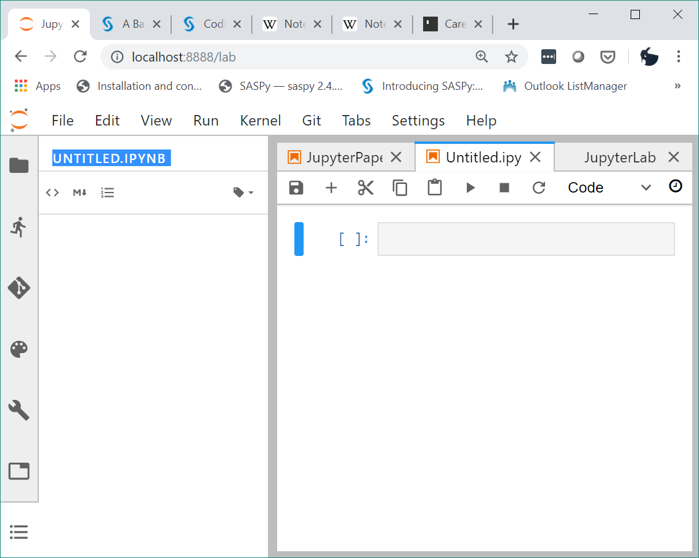
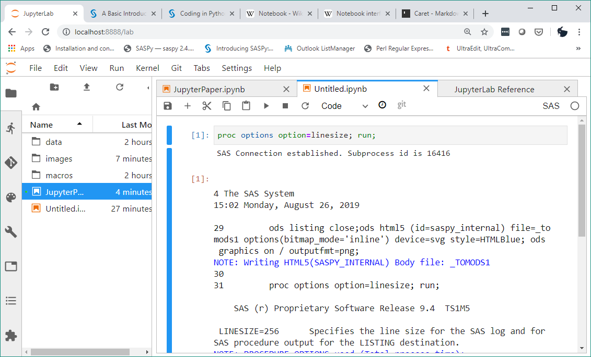
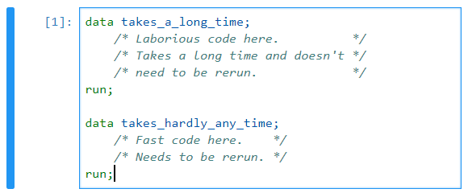
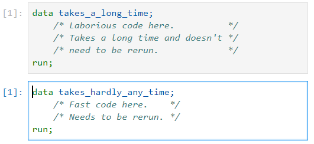
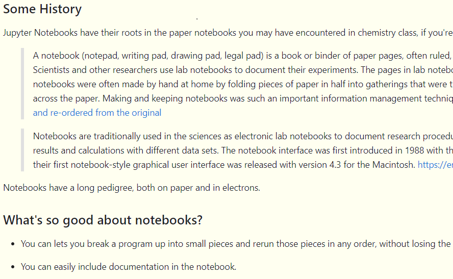
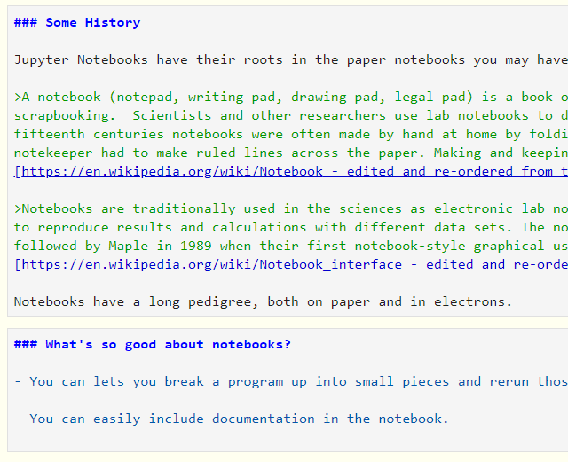
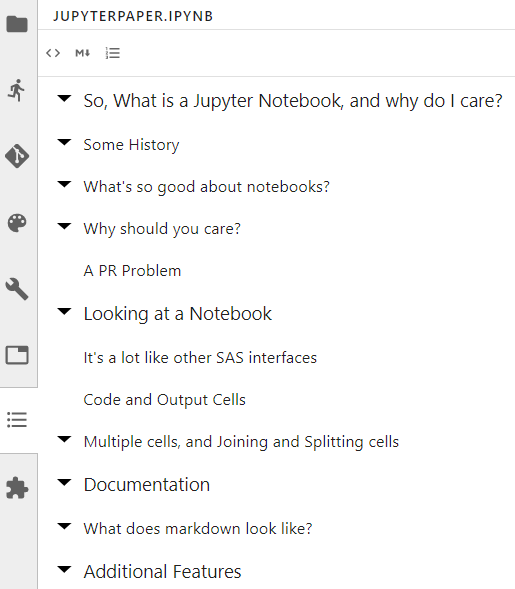
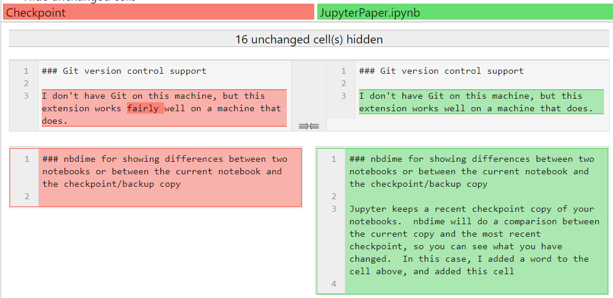
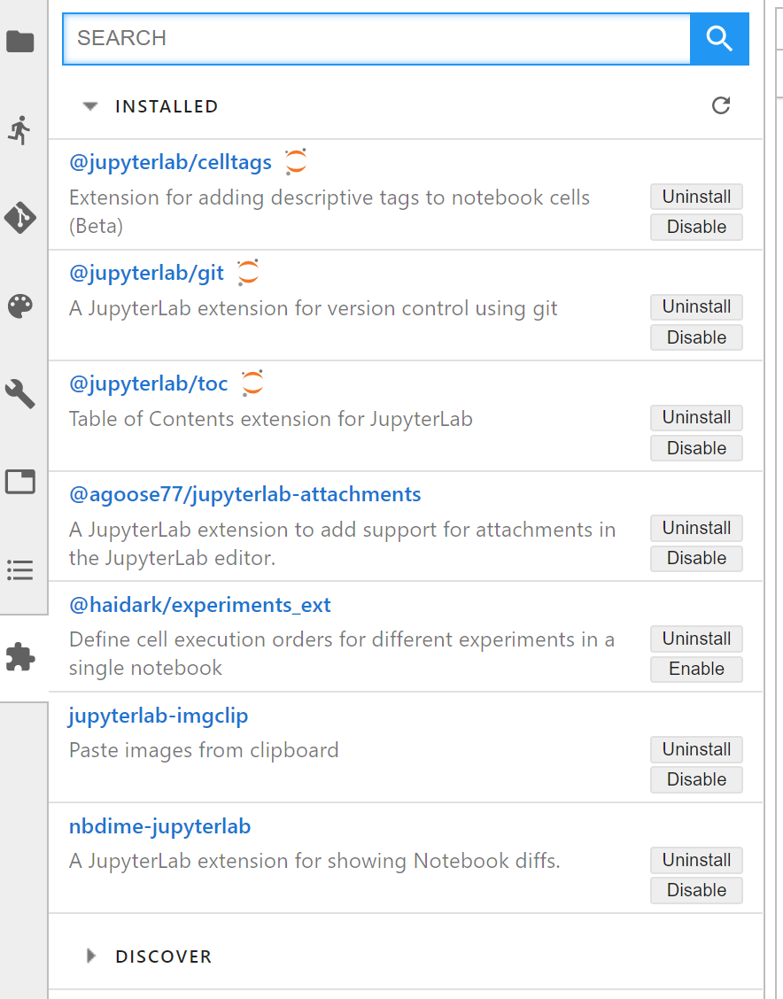

<p style="text-align: center;">Paper 89-2019</p>

# <div style="text-align: center;">I Don't Use Python or R </div>- Why Should I Use Jupyter Notebooks?

__Jack Hamilton</div>__

__Division of Research__ 

__Kaiser Permanente__

__Oakland, California__ 


## Abstract

Jupyter Notebooks is a web-based tool for editing and running programs in various languages, and for displaying and distributing the results.

Most Jupyter "advertising" to SAS users has focused on how it works with R and Python.  But what if you don't know/care about those languages?  Can Jupyter Notebooks still be useful?

This presentation starts with an all-SAS demonstration of Jupyter Notebooks, and shows how they can be useful to old-school programmers.  A few of the ways: Iterative development, Integrated output, and Stylish documentation.

### A Note About This Paper

This paper was written using the markdown document facility in Jupyter; markdown is one of the topics of this paper.  As a consequence of using pure markdown instead of Word, it will not be possible to make this paper look like all the other papers. 

One thing I didn't completely realize about Jupyter until I wrote this presentation is what a tremendous time-saver it is to use markdown instead of Microsoft Word.  It saved at least a day of work.  Besides the time savings in the initial creation, using markdown will make updates much easier - no need to copy and paste code and results from SAS to Word, no worries about whether I've accidentally updated a piece of code without updating all the results...  It happens automatically!

This presentation, updates, and source materials can be found at https://github.com/jack-hamilton-kpdor/why-jupyter-notebooks

### Some History of Notebooks

Jupyter Notebooks have their roots in the paper notebooks you may have encountered in chemistry class, if you're old enough to remember paper.  Wikipedia says: 

>A notebook (notepad, writing pad, drawing pad, legal pad) is a book or binder of paper pages, often ruled, used for purposes such as recording notes or memoranda, writing, drawing or scrapbooking.  Scientists and other researchers use lab notebooks to document their experiments. The pages in lab notebooks are sometimes graph paper to plot data.  During the fourteenth and fifteenth centuries notebooks were often made by hand at home by folding pieces of paper in half into gatherings that were then bound at a later date. The pages were blank and every notekeeper had to make ruled lines across the paper. Making and keeping notebooks was such an important information management technique that children learned how to do it in school. [https://en.wikipedia.org/wiki/Notebook - edited and re-ordered from the original](https://en.wikipedia.org/wiki/Notebook)

>Notebooks are traditionally used in the sciences as electronic lab notebooks to document research procedures, data, calculations, and findings. Notebooks track methodology to make it easier to reproduce results and calculations with different data sets. The notebook interface was first introduced in 1988 with the release of Wolfram Mathematica 1.0 on the Macintosh. It was followed by Maple in 1989 when their first notebook-style graphical user interface was released with version 4.3 for the Macintosh. 
[https://en.wikipedia.org/wiki/Notebook_interface - edited and re-ordered from the original](https://en.wikipedia.org/wiki/Notebook_interface)

Notebooks have a long pedigree, both on paper and in electrons.

### What's so good about notebooks?

- You can break a program up into small pieces and rerun those pieces in any order, without losing the history of what you've done.

- You can easily include documentation in the notebook using a simple but powerful markup language named _markdown_.

- Not the topic of this paper, but you can switch between different programming languages in the same notebook.  Many of the SAS Institute examples use SAS and Python, or SAS and R; other languages are also available.


### Why should you care about Notebooks?

Why should you care about notebooks?  Maybe you shouldn't.  You might not need or want anything Jupyter does, or you might find it slow and cumbersome (the way I feel about Enterprise Guide, which many people claim to like), or you may have existing processes that are time-tested and comfortable.  But I've found it very useful, especially for small-ish projects that need to be presented to others.  Having the programs and documentation is one place is a big time-saver.

### A PR Problem

Jupyter has a bit of a PR problem for traditional SAS programmers.  It's often presented as a way to do things that plain old fashioned coders like me don't need or want to do, such as passing data to Python to do in 12 steps something I could do in SAS in 1 step.  And the "advertising" uses a lot of buzzwords (italics mine):

>With the recent introduction of the official SASPy package, it is now trivial to incorporate SAS® into new
_workflows_ _leveraging_ the simple yet _presentationally elegant_ Jupyter Notebook _coding and publication
environment_, along with the broader Python _data science ecosystem_ that comes with it.  [https://support.sas.com/content/dam/SAS/support/en/sas-global-forum-proceedings/2018/2822-2018.pdf](https://support.sas.com/content/dam/SAS/support/en/sas-global-forum-proceedings/2018/2822-2018.pdf)

(I don't mean to pick on the author of that paper - it's actually a good paper, and I encourage you to read it.  But the introduction is Buzzword City.)

Also, the examples tend to emphasize Pythonic aspects of Notebooks:

<img src="data:image/png;base64,%20iVBORw0KGgoAAAANSUhEUgAAA2kAAAHfCAYAAADKhJDnAAAACXBIWXMAAA7EAAAOxAGVKw4bAAAA%0AB3RJTUUH4gkFECIlXQazfQAAAAd0RVh0QXV0aG9yAKmuzEgAAAAMdEVYdERlc2NyaXB0aW9uABMJ%0AISMAAAAKdEVYdENvcHlyaWdodACsD8w6AAAADnRFWHRDcmVhdGlvbiB0aW1lADX3DwkAAAAJdEVY%0AdFNvZnR3YXJlAF1w/zoAAAALdEVYdERpc2NsYWltZXIAt8C0jwAAAAh0RVh0V2FybmluZwDAG+aH%0AAAAAB3RFWHRTb3VyY2UA9f+D6wAAAAh0RVh0Q29tbWVudAD2zJa/AAAABnRFWHRUaXRsZQCo7tIn%0AAAAgAElEQVR4nOzdf2xb553n+w+LJosT9+LO3TSdC2zcaRomlgxQwaWDoAnpYt2tprKbqYZFAxd3%0Atte0O06X9UII6qREkVV/eYOASVwExKa6rRub3pm9G8GDsuokMlNl40UsjYMi5sBSK8kO06SVdzET%0ANzMDTF12E6C8f5xzyEPqnMMf4k/p/QII2Dy/nueco0N++TzP9wlEo9GSAAAAAABdcf78+YDf8kA0%0AGi29fO6VbpUHAAAAALasT+z5uCT/QO19XSsNAAAAAGxxdgNZIBAY8lrn/V0rzQC5/pt/1t/93f/U%0A7373u14XBQAAAMDm9EAgEDhTKpVWaxcQpLn4u7/7n/rQhz6km266qddFAQAAALA5bbde64I0uju6%0A+N3vfkeABgAAAKAnCNIAAAAAoI8QpAEAAABAHyFIAwAAAIAuGR0drbsOQRoAAAAAdIEdoM3Pz5/w%0AW4/sjgAAAADQBXNzczIMww7Q1qzXOn3akvaP+s//7rTu+aT5+tZCg5st/PfyNvf8u7/VW50q3mpC%0ARspQZL7QqSMAAAAA2GRGR0cVjUYPywzOXnWbI03acEvam/rWJ1/RC1Xv/ZGeeulf6+Mb27GkP9C/%0APzWu/2e7462F/657vvHLdWt++lsH9I2IpMi/1k9fkrT2t/rCYxsuwAAoKH0ypOTNWRXHx3pdGAAA%0AAACNc21FkzYcpN2mb7x0m76hN/WtT/5Se9oSnPmwg7CyN/WtTy7qtg938qAuhqZUHJrq8kEBAAAA%0ADCJnspB649GkjnZ3fFPf+uR/13/+rzPlLohf+K//2NYjvPVfF/XC6Eh1a5sfqztkw90n1ykofdKQ%0AkTLWdXfMzRiKzCQUSRkyTiaUsNZLrEq6llYkZSgxkyhva8zkKrtddbxftV/zeJH5ggrzEWt5Qjnr%0AeEYqpOQ1Sasxa1lE6WuNVCOtiGHIsF6RtKMeicr7hmEokWtku5wSRkLpdGTdskI6IiOSVuUIBaUj%0A1ccEAAAANrv5+fkTjQRoUsfHpP1S/+lXI/rpSwf002/9kS4/e0mvtG3fb+r0s9K//79va9se6wtq%0A4lBRxUMphV2W5lelyUMpha9ltHjnkrJDUuZyJcrJrErZZFHF8bi0GqsEcDMZhSNLKlrL8gshc5nt%0AneM6rtPWcTM6Nl/Q2HhRxeSSUrdIGsqa2yYXNHFL/Vrkjic1ki2qWDRfCxPB8rKxqcr7xaWUFmNm%0AUFhvOymj5MpkeTslDyhdkIITk4rnpzVbjjtnNZ2Pa7JqWwAAAGBLWJN0QdIZr/FoUseDtD/SU0kr%0AiPrw/64dbdxz061oktVd0hq/1glD4zJHhoW1f8f6ICQcOWouHxpXXNLirwsqXJ5WXnFNRoPlfdjL%0AbPlVaTwalG6Z0EKyqIXoxgKc4HBYmZgho6qZzJJLVFrSQknlG91OcWWnrHFxwX3aH85rpSBJYxqP%0A5zVtRWmF2WkpZZ0HAAAAYGu5KumCX4Am9W12xzrW/laTXW9Fa6NrV7TYzPrl4K89ghMLZovX+IwZ%0AjJWDrpwSsUWlliotaeGGtvM3djQlTc+qoJyOJ0doRQMAAMBWdbVegCYNaJD2yv+3qMvNtqJJbRiT%0A1h5m65nZ2hb84IhkdWGUpML8MWU8WuI8vXNFLY3wGpsyA7HMjNmlsVAdPOaOV7ekeW5XK3dcyXxc%0A5YSTwQlNjkxrNj2jTLy9AScAAACw2bQ1Bf8Lnzyt9qXg97D2tzox9wf696d60YqWUyIVU8b+70JI%0AxoIUHy9qvIGt89b6krnNxC2SbpnS0q8XFXJbVldQE/fFlZxJKpRKSgordajeuLSC0pGQko7oK54t%0AmoFTcEKT8aRiIUNJSeFUSnGt1N9OkpRRzMhY/w4rtbRQFYyNjY8oFssoniUrJgAAALYea360w5IC%0A9dYNRKPR0svn2pfOoz3+Uf/5370iPTrefGuZVJ4n7dj/+3/pIy1s/vOfXdLQ0FALW3q4llbkZFKK%0ALG14PFl/yilhzGi8OOXdSpZLyDg2rKWFCW3GMwAAAADUY6fiP3/+vG+gtsGWNKAROSViGcWzRQI0%0AAAAAbHmBQGCoh9kdN+Kf9J8Onm5uDJk15uyeg4u63NGyoVHmvGsxLaaWNMVgNAAAAGxhc3Nz9mTW%0ADwQCAc+ue33a3bG32t7dEQAAAMCWZ3d3nJ+f/7p85krr45Y0AAAAANg85ubmGlqPIA0AAAAAusBu%0ASauHxCEAAAAA0AVzc3MyDOOEpO3Wi+6ObbOakJEyFJlvaQrpza+QVsRIuE90vRls9voBAACgI0ZH%0AR+350taslyuCtIFWUPqkIWOGcAEAAADod/aYtGg0+m2/9QjSWjE0pWKyuEknpgYAAADQKY5AbcVr%0AHYK0plgtVyljXXfH3IyhyExCkZQh42RCCWu9xKqka2lFUoYSM4nytlWtX6uO96v2ax4vMl9QYT5i%0ALTe72eVmDBmpkJLXJK3GrGURpa/Vq0NOCSOhdDoiwzBkGIYiaUc9Ekb5fcMwlMg1tp3ZBdDaLpRU%0A3nlEz33WbFe7zwavw7qupzXns7GWxtbrBwAAALQiEAi4ZhIhSGtKUBOHiioeSinssjS/Kk0eSil8%0ALaPFO5eUHZIylysBQmZVyiaLKo7HpdVYJYCbySgcWVLRWpZfCJnLbO8c13Gdto6b0bH5gsbGiyom%0Al5S6RdJQ1tw2uaCJWxqpR0bJlUkVi0UVl1JS8oDseGRsqmi+by1bjDnHXjm2y8aVTx63luWUCCU1%0Akq1s5zw/fvvMHXdsVyxqYaKR1knrOiTN11IkrPzCAStAzSkxk3Gck6KK443Oou11XvzrBwAAADTK%0AMVfaCUkfc5vUmiCtnYbGZYYDYe3fsT7YCEeOmsuHxhWXtPjrggqXp5VXXJN210nHMlt+VRqPBqVb%0AJrTQlm6WcWWnrMAluE/7w3mt2IfLJSqtXutajJzbDVcCldyMMuGUjnrFQj77DA6HlYkZMhLNjaur%0AtCwaCi1U7VHDt6jcuphwzZfjxeO81KsfAAAA0KC5uTk7QPNEkNYL165osZn1y8Ffp+WUiC0qtdTO%0AFiP/fQYnFsz3x2fMIK6RYG01odBCvtz6uBSp2qPVypZVXFJmptJFFAAAAOi1mgyPr5ZKpXXNCgRp%0APWC2npmtbcEPjkhWF0ZJKswfU8ajJc7TO1fU8mQAueNK5uMaH5NUqA4ec8cbHHsVHFY4P63ZgiQV%0AlD7g2K7RfY5NmQFcZqbhgGrkg0FJBc1ecdvjmKaSRWWHJGlRV+qO1avhPC9+9QMAAACaUJPh0TUN%0AP0FaU3JKpAwZJ80v6fmFUFNd6uz1Qwt5xcet8WNDU9aYKpdldQU1cV9cupZUqOHEIZKUUczufhhb%0AVGppymypC05oMp5XMmQuOzacUryhYkzodErWdiGtTGYr2/nus6B0xKjqCjmSnarfajh0VKlb7Fay%0AkFbudLbOWdfIesVW1cT59D4vnvUDAAAAmuAYk/Z1mRNarxOIRqOll8+90s1y9b2f/+yShobWjd9r%0A3bW0IieTUmSpD9L255QwZjRebCAY2lI4LwAAAOi80dFR55i0C5LOlEql3zjXoSUNAAAAALpvTdLV%0A2gBNIkgDAAAAgK6wuzparspsSVuH7o4u2t7dEQAAAMCWVjM/mmR2c5xzW5eWNAAAAADoAkeAtiaP%0AzI4SQRoAAAAAdFRNN0fP+dFsBGmtWE3ISBmKzLc8O9lAyiUq6fIbmXMaAAAAgMnRiuY5Fs1GkDbQ%0ACkqfNGTMdCdiGpsqqlhcUipcf10AAAAA66xJuuCW0dHp/V0qzOYyNKXi0FSvSwEAAABgsFy1Xr5o%0ASWuK1XKVMtZ1d8zNGIrMJBRJGTJOJpSw1kusypzMOmUoMZMob1vV+rXqeL9qv+bxIvMFFeYj1vKE%0ActbxjFRIyWuSVmPWsojS1xqpRloRo9J1MZIuNLYMAAAAQEui0ejhaDR6MhqN/nO9dQnSmhLUxKGi%0AiodScuvxl1+VJg+lFL6W0eKdS8oOSZnLlWAssyplk0UVx+PSaqwSwM1kFI4sqWgtyy+EzGW2d47r%0AuE5bx83o2HxBY+NFFZNLSt0iaShrbptc0MQt9WuRO57USLaoYtF8LUwEG1oGAAAAoHlzc3PllyTt%0A3r27tHv37pLX+gRp7TQ0rjFJUlj7d6wPbsKRo+byoXHFJS3+uqDC5WnlFddkNFjeh73Mll+VxqNB%0A6ZYJLSSLWohuLHAKDoeViRkyXLJ/+C0DAAAAsDHOYC0QCHzAbR2CtF64dkWLzaxfDv7aIzixYLaU%0Ajc+Y3RodAZnfMgAAAAAbMzo66kzJ/4BboEaQ1gNm65nZ2hb84IhkdWGUpML8MWU8WuI8vXNFLY0c%0AG5tScSmlcGZG60Ixv2UAAAAAmuIMzubn509YKfnvtV5VyO7YlJwSqZgy9n8XQjIWpPh4UeMNbJ23%0A1pfMbSZukXTLlJZ+vaiQ27K6gpq4L67kTFKhVFJSWKlD9calFZSOhJTMV96JZ4tWS10Ty2KGMtby%0AqXY28wEAAACb0NzcnAzDOOF4a00ec6YFotFo6eVzr3StcIPg5z+7pKGhofbt8FpakZNJKbK04fFk%0AAAAAAAaPoxXt66oEZ1fd5kyjuyMAAAAAdJidLCQajX5bZnC26jWpNUEaAAAAAHSBI1D7id96BGnd%0A0KbU+QAAAAAGmyP9/qjXOgRpAAAAANBl0Wj0J4FAwDURBkEaAAAAAHSRo9vjCvOktctqQkbKUGS+%0ApdnJBlYuYZgTXBuGaue49lsmSSqkFVm3LKeEkWAeNgAAAGwZNfOlfV0u86QRpA20gtInDRkz3Qlz%0AxqaKKhaXlAo3twwAAACAaW5uzjmZ9XZJt9a2phGktWJoSkUSgTQnOKGFIhNfAwAAYGsbHR1VNBo9%0ALHMy6wuSLtSm4idIa4rVcpUy1nV3zM0YiswkFEkZMk4mlLDWS6zKnMw6ZSgxkyhvW9X6tep4v2q/%0A5vEi8wUV5iPWcrN7YG7GkJEKKXlN0mrMWhZR+lq9OtR0MSykFXH8P5cwlEibXRPN7osb745Ytytk%0ALlFeHklvrS6kAAAA2Frc5kurXYcgrSlBTRwqqngoJbdefflVafJQSuFrGS3euaTskJS5XIlKMqtS%0ANllUcTwurcYqAdxMRuHIkorWsvxCyFxme+e4juu0ddyMjs0XNDZeVDG5pNQtkoay5rbJBU3csvFa%0AZqal08WiisWisvGMNtqb0r8rZEaxmXEVi0UVl1JS8oCI0wAAALBZ1YxHc0WQ1k5D4zJ784W1f8f6%0ArpDhyFFz+dC44pIWf11Q4fK08opr0u466Vhmy69K49Fg1+Zbi09OyD7C2FSnuyjGlbUPENyn/eG8%0AVgjSAAAAsIn5jUeTCNJ649oVLTazfjn4AwAAALBJrMns7vib2gUEaT1gtp6ZrW3BD45IVhdGSSrM%0AH1PGoyXO0ztX1Fzj06KuFCSpoPSBpPJNbdtBueNK5uMaJyIFAADAJmR3dbRclZk4ZB2CtKbklEgZ%0AMk6agU1+IVRJDtIAe/3QQl7xcWv82NCUliJh92V1BTVxX1y6llSo4cQhYzqakpIhQ4YR0vT+lOIN%0Alb6gdMTcJpmXMjFnIpBWl0lSRjE7SUlsUamlKVoNAQAAsOk4xqKdsN5ybUWTpEA0Gi29fO6VbpVt%0AIPz8Z5c0NDTUvh1eSytyMilFlkjbDwAAAGxRhmHYAdqapDNumR0lWtIAAAAAoONq5kd71StAkwjS%0AAAAAAKDjauZHW/Nbl+6OLtre3REAAAAAVJ085Pz58wG3dWhJa4JhGL0uAgAAAIABNjc3V25V2717%0Ad8ltHYI0AAAAAOgyO1ALBALruvC9v+ulAQAAAIAtrGa+tAcCgUBVpkeCNAAAAADoAmdw5pgvbbv1%0AIkgDAAAAgG5zBGeSmeXxqqQLznUI0gAAAACgu5zB2dVSqfQb50KCNAAAAADosJpxaFclXfCa0Jrs%0AjgAAAADQQXaA5ujqeNUrQJNoSQMAAACAjpqbm5NhGHaAtma9PNGSBgAAAAAdNDo6qmg0elhmcPaq%0AXyuaRJAGAAAAAB1lT1xt8W1FkwjSAAAAAKArotHotxtZjyANAAAAADrM0Zp2byAQ+IDfugRpAAAA%0AANBhjhT8t1ovTwRpAAAAANAFVgr+7dbLE0FaE4rFYq+LAAAAAGCwkYIfAAAAAPrIVevliSANAAAA%0AALrAmivtaqlU+o3fegRp6KlcwpBhmK9ErtelgadCWhHPa1RQOlK5jpF0ocHtGj1uQlvx1sglas5b%0AIa1IJK2C5xYAAKCfObI73kp2x4Fgfsltb5DSiX2239hUUcXiklLhXpdkIwbjXHdM7riSSmmpWFSx%0AWNTCRLDXJWqj3vxtFtIRxZTV1JjjzeCEJkeSCm3ZGw0AgE2D7I4A2iA4oYVisTposBSuLEojd8o1%0ANPPZDh4KaR1IjijrctLGprKKZ44pTXMaAACDjOyOneDsomc4u2JZXbvWd9/LKWEklE5H1nUJK6Qj%0AMoyQknkpE7O3jVS+hHntM5dwOYa537r77ISacrp1eXNd1iFe1yiXMJRIO8vTyPWr3V9lWcvXz7/0%0ASqwrl/3/OvdSTXe4XMJxvuvUz+u8eHVJLVhlCJmVb3i7uufFuSyUVL6RU+ZyzEH928wdT0qpo3KP%0Aa8d0NCUlj9OaBgDAoLLGpfkiSGtSLmEopqyKVteuYnHK/DJVSCsSmtb+Jev9pZQWY84vXxklVybN%0AZdm48snjykkKTiyUu/vFs/Y+F2T2GMspEVrRZPlYWcne59iUitm4MjHzi2guEdNiakkLE8E6+/RR%0A86WzmcAidzypkfKxqru8+S3rBM9rZMlMS6etZdl4RjM5yfdcy+6W6by2iY1dvw3xupcmFc9Pa7a8%0A/5xmMnFNTgQbKov7efHukmrWvagls/LrzrV3V1a/suSUCDnul6WUGu0Juzn+NnOayYS1f5/330hw%0A336FMzNbcpweAACDrtFxaQRpTTG/QKWOrv+NuzA7rXx8svJlKzihyXheK+UvgvFK96XgcGNfPAtX%0AtKiMYuWAKaaMc/nYlJZSi4oZ5pfTDQc/Vte0Ys2rka5qweGw2TLgEtH5LWs/72tki09OlLvmjU1Z%0A9at3rq3WkaZad+rts2Ve99KYxuN5Tc/aLUHHlImPW4FK/bK4npdO8CtLbkaZcEo+l8/DZvrbHNGd%0AfqsH79SIFnWFLo8AAAysaDR6Uj7j0gjS+llhRflwJSGDV4tYONymrBsbaEmzW1WK4zPmdo6N/Jb1%0ADd9znVMitqjUUpOtOw1ev3YaO5qSpmdVUEGz06oELT0oi6d+Kkuruv23CQAANg27NS0aja54taYR%0ApDUlqOFw3nU8iNkF6VjVeJVjmbCGG/riGdSdI9Ji7U/jY+OK55PyHH6SSyg0vV+nF04rtRirGevl%0AsU/fYrTeklYp85QZxLh1x/Jb5mXd+J56vK+RL79zXbiiRWeRjte2pLV4/XzZLSUFpQ80MS4ruE/7%0ANa3Z3KymtV/lXnMbKkub+ZUlOKxwuctmM3XfTH+bdVrJCle0WK+1DQAA9K3R0VFJ0vz8/Ncl3eu2%0ADkFaU4KaWFhSajGmdckJghNayI4oGbK7xE1r/1LjrQNjR1NSMlSTSGBMU0spLcYcLVt2YohcQkZs%0AUanTEwoqqInT5vbOL4Pu++yE6nmyjFBSI1l7bFIjy6oTKVQlp7iy6HZAHz7XyJfPuba6x9nX9thw%0ASvHarZu9fnXKYu7OPDfT+9cfz7f+kyNKxpIacXRfbL0s9a9R89v5n+vTjrqvTGYbrPtm+dus7rLq%0AemZnp5W3u7ECAICB4gjQTsjM8Og6Ni0QjUZLL597pcvF628//9klDQ0N9boYALaiQlqR0IomaxLe%0AmHJKGMc03ESQCQAAes8OzqRygCZJa5JeLZVKc7Xrv79L5QIANCI4odOpiEKJnIo1fY1ziZgy8ayK%0ABGgAAAyUubk5GYZxwvGWZ4Am0d0RA8ecc6o2uUlX5oJrm81Qh27bWucsOLGgrGLV3UpzCXOKAWYG%0ABwBg4IyOjioajR62X5LOeAVoEt0dXdHdEQAAAEAnOLs+nj9/PuC2Di1pAAAAANAlc3Nz5TT8pOAH%0AAAAAgD7gaE17wC1QI0hrUi5RZ5Jna0Loxuf1MlOVtzy/c9PHqz6uXZfIgA3q8bsOrV2jnBINpepH%0Ao+pehx7JJVzK8+ZJXdy5U8vnnG+e0/LOR/V2F8vWFm+e1EWvcvst6weu18FPq9doQK8t3HXrvm76%0A/uzj4/X7s6BV3b5GVccd8PPZ8Tr4P3fffnSnzu80X12/fs1qw31Wk4b/XrnMlUaQ1qSxqaKKxSWl%0Awr0uyQbljiuplJasCasXBiyft9912DTXqO02+INAk/rxOhTSEcWUXT9B+223yWh6b2/qrc95PaT9%0AlnXW9XOz0sN/rg81uay/9e58Dq5OnLP+vA7c183jnLVXd85nZ+ve63viQ48ta/fyC9q+s0cFaEZL%0A3xkqagI0yczyuFa7Hin42y04oYXiRN8fr3BlURoZ12CFZm3S7WuE/lBI60ByRNmiV3bEnbrpI90s%0AUCec0y+fkm5+4bYml/WJ2w5p1/KhXpcCA6WL93W378+OHW8AngWt6skzZDOcz81Qh25r7TuDR4D2%0AaqlUWq1dl5a0NvLu3mV2pUunI3W7FxasdRpp7WjlePb+Q8m8lIlZyx3d/KyugN3pplbTxbCQVsTx%0A/1zCUCLtLM/GuyPW7YKXSzTdBdS3nH7ns2ZZZTv/89LMPquve0jmZW8mdX2HrpFnHer8rbS6naTc%0A8aSUOuoyQbQk7dHO5b/SR1xjm0fLXTAunnxTknT95Od0fuentbYsvXPE7qLxOb31pv8yu7vHWyc/%0At26fkspdKFyXOcri+UvquZf0TuyIRz3WL3v70Z1aPuk8ZqUrirPrSeWYHr/knntU5z93Utc9iuV2%0ALmvr6NXVxf98rt9v5ZzVdK1x68rTynZ+16hmmbMefud6/fn2Pl5ln973Ut1z1ol91tFs/a6f/Jwu%0Anjyp5Z07df5zJ/XWox7doNbd1+Y9Wn2fbex81pbfrVt0I9vV1s/vfPp2/WqxDt7nrLnnUr/e1x05%0AZ/WeyS7ns96963VP+B2v9b/p+tfIrQ6N3Nee+/Qpi7lrt+eut+snP1fz+WL+jTeyrV3WRu7BqnNd%0A83n29qO1x/P5ztCARiaylgjS2sq/e1dGyZVJFYtFFbNx5ZPH132ZzSUMhab3a6lYXN8dq03HC04s%0AqFgsaikVluJZc3lxyvziWkgrEprW/iWzC2RxKaXFWANf5NcFG+0L8DLT0mmrS2Y2ntHMBvdZ75zF%0AZsbLdVfyQMPzb7mXM6dEaEWT1vvFYlYqn8+cEqGkRrKVc91Yr0C/fZqBSHmfjm6s5nU36x0vL19Q%0AO3q5Nn2N6t5njnu36jr4193/byynmUxY+/c1W+GsLr/0Se1eXtbuZ2L67VM/0NuSth36q3K3jJuf%0AWTaXWw9sv2X2PtfeOGK+/8LD0lOPVL5k/OApGeVtlrXrUDOfAG/qrWcua/uf72lq2Tuz0pB1vB2x%0ArH5tfaCaXU+Wy+UsHnlUb+s23bRDKr75ppzBzPU3L0s7btM23/Kd0/KRy9r+wnL5fGrnwxqy6ujV%0A1aWR8+l2jepzbFdzHfx4X6NzWv70G9pun7PlZ6Qj1UGM17l++9GduqxnKud7+TGzy9GbJ3Xx07O6%0A+QXndXDu03EvNXh/1i9nK/usc85arN9vn3pDH1x+RjcvP6V3bn9B4Yd3Wveeze2+vk0f+avK9dkR%0A26ntL2zsfEr1umLV267276j++fQ83gbq4H3Oarar+nvowH3dzD3oKEsvzln9Z7L7+fS7d73uCb/j%0Abexv2vsatXZP+OyzgXPd7HN326Ejunl5VtfKAek5vbMc0/YGPh+970G/c11zPJ3Tr7ONHa8eZ9p9%0A1QnQJIK0Loora0deweF1X8gzMcOcqHZhok1dEP2P56YwO618fLLyxT04ocl4Xiv1ApXghBaKlcDA%0AfrVjzt34ZOV8jE21Z58+R3Ocs33aH26g7vaWbuUsXNGiMoqVA9eYMvYGuRllwikdbbY+fvuUFBwO%0Amy1lXczU0ew1qn+feVyHOnWvf8+P6M6m/7hi2vGY9cH1kdt1U7Ob19vnbXt0885l/fYt87/bbt9p%0A/kr6qEdT2Z7HtHt5WTvd4rBzP9Ca9ukW11Y072U3HzlUDq4+9Jhj385Wr08/pd+qUkZz+Usq7rxc%0A/rC/6faP+NS5k1q9Rt7XwY/nNXrzTRWV1eXyL7NH9E7Ntu7n+px+nd3pGkBfPzer3zp/3b7tkLbH%0AnOVsoe51y9nue34D9Yt90vpCtVM373G5ef3ueZm/iP/6k5Uv8R05n/W28/g7atWG6+B5zjz+Hjpw%0AXzd1Dzbxt+llI+es7jPZ63z63bs+90Td47lp+RrVqUOd6+C2z6bOdcPXdo8+GFvWO+eslq6Gx875%0A3IPyO9c1xzv5jN4pX8+Nc7SiXZV0wW9dxqT1iXg2K8ViSox3OhDpgEJakVBS+Zq349kBrEs7FVaU%0AD6e05BZ4t5pM02+fslrMJmR124yZraWb5SLUqftmsO3QX2n3IVkf4kek2DPa/Zj7B0ytt1/K6uYj%0Ay66tWX7L3FVavT5ym6xfR98wy3jbDv32pbd0XdLNR/bpnZfO6bqWZXyy3q+Me/TB2BFd/vROa3S0%0A2cLReJn6g+c1eusN/Xbnwwr/1aH+rtOglLMBvvf1uUeVf+OIea16xvvvqFeafhZ04n4ZoHuw3jO5%0Anc/WRo7naoPns/k6dN+H/vxhrT1yTtcPvaVfPrVD25c33qrld64rx5OuzUrbn2zsc7gJa5IulEql%0A3/itREta3xjT1FJKi7HepSsP7tuvcOZYpftYIa1jmbCG630j3lBL2qKuFCSpoPSB9YFez+SOK5mP%0Aa9xZB2u8WsPXZ2xc8XxSx93WDw4rnJ/WrGfdPc6L3z6rjj1ldqHMzDi6/AV154i0eDqbdTMAACAA%0ASURBVMUjQvSsX3uvUVP3mfM6NFp3T3Y92sXZ9a+ZZQ7nfqC15Zg+WPv83/OYdr/wsG7KvuQ6hspt%0AvMXa5Yf1R649HX2WeXnzTRUd/337B45fez9yu266/JJ++cbtumXPHt2sl/TryzUDqN3KaZUjvLy+%0Am1J9DZ7PdS7rt29K0pt66xGfVox116GB7Wqv0Z5P6ublp/TLpjOvfUQ37VzW2g/Wb7htzz7dlH2m%0AatzJWrbRweoe56zlcvrs0+Z6f3aofr739TktP3O7wjVfbjd2Plvg93ckqZX7unPnzMH599CB+7qp%0Afa772+zyOSuX2eWZ3O5na73jdeJvupV7wkdT57rBfUoyW+R2zOrayZfcW7WafPZUcTvXt+3RzZrV%0AtXPn9I5Pa72rxr4rXrVevmhJa0pB6YiZfEGSFDOUkd1i5Leswd0HJ7SQXZERM7SYWqqTFr8Nx/M6%0AfshQUpIUVmqpPeOW3I3paOqYQtbxwqmU4vmVBrZr9TrUO2cZxYyMtdCsu/NUFq4sNl2/qaWUIiGj%0AkqrVbgkKTuh0arpc93g2q3hspryd93nx2WftebHq5qzD2NGUjoVCMpKVOtrX171+nbhG9e4zr+vg%0AV/d6xjQej+nYbEETbbyhP/TnD2vt05/W+acks2XIMT7Cc1lWl3dmdVmV980PnDf11ufMgeG2m59Z%0AbqiLxds/eEra94J7K5rPMk+3HdL22FPlVq+bHn5YN8v6tfe222QsP6Xivhe0TbdJt19WPrtDH3R8%0AiF1/87L7PnfsVH7nU443Y9qx/Jg+VFv3Izt1Xmb97W45fufa3R790cPPKO+sw7KzFcPrOvht53eN%0A9mjnCw/r4qfNspu7beTX7dv0kb96Qfrcp3W+PJbGOi+3HdKuZ97Q+arWx8aDW/dz1mo5/fZpLnO9%0A7i3W73qd71Xe9/WbeutzR/TOsvRO+V6z99vq+ax/f7ry+zuyuJ9Pv+O1fk/4Pwu8/x7afl/X3adX%0AWbp9zvyfyW1/tjbwGdDuv+nW7gn/+vmf6wY//9w+Az65Q+ePZHXzM4+tO2zTz5665/o2feTIDp0/%0A8pRufqbJVkZruEVmJqepMc8v5FfrtaJJUiAajZZePvdKM4ff9H7+s0saGhrqdTGwlRTSioRWNGkn%0AcdmyckoYMxrvxHnoi3N8Tss7X9IHHYOXN8zqLrPdbZ9+y7rt3KM6f0TWB6Tp7Ud3au32F5pMkIIt%0Ar5/u60Hhe8468FxqWT+VxcdmuAcH5p6wnHtU55+5fQC6yeaUMGKSS6PJ6OioPSbtjF/CEBstaQC2%0AhuCETqciCiVym2ecnmTNC9TCsp47p19nJeMZAjQ0qa/v6z7FOWuvzXA+B6oO57R8JNt8q1aXFdIR%0AhZJ5hVNLWmjD1wyCtL5lRuIZ12Wd7oYIbE7BiQVlE4YSuS2e1KYX9vy5tu/8tKOri3TTwy9oV9vH%0AYwMANou3H92py9nB+LwoJ29rE7o7uqC7IwAAAIB2cc6Tdv78+UC99cnuCAAAAAAdNDc3p7k5cyja%0A7t27S/XWJ0gDAAAAgC5wBmp+wRpBGmArpBWJpFueZxoAAACop5FWNYK0gVZQOtLuya87sc9Wdbl+%0AwQlNjiQV6o/KAwAAYAsIBALrkmEQpAEOY1NZxTPHlKY5DQAAAB1iJxKx5k57oDZQI0jrolzCkGHY%0Ar4TK7TWFtCJGZVmlISenhJFQOh0pL4tY0UMhHZFhhJTMS5mYvW2kElx47TOXcDmGud+6+9wS9RvT%0A0ZSUPE5rGgAAANprdHS0NkBzRZDWJbmEoZiyKhaL1mtKY5IZbISmtX/Jen8ppcWYM3DIKLkyaS7L%0AxpVPHldO1lwMxSWlwlI8a+/Tnjstp0RoRZPlY2Ule59jUypm48rEzCAql4hpMbWkhYmg/z5rgqLa%0A4Gjg6+cQ3Ldf4cyMCNMAAADQbvPz8yccAdqapFdLpdKqcx0ms+6KnGYyYaWW1s+eW5idVj4+qQU7%0AUAhOaDKe1ExBUlCS4sras+4GhxXWSv3DFa5oURlljIzjzbBS9j/HprSUiihkGFI8q2Ijs2IHJ7Tg%0AOUPfJqifU/BOjWhaVwrSGBOGAwAAoP3WJF2VdKE2QJNoSducCivKh1NaKrc0ubcYhcPhJvbp35LW%0AVZ2oHwAAANA9ngGaRJDWJUENh/Ou45zMrnXHqsZaHcuENdxQC05Qd45Ii1dqBo2NjSueT8pzWFUu%0AodD0fp1eOK3UYqw8Dsx3n8EJLVQFRebLbATbBPVzKlzRokZ0J61oAAAA6IyrXgGaRJDWJUFNLCwp%0AtRhbn1gjOKGF7IiSIev90LT2L61vFfIydjQlJUM1STDGNLWU0mLM0eplz/+VS8iILSp1ekJBBTVx%0A2tzeGci473Pr1M/sojmu9Z03AQAAgM4LRKPR0svnXul1OfrKz392SUND66YrwJaQU8I4puEmAkkA%0AAACgEaOjo3ZWxzOlUmnOaz0ShwAOuURMmXhWRQI0AAAA9AjdHQFbLmFOIzBFR0cAAAB0RjQaPVxv%0AHYI0wDY2RYAGAACAjpmbK/dwvDUQCHzAaz2CNAAAAADogtHRUfuft1ovVwRpAAAAANAlVuKQ7dbL%0AFUEaAAAAAHSYoxVNktaslyuCNAAAAADoAqsVTZKuWi9XBGkAAAAA0D1rki6USqXfeK1AkAYAAAAA%0A3ePbiiYRpAEAAABAN131a0WTCNIAAAAAoK8QpAEAAABAF0Sj0cONrEeQBgAAAAAdNjc3J0mKRqM/%0ACQQCH/BblyANAAAAALrADtQk3eu3HkEaAAAAAHTXxwKBwJDXQoI0AAAAAOiiaDT6bUnbvZYTpAEA%0AAABA993qNTbt/d0uCQAAAABsNaOjo+V/z8/Pn5B0q/VarV2XIA0AAAAAusAKzuoiSAMAAACADnK2%0Aoklak3RV0oVSqbSuFU0iSAMAAACAjpqbm5NhGHYrmm+AJpE4ZGMKaUWMhHLVbyodMWQY5iuSLvSo%0AcM4iuZWzR/qoLLmEoUSu+v/2dUu4FbCQVsRrmSvzXmh8/Y0er/q4Td2DhbQikbT64G4FAADYdEZH%0ARxWNRg/LbEXzDdAkgrT2yx1XUiktFYsqFotamAj2ukRwUUhHFFNWU2OV98amiioWl5QK965cbdHK%0APRic0ORIUqGWI0oAAAB4sSextlLv10WQ1maFK4vSyJ0iNOtjhbQOJEeUdUZojQhOaKFYVLObtazF%0A47V6D45NZRXPHFM/NP4CAABsNnagJp/50WwEac2yuqAZhiEjlFS+/HZEhmEolMxLmZjV1ayT3fpy%0AShgJpa3jruvW5lHOuntNGEqkHds66+Dcp+HdVXBdd8EWy7J+v95lseteSEdk1HTbyyWqz03ueFJK%0AHVUzsY93V8g618HBvkcaaaxq5Xh170Gf62ca09GUlDxOaxoAAEAHfSwQCAz5rUCQ1pScEqGkRrJm%0AN7LiUkp2z7jgxIKKxaKWUmEpnjWXF6fqBwI1X5x9x0Stk1FyZbJcFiUPWK0g3uVsaK/T0mmrq1w2%0AntFMzt7niiat94vFrBSLlFtdzK6CleMtxuzgoPWy5BKGYspW9us4n7njjn06uvQFJyYVz09rthwn%0A5TSTiWuy3OUvp5lMWPv3NdfO5N8V0nEdsnHlk8fXBee5hKHQ9H4tNdgy1srxfO/BQlqR0LT2Lzmv%0AUWRdq1lw336FMzN9MWYQAABgM4pGo9+ORqMrfusQpDUjN6NMOKWj7ezuZnVpK9a8GuviFq902Qvu%0A0/5wXiuFjZczPjlR7io3NmWVpXBFi8ooVg4kY8o4N8olKkGms7Ws5bKYwVTKY8PgcFiZmCFjXTQ7%0ApvF4XtOzduvSMWXi4zXB8ojubGt/VOd1GF4XhGZiVrC5MNGmbrD+x3NTmJ1WPj6pcqwanNBk3Lpf%0AnIJ3akSLukKXRwAAgLabm5srd3vcvXt3yWs9grRe21BLWhcVVpQPV5JRmK8F60t/TonYolJLrbXc%0AtcJuNSqOz5jnzHHCxo6mpOlZFVTQ7LQ8A71uiWezimdi/XdNAQAA0HX2nGnz8/OHvLo9EqQ1Izis%0AcLkrXUHpA82Nr3Lf50Za0hxyx5XMxzU+1mA5rZavhgOHsXHF80m5DlcqXNFiVVEcx2v5nAU1HM7X%0AHx81NmUGhc4uesF92q9pzeZmNa39Wt+zsdstRWOaWkppMda74NvsxuhIClJI61gmrOHac1O4osW2%0AtzQCAABAqgrQTki6V9K9gUDgA7XrEaQ1Izih0ykpGTJkGCGtTGYV72mBHN0PY4tKLVnjjxooZ+HK%0A4vrd+aoEGuUWPztBh9V1zjyeoWPDqcrxWj5nQU0sLCm1GHO0MNrj3KrnATNCSY1kneP/gpqYHFEy%0AltTIZG0Xw+rukI4zYu0zJDPvhrNF029Zg4ITWsjGlYk1Mm9ZG47nevyR8jUyQtPav7Sg2uz8ZrfI%0A2u6hAAAA2KiaAE0y50y7WiqVflO7biAajZZePvdKF4vX/37+s0saGvJNuNIHckoYMxpvJDkJqhXS%0AioRWNMm5q5FTwjimYZfgDQAAABszOjpaG6C9WiqV5tzWpSUNW09wQqdTi4oxSKxKLhFTxplcBAAA%0AAG1ht6JZfAM0iSANPZNTwiVhivlanxq+3YITC8qqV8k8elt39yIlzAyUXZupGwAAYOuYm5tztqJd%0AlXTBb326O7oYjO6OAAAAAAaBsyVtfn5+uFQqrfqtT0saAAAAAHSQc360ehNZSwRpAAAAANAVjUxk%0ALRGkbUwhrUg5LXz5zar08PXTrTeyzy6zJtiuHq+VU6IN5colavZbSCtip/IHAAAANjk7UAsEAqNe%0A67y/a6XZKnLHlVRKS8Xa+blQSEfM5BTO3BTBCU2OGAol7iRpBQAAADY9x/i0jwUCgTW38WkEaW1W%0AuLIojYwPdoAWnNBCcaK9+yykdSA5omxxfSA2NpVV3Dim9NEx0r8DAABgU5ubm5NhGCckbbde64I0%0Aujs2y+oKaBiGjFBS+fLbERmGoVAyL2ViVnfHBrsHeuxz3bLaLog1y2q7VuYSztTulbLkEoYSaee2%0A1ctcj1XZqfvx/MopKXc8KaWOekwePaajKSl5nHnLAAAAsLmNjo4qGo0ejkajh2XOmbYOQVpTckqE%0AkhrJFlUsFlVcSilsLQlOLKhYLGopFZbiWXN5ccojKGlsn+ayFU0WrWXFrBSrzKOVO+7YrljUgqMZ%0AKpcwzK6F5W2ry5KZlk5by7LxjGas+GhsqqhicUmpsFxkFJsZL5dTyQNWWfzLKeU0kwlr/z7vZrLg%0Avv0KZ2Z6OxYPAAAA6LBGMj0SpDUjN6NMOKWj7Rw65bfPwhUtKqNYuYUqpoxjcXA4rEzMkLGuycsM%0AilI+BY1PVsbMjU0V1dhwsLiy9orBfdofzmulUL+cphHd6deVMXinRrSoK2QQAQAAwBYSCATWTdBM%0AkNbPCivKh1NaKhYdLWIL5XFbdutdcXzGDI5c+yf2vpwAAAAA1pufnz8h6YHaQI0grRnBYYXz05ot%0ASFJB6QM148fqscZzVcVSfvscG1c8n1TdoVpjU2Y3yXJ3waCGw/nOjvHKHVcyH9f4WKPlrNNKVrii%0AxXqtbQAAAMAm4Mjw6IogrRnBCZ1OScmQIcMIaWUyq3gTmxeuLDa5zzFNLaW0GHMkACnPKVY9H5sR%0ASmoka487C2piYUmpxZhr4hCfElr7DMnMf1KbBMTRpTG2qNSSfTy/cprLx+N5Tc96R2mF2Wnl4+MN%0AjOEDAAAABtvc3JzdiiZJV61XWSAajZZePvdK90vWx37+s0saGlrXNRQbUUgrElrRpGsylZwSxjEN%0AL9FFEgAAAJuf3ZI2Pz//dUlnaudKoyUN3RGc0OnUomIu4+ZyiZgy8UkCNAAAAEAEaeii4MSCsopV%0Aj8nLJcypAhpLLwkAAAAMNEcr2gmvdd7ftdIAMtP9j1W/oSLxGQAAADY5Z7IQvwBNIkgDAAAAgI7x%0ACc7WJL1aOx5NIkgDAAAAgI6Zm5uTYRi1wdlVSRfcAjSJMWkAAAAA0DGjo6OKRqOHZQZnFySdkUtG%0ARyeCNAAAAADokLm5OUlSNBr9tqSrpVJptVQq/cZvG4I0AAAAAOggO1BrFEEaAAAAAHTHxwKBwFC9%0AlQjSAAAAAKALrC6P2+utR5AGAAAAAB3m6PJ4ayAQ+IDfugRpAAAAANBhjvnSbrVengjSAAAAAKAL%0ArMmst6tOl0eCNAAAAADonjXr5YkgDQAAAAC656r18kSQBgAAAABdEI1GD0ej0ZNMZg0AAAAAPTY3%0AN1fO8Lh79+7S7t27S17rEqQBAAAAQJc4gzWvVPwEaQAAAADQRY50/A+4BWrv725xAAAAAGBrcgRn%0Adjr+e2UmEZlzrkeQBgAAAABdYgVnNtd0/ARpAAAAANBdazJb0C6USqXV2oWMSXNxww036He/+12v%0AiwEAAABgc/IM0CRa0lz9q3+1Xf/jf6zpvffe63VRAAAAAGwi0Wj08Pz8/BmvAE2ygrQLf3O+e6UC%0AAAAAgC3oscce06OPPipJtwYCgQ94TWr9fkm6977d3SwbAAAAAGw5n9jzcfuft1ovujsCAAAAQK+8%0AfO4V3XjD+05I2m69XIM0EocAAAAAQBd8Ys/HFY1GD8sj9b6NIA0AAAAAuuDlc680tB5BGgAAAAD0%0AEYI0AAAAAOgue0yaK4I0AAAAAOgia1yapz4O0t7QPxz5Q/1izHz93d80uNnfPFTe5hdHvqv/1dEy%0AAgAAAEDj7HFp0Wj0J4FA4ANu67QnSPvVd7U21kJAZQVi3uvfpT/4/t/ro7m/1/95n/WWMwhzO+Z9%0AT+ujub/XR7//Dd2wkToBAAAAQJvZc6XNz89/XdK9buu0YZ60Of3dg9/SDV//e22/T2bA9uAf6x++%0A/xP9yw9vfO/r3Pe0Ppp7uvr4Y0/qxls7cCwAAAAAaLP5+Xl7rrSrgUDgA6VS6TfO5RtuSftf00/q%0At//mLystXR/+sv7g31zS9QtvyAygHtI/2yv/6rtas/7/v6b/WL8Yu0//9Ib022/bLWJ/rH/4VSvH%0Af6TxgNBqiWu8tQ8AAAAA2m5N0tXaAE1qQ0vau7+6pBs+/NGq92788F1671e/8N3uX+z/iT66/w39%0Aw5H79O6fObozNmVO/3hK+oPvj7ayMQAAAAD0ylVJF9wW9HHikPqabkWTymPWWgsKAQAAAKAtXFvR%0ApDYEaW6tZm6ta233q+/q7VPSH+ynFQ0AAADA5rHhIO1f3PunuuG/PVkZS/ar7+qf/ttd2nbv7dYb%0Ay3rvV5L0hv4h9S29V7X17brhI9J7a280fdx/nv6W3mu2FU1iTBoAAACAnrAzO9az8eyOH/6ytn/9%0Ain7x4B/qnySZafPtzI6j+j8OPqn/YS274eA3dNMbV6o2/9/2f0P/9OB9+sWp2m19WIEgY9EAAAAA%0ADBIrs6OvQDQaLdkTqvWXN/QPRxJSssVU/r/6rtZS0oee+bL+RdvLBgAAAACNc8yPdkJmZsczpVJp%0A1W3dgU4cAgAAAACDwtGKdtV6uerzIO2S/unBP2xuDJk15uwXD9aOfwMAAACAnluTdMErs6PUjjFp%0AHXO7/uUzf69/2exm9z2tj+ae7kSBAAAAAKBpNQlDfFvRpL5vSQMAAACAwVUzFk3ymR/N1sctaQAA%0AAAAw2F4+94puvOF9doC2Zr180ZIGAAAAAB3yiT0fVzQaPSwzOHvVK6OjE0EagJadffB9uvGGwzpb%0A9e6svnTD+3Tjg7M9KhUANKjwHd17w/t0o/P1se+o0Oi2zudc7f8BwGJPdxaNRr+tBlrRJII0ABuw%0AN/ZFSc/qR84o7WxWpyQdjO3rUakAoDkHf/x7vfve7/Xuj78oXXxYT56tt8XrevrfPqyLnv8HAE/b%0AG1mJIA1A6/bGdFDS4uXXy2+dzT4r6Yv6072Szh6u+oX6S+UvPmZr270PHrZ+xb5H937M+Qs2rXEA%0AeuVuDd9h/dP1Gfa6nv7YDn31oqRT9+vGjx3Wl6r+bz3HGn7+1fZGALAZvXzuFTtxyMcCgcBQvfUJ%0A0gBswD796UHp4nN/bQVXr+vyoqSDMe0tfEf3fubZql+oT33mHj3t6Ed0cXFYf/He7/Xuez/VX3z+%0Abunic3q+IKmwKnM3tMYB6LxTn7GCqc88Kx38ph4Kyuy+6PoMu0MPvXpZT+ySdPB5vfvqCX2v6v9f%0AUbCp598J7e1RvQF0jz0uzeryWBfZHQFsyN7YF6VTz+n5wlf0kP5a0xfv1hN/uU+F57+pi5IufuZ9%0AOuVYf+V1SUHrPyND5X8GH/qmDj5yv1ZelwqXn9PFXU/pL/jmAqALDv749/reXpmB2fD9ulHPa3nn%0Ac/WfYR4KzzewreP5B2Dzs8elWcHaiqSA3/q0pAHYmL0xHdRrmn7+dfOLya7P6/7yN4+79cSK9Uuy%0A9fqeI/DatfMOx47MVrlT2e/o+ede067P/wlfYAB0V/BPtH+X8w3/Z5i/Zp5/ALaael0eCdIAbJDd%0A5fEJPekIroL3f167rOBNkgpP31N37IXZKvewvnrxbu2/ny8wALqs8NeavmgGUK08w2wb2RbA5meN%0ATXvAL1AjSIM3OzVxbTpi6/0vdfPTptepjWvrfPawbrzBGl/Q6Pmw1rv36dc9l3X1nLbR3tgXpYvP%0A6pQzuAp+RRd+/EVdfGSHbrzhfdr5iPTESp2xF1YiElW1xgEYDK/r6Y85E/5YCYAcwcnZB5tIcd9F%0A5TFpww+bXa0fuqPOM+wO7RiRI1FIzf9bef71Src/63v9eQ700Cf2fLzhdRmTBk9m17W7teuiNd6o%0AZ1+ardTGI8/3qgD+gl/Rhfe+0utS9NbeE3r3vRONv699+t57v/fcHV0dgUFkBSqLqypon4KFVS3u%0A+qIO6pIuF6S9QSuxUD+Nxar3/PZ8hkl7v/97vft9x65q/t/q86/buvtZ3+ef50CHvXzuFd14w/vs%0AB8NV6+WKljR4mNWTj7ymXZ//pvbvqnTZWMf+pe3Bw1UTgT79YCXtcFXLkWdKYrs7SL1Ux/33C2zt%0Ar43OetjnpeqXyOf+rFLPdb8mWr9Eb8FU9OZ5u1+n9EV9/SG6OgKDyGxVX9HrkvT6ii6OxPTI52V9%0AhryulYuOrK0+nwfolgY+67OHm/s8r/lMPPug3Zo6AJ/nQIfZGR5lTmh9oVQq/cZrXYI0uDub1Snd%0Arf3379P9n79bFx95wrcv/SnF9O57v9fyk3dLFx/W9M7L5f+Xt7VSEu968rIjJbH1IC98R1945LXy%0AspmD0qlvmV1IHqpNbdyVE+BRT2eaZjdnD2vnI6+V0y7/qdavd3Hkm5VzdeqbVSmZpTt0/xZNRR98%0A6KfW4Po+7RIEoL47hrXLajkrXL6kg7F9Cu64SxeXX7eeZ9YcZA2kqEcXNPBZb3++v2t137Q/sz0/%0Azz311+c50At2hsdGEKTB1dnss+VxQeYA6Gf1I5+Hrx1EBHfcJUka2eFsCbE+sJ9/ThedrSTOiZCt%0AjFp2//0fxX7flw9w5xcKN4XLl1SeyFnWr8o17Ixe9rmqFXzomzqo18xU9M+bqegfIWoBMAiCQxrR%0Aa1p5/XU9/5zMgOyOYe1aXFXh9RVd1F3aEaykqK/+4ct87qF7GvmsL/9I6PjM9v08B1BXI3OlEaTB%0Axax+dErSxYe10x5ILelUttEud9YvpU25Qw+9+nu9+97zOij7g3urZsIiFT2AQWU+vxYv/7VWLpoB%0AmYJDGrm4oucvXzInui+vu5H09ti4jX7WA2iFozXt3kAg8AGv9QjSsE7h6W/qVM2H58xBSaeyGwqa%0A7F/pvm33aS93s7jDkfnwDn2v3FJltsANErN1rPJL5NmsR7fIOkhFD2BQ3bHzbl187jkt7hqW+fS6%0AQ8O7Lmn6udcqPQlIUd9zjX7Wm0MPZH1mmz1lfD/PLWarmpUsBsA60Wj0pKRbvZYTpKHG63r+udfW%0ApUA3u+05HsitqElJfONnntXBH//UzCQV/Ir+4sm7q5btevK/WFmmalMd97G9J7T85N3lLjw/knu3%0AyPr76edU9FZyk/KA8Q6MIznrknClYXbab8er1fumlRTUftv09VQLPklqqsptruc6lYSfjtada95P%0Agjvuki6+povlLI53aMfIa7p40dEVvu9T1Nc+52qSYflNqTIQGv+sPziyYra0WWPQvrdXdT/Pv37Q%0AHr7wZ5quOm47P887MOWDPR1BOxPa1HsGtDolwYY+J9tk0J+XftMrNbpdC5+PNWn4PVvTSMGPGma3%0Aw4dq365KJexMWVyTvnjvCb37XuW/wYd+qnedO/NJZ7xuXedmtamNu602TXNVPauXVdXj7GGdOmV1%0A/2xiH7b+6+poZefSU1p+zxwzWHj6Hu0cvkda+WkPp2lYb9eTl3XhIauVdvhhfeHpPzH/j+YNyDQT%0AXPM+4fKcd32G+3we9J7js/DsYd34mUt6wvmM6+tfCxvR3Gf9977fzBQr/p/Z7fs879yUDwd/bHa9%0ALTx9j3Z+5h4Nd+zzjSkJBl4Tn4/O4MyazFoyW9JulbRauz4taUA71f4KV9Ui2OAu+jkV/dkn9NWL%0Ad+uJv6wkdTGzMjo+wPzSajc4BcOXsm0sc3BII5KZXc7+levBw9Z1sn5xrZcK3CMF9dkHfVpuvNJW%0AOw1KCnKfXzfN6+b45bFunbowzURfXvOtO73GpuYxpYrrfWK3vpXvRa7/RnV6ygc7kVd5aoKmpx1w%0AWPd8aOOUBM1Mh+SybuV51S/PS3sHPfyMbPTvtZnPR5nBmSNAW5PPXGkEaUA7Bb+iC+9VD4Rv9pf8%0Afk5Fb2avtJIBuK7gP82C57IGpi5ovdDmNAb2WBhJurg4rL+wz3EDqaRdU1CfPazxxae0bI+htKdN%0A8NvG5VwNdArys4etbmpWkN5QnbowzURfXvOtO73GZuY6pUqd++SiYrrgOQ0LmtLxKR/u0PAu6wef%0AlqYdqFj/fGj/lAQNTYfkWZ7Kst4/L9U3n5Et/726fD46rEm6IOmMpDNec6URPzJZqAAAIABJREFU%0ApAFoUfWYjS+d9Z9mwXdZA1MXNKs8VmL4YV08+Hx1sOzo/tJIKmm3FNTae0Lv/qX0hRvc04e7buMw%0A8CnIl5+wPrgrLcWN1qlT00z0+zVneo3Nx3VKlTr3Sb1pWNCELk75sNFpB+o9H9qhkemQGipPHzwv%0A++UzsqW/V4/PR4erMieyXmUyawBtYT6k7Ae9NW3CylPa1eNyuSn/6vfe7/Xu96tbK5wtLK0qPH2P%0Abhx+TvtXvOfNq29wU5BfPHVJ2iVdfOTPan5ZbKROnZlmov+vOdNrbAXteTagMZ2e8sHsMtmO50f3%0AtTIdkqk/npfSoH5Gen8+StFo9HA0Gj1ZKpXWjUGrRZAGoHF7v6ondr2mr/7bSt9y+9cuyX+ahUaW%0AbXTqglY0kkraLQX168uvye76abYEVnPbZv1xBzcF+a4n/4suvHq56n5opk69nGaiV9dcYnqNraDe%0AfYL26uiUDw1+htn8ph1o5PnQTY2WZ1N/Rlrjl+25AesO6WiQ1+djcX5exXHz+83u3btL9fZDkLYl%0AtTmFeiPpYxtNq9q36aoHOT15O1l96GVNfnrD+7Tzkdekg883lJa53hQMG566oBV+5bK4paDe+9Wn%0AtEvPavyG92nn8l3ru3+4pa32OW7fpCA/df/6dOOe7tBDf/mUdl18WF94+vXm6tTLaSZ6dc2l/phe%0AwyXNeENJCzzTTsOp3n0yEGoSNvRzYqNOTPng7GLX6GeY97QDJvfnQ++mGGroeSVt8s/Iffrej79Y%0A/twzx8a36xjen4/z8/OS6gdqgWg0WnLMfI1Nz5FC/VVHCnXn4MZW9jfy/LruRS2xUmeP/LjfmrRn%0A9aUb7tepg/Xqaa63aKcCb1Tf1hvolBb/VgZeH9S79nlz9rD1xavO84fn1NbhNu0ANgf+jvvGJ/Z8%0AXPPz839cKpXm3JbTkrbVbCiFem1q1nt0r0v6WL/Uw85fYP3Tmg5QuupBS08O9FhfTzPRQf1db8f4%0AlUbSXrtOAlu7Te1kwzX/H5QpKGBp8Xoy9QDgKRqN/iQQCAy5LSNI22Lq9o9vIOVpJTXrT60+t6qk%0Aj62TctXJP63pJkhX3a/pyYEe6+dpJjqp3+pdlTXt4DebeE7V8NzmDj30jS9Kp7LWOBLHvFV9kl4b%0Afl7TV4ftoOuwzmpj15OpB/qENVUQrWi95+jJeG8gEPhA7fL3d7c46Hd2EoiLn3mfTjneX3ldKje9%0AOVKzrrP3hN69w/zVzE4msfK6JJcfjavTmq4PHoMPfVMHH7nfTFd92UxX/ReD8lBZfkL3PmL2s65N%0AT+56bh3nZ6DrDWBglLs3Fr6je4fv1416Xss7G3tOOfk+2/bGdFD360dnT2ivsjqlL2pmr1R4uoHP%0AGvTY3eu7O7ZyPa37pt5nPrDVfGLPx+1/3mq9qjI+0pK2xZgPx3rzTPinPPVLzdre1MODm666H9OT%0AA4Cr4J9of9U8Gq2kvfbaxn6ezeps9lntevKrG0yJjt7iegLt8vK5VzQ/P39C0nbrVYUgbavZ+1U9%0AscuR+lTV46Y2mvK03amHBzVd9SCnJwewxRT+WtPWXFCtfAbU22Zv7IvSYlY/Wqw8zwZ9CoqtjOsJ%0AtMcn9nxc0Wj0sKQ161WFIG3LcUuh7hg31XTK0+r0sXe0O/VwP6SrdtqU6cl9pmSwB3w3O6UAgL5X%0AHpM2/LDZrfqhO1pLe11vm71f1RN6VqfkeJ716xQUtQYoFX37OcekOT4HBvl6An2kXnZ9UvCjz/VB%0Auuqe6Fa960zJIDNVr7bc+QcAkYoeQMfYY9Lm5+e/LulMqVRiTBoGQ3+nq+6crta7kSkZJOm5P6v8%0AkuxInew33YJXumWzfi5pmEnHDWAgkIoewMYxJg0Dq9/SVXdLN+vd6LjBiyPf1Lu1qZPrTLfgmm65%0APC3B7/XuylPadep+swsN6bgB9C1S0QNoP8akAdiw6tTJlr0n9O5fSl+w51mqyRrqto0ZFJqJZey5%0AWi48dEc5hXfVvE11s5ACQDc4sxZaP57tjemgntWPzko6a6ai/9O9auhZ5vo8BbDl2MPNotHot92W%0AE6QBW1hjUzK4a+90CxLpmwEMDlLRA9g4R14QujsCcKgzJYOfVqZbMINC69dnzepLVsYw0jcDGDSk%0AogewUY4JrT8WCASGnMsI0oAtrc6UDD72tjLdwt4TWn7ybqsr0P06tZG03wDQFaSiB9B+juyOrslD%0ASMEPAAAAAF30iT0ftwM0yUwcUpWGn5Y0AAAAAOiNNUmvMk8aAAAAAPSHq5Iu1L5JkAYAAAAAXeJI%0AGCJJV0ul0m9q1yFIAwAAAIAucoxHc0WQBgAAAABdUNOKtma91iFIAwAAAIAucbSiXbVe6xCkAQAA%0AAEB3rUm64DYeTSJIAwAAAIBu82xFk6T3d7EgA+/GG4hpAQAAALQmGo0qGo0enp+fP+PViiYRpDXl%0A+vXrvS4CAAAAgAH2qU99SpJuDQQCH6C7IwAAAAD0kBWgSdKt1ssVQRoAAAAAdImV3XG79XJFkAYA%0AAAAA3eU5R5rEmDQAAAAA6ChHN0cb2R0BAAAAoNucwZljEmtJukp2RwAAAADoshdffFHbtm1zBmdr%0AMlvQLvhtx5g0AAAAAOiAT33qU4pGo4dlBmcXJJ2R5DtHmkSQNngKae3+8osb3MVu7U4Xqv6/bds2%0A8+W17xe/XF6napVevd8C6l35/2av91ass11P6r116u1lK56PrVhnu55bsd5eOB+N2YrnqZd1fvEr%0Atzv3erVUKq3WC9AkgrQBU1D64NeU39Au0jr4tXz1/888oEvXr+v69Ut6fOmzLn8EL+rLn13S45eu%0A6/qlx7X02S/rxZ6+T72pN3Wm3lu83pyPrV3nrVxvzsfGbMXz1Ad1lqRoNPrtaDT6k0aLTZDWBp7R%0AuCOiroqqC2ntdvz/xS9v07Zt1sW0lu3+8pe1u2qfBaV336Wv5SWd/qy27U6roGYVlD54RqED4co7%0As2ekB/YpKEkKauL8dX23NvlM4bKWwg9oX1BScJ8eCC/pcqGH71Nv6k2dqfeWrjfnY2vXeSvXm/Ox%0AMVvxPPVHnZ958UW9+OIzkqTdu3eXGik5QdpGvfhl3fU1lSPn8OnPms2phbR2f/a0wo9f0vXr13X9%0Ahwd0+rONN9XmNa7z16/r0uNh6fR/VLoQ1MT5S3o8LOnAD3X9/IR1czWukD6oMw+c0leGKu+9sZpX%0ASLM1AWGNN1aVD+0o38w7QnmtvtHD96k39abO1HsL15vzsbXrvJXrzfnYmK14nvqtzrZAIDCkOgjS%0ANqhweUlSSDuCkoITOn/9us5PBFWYPaO8Dug/TFgX5FPjOiBpqcGfAMJDZv/V4I5QmwpqNu2emgiu%0AW3T6jHTq+nVdv35dP5Rbk+8Ao97rFm3aem/FOkvUe6vV28tWPB9bsc7S1q23F85HY7bieerDOn/l%0A9nk7Df8D9QI1grQtojB7Rvn813TXtm2662t55b92V3kA5YH/UGmVu30ovD6QvH1I4aXLVvfKgi4v%0AhTV0ew/fp97UmzpT7y1ab87H1q7zVq4352NjtuJ56sc6f+eNqKLR6OFoNPrteuUnSNsgs6XrtGZe%0AlKQX9eVt27Q7XVBw3wMK67T+o51J5sUZnVZYD+yrRPPmDVHQ5aUulHPivNnt0upCGX78ks5PBPWp%0A8QM6PVP5+eCN1bxCO2p+cQjuUCh/RrMFSYVZncnbLYc9ep96U2/qTL23aL05H1u7zlu53pwPztNm%0AeEb8dv52feVF89jRaHTFtwLRaLT07nu/59XA6/r1666vS4+HS5LMV/jx0iV72Q8PVN6XSgd+WNnm%0Ahwfs98OlcFgl6UDph9evl65ferwUlkrhxy859hEuPX6pZjvncZp8XXo8XNl/Tfkr7/+wdMAuU01d%0AnPXo2fvUm3pTZ+q9xevN+djadd7K9eZ8cJ4Gtc7RaLT8knRQ0lCpVJLbKxCNRksvn3tFqO+9d4u9%0ALgIAAACAAbVt27YTjv9ekMfE1u/vXpEAAPj/2zvf0Diue+9/18SGdvM6zxuHPjdeVbKNrLIyvTaM%0AQhPSLnadOnHRrWlShGLs3Kr3Ma6JC4JcJzcYBHZQjO6tcxvTCNGkOFdUvkocmU1DUqwFu8ESlYUt%0AqVqnBPvNkzf3xe3e8EjF87yYmd0zs+fMnNmdndXOfj8w2Dp75sz5/c7v/Pmdc+YMIYQQ0p7kcjkY%0AhnEUAAqFwgsArqs+bE0njRBCCCGEEEIaTN5+H8121t62g1OyuDw4hBBCCCGEEEJiplAobE+lUg/L%0AfqOTRgghhBBCCCEx4nwvDcBe2e900gghhBBCCCFkA0EnjRBCCCGEEELi5z6sEx6roJNGCCGEEEII%0AITFin/J4X3W6I500QgghhBBCCIkJ55RHwzA+Uh0cwiP4Q7B5y9eanQVCCCGEEEJIC/PkE48DAAqF%0AwmlYB4f83huHK2mEEEIIIYQQEgOCg3YRwKMAtspW0+ikEUIIIYQQQkiD8ThoAHAPivfS6KQRQggh%0AhBBCSAx4HLQbpmlWbXUE6KQRQgghhBBCSENxVtFsfB00gAeHEEIIIYQQQkhD+eTTa9iyeZOziqb8%0APpoDV9IIIYQQQgghpIE8+cTjzrfR7gG4rvo+mgOdNEIIIYQQQghpIJ98eg0AYBjGazrx6aS1EVeP%0AbcKWzdb14lUndBXn91TCtxybkd5bPP9t3zjF89/G3vOr0mdt2XwUVwPSkcfXy1sQqmcGyRT8/Bm8%0AqJLNvhydyHWvDpelX7PMmnnRuVeps6tHpWnK4vulr0qnXpkt9PQZry3Xb+NquTXTVum8WeF1y+3g%0AX961tTmNrvP1UXtb17r6CFs/Vffq5Emn7ZS2lbrtaA34tVcqfcbTP+vbRv3I86L7zLD1Rsc+atdr%0AHFS3jVo2KW2zo7MD/zzUPh5S3R+2rkTVFhQKBQCAYRhLgdk2DMNcW3/AK+nX+0dM9L5u3ll/YK6t%0Ar5hne3ebZ5cemHfO7TYxeMWOt2Ke7YU5+L7n3qXXzV7XvZ44S6+bvYDZe25FSMdKXy8deXytvAVd%0AqmcGyRT4/CvmIGACR8xp1XOd394/IqRzxRwUwyVlopV+WB1oPTPgXqXOrpiDsNPRiq9IX5VOvTKH%0A0WfMthyJjSvk1ktbpfNmhcdV3rW0OY2u83VedbR1rauPsPVTuMLmSRXfJa/Ydih0oVUeYexeeKaW%0APuPon0PYRgSX9jhG9syw9Uap42j02vhLUjZaNilvsyOzA9881DsektyvU1ca2BYYhlG+TNOE6uJK%0AWr0UR7F38ya8eKwyw7BlzyjOH6ueJQDgmonwnYXZM4qikP7eY0ext46Zt+LKAnoPP40MAKADBw4D%0A711ZRebEZ1h7a78dqwMHDu/GrRX3TFPxyiVAuPfEjQf41T7n11Wcf/4Sdg3uFm74AO/N9aAzA710%0AFPF18hae3djeESRT0PNXcX7PZTyzfgWDiqdcPfsSdr1/EfsAYN9FIZ0KqjLRST8MYl7Uz9S4V1l+%0Ay7jVexgHMgAyT+NHvQtYKcpSs3SvSl8/nXAy6+szfluO2sZFubXSVum8WeERyK1V3qHbnEbX+frR%0AadMsquthy+pDke9qJDKHzZMivoWk7RBw26dG3rSofqaWPhveP4e0jQjQaev0n+k/RlDqOCK9Nhbd%0AvlDWRsjb7KjsQN1+1Tsekt+vU1ca0RY8efQ/8TVjBYB1DH+hUDidSqW+q8o9nbSIGMezWFt/gDvn%0AdgNzL+G9HSvlv+dOnbWWWIuj2PuDX2Pw/QdYW3+AtfePYPwH38b5IoCrR3Hw1uu4Y4dj7hKuCIOW%0AOTyL6076469a94Qg09mDuUsfWI4fVnHl0k1JrBmcO9WD0yfctXP1zk3swgdSJ7F4/jm8d/hdnNoh%0A3rCEud4FvOaJr0xHEV8nb8GCn8T1d4CfbN6ELZufA975DCcy/jLJEZ/fgRM3fBr74iheu/U6Tnki%0AWEveBwBnEK0sk4D0w+DJi54dyO/1Lb9dXeWGrHPXTSytQql7VfrKdOqUWVefzbflGm28LIDc7nzT%0AVum8WeGRyK1R3qHLqdF1vn6UNhlUD4HW1Ycq3zoy15gnb3wrTNJ2qHQRIm9+yJ6ppc+Gt2m12UZ0%0ASNo6v2eGHCModdwQvUaNomx024jANrt2O1CPyeodD8nv16krjWgLvvrqGcc5uyiJUQWdtIgYfNby%0AqjOdPQCAXZ3iYMiacSheuYQ5AOM/sI3wB78GYBv6votYcyqJGG7Tu6PDlX5o9l3E9K6XsMOuhEu7%0AvF7+DF7c/Cq2L8krw/gl4DfrlnM5jQPWCmBxFD+5dBi/8Q789l3E2jvvluPf2fFqecVQmo5PfJ28%0A+XL1KLY87zzzXeD5Tf55kRLu+VfPviTMCFXInPgMa+sP8MzlTWW5/cukfqryEuKZMjn0dQZf3avS%0Aj4Ka0m26Lddh4zZquetPeyNTU3lH3OZslDovtcmAegigdfWhyreOzDXmqSq+qu1Q6SJE3pT4tFeB%0A+mxy/9yodt8vL77PDDtGUOk4cr3GSBQ2GYEdhBpf1ItmXYm6Lfja1/4ThmEctU94vA5gEj7H8NNJ%0Aawh+2xd24+ySvZJmX7/aZ3vk2y/hR0v2SloD2PeW88zP8AxuVhzJ4ij2bn4V25fUM3qDr5wsV6aO%0AHdZydvHKJczNWQa849RNzJ3qrGztzHS4Kp+z9UCWjl98nbz54V2uPvHKEYxfnvHPiyuBsM+fwX+O%0AH/FdDRGfpSyTSJDnRe+Z8nulOuvYjt5by+XZppVb9nYRH91L01ekE4XMQTTVluu0cQuF3EFpq3Te%0ArPCo5NYhsjZn49R5aTvtWw8FWlUfknxry1xHnrT6QYkuasmbF79naumzaf1zHfU1CGVe/J9ZyxhB%0AqeOo9BozWjbp12ZHZAdaY7II0akrUbcFpz69Jp7w+DaA+37H8NNJi5HMgcPoxc3yvldrqdQ6bWb1%0Azk0A1v7k4spC9A+/erSyfFwcxWvjR/DMPuv/e7cv4fS6unLte9ZdYVfvWIbqzCI42zp7z63g+okO%0A97NsdnV2KNNRxdfJWxDu5Wrg6uVfo3eHT15Eanl+cRm3erfDlZJHPqncYplERVBe/J4puVeps0wX%0Adjnbc4V99irdK/OmSKdumTVomi1HYONWOhK5ddJW6bxZ4VHIrUOUbc4GqfPKdtqvHiryC7SIPhT5%0ArkXmwDwp4ivbDoUutPIWgFZ7pdJnM/vnWutrYLo+eQl4ZugxgqZ9ADXqtQlo2aSqzY7IDrTGZFES%0Atq40oC2w2eqbT57uWOdln+JSPoXm/SMmUDkl5s653a6/rd9hX0K4nQ4AE4NHzEHnZBjZ6U2o7USg%0A6UGUn+3kVwxzLutZ7hNrLDnE391p3zm32xUupiuGq9KRxVfnrXa5KyfyqPJSkTv4+ZJTfVyn/sjz%0AoJJbfppSHSdgaeTFfXqS5+Qjyb1KOxDsWpRDpXtV+qp06pVZrk+5fuO05ahsXCa3bt1W6rxZ4TGV%0Ad21tTqPrfH2Xjk2qTiVrVX3opBtGZr88qeKr2g4dXajtV7/Mg/OuJ3e0/bO+bdR7+eZF+ky1PoLH%0ACOHtI4xe47mqy0anvsja7CjtwH+cWed4KEBmnboSZVtgGIYJ4C0A/wygS3W6Y8owDNNZeiOEEEII%0AIYQQEj1PPvE4AOt0RwD3AEyaprksi/tQjPkihBBCCCGEkLbkk0+vYcvmTc7pjvftSwrfSSOEEEII%0AIYSQBvPkE4/DPt3xHoDrPDiEEEIIIYQQQloEOmmEEEIIIYQQ0kA876MFQieNEEIIIYQQQhqMroMG%0A0EkjhBBCCCGEkLi4B+CG6lRHBzpphBBCCCGEEBIP9wFcD4pEJ40QQgghhBBCGoTzPprNfb9THR34%0AnbQQrK991ewsEEIIIYQQQlqIfD6PdDqt/T4awJU0QgghhBBCCGkYuVxO/D7aPZ176KQRQgghhBBC%0ASIPI5/MAAMMwXtO9h04aIYQQQgghhDQQwVFb0olPJ40QQgghhBBCGozjqPX19ZlBcemkEUIIIYQQ%0AQkgMOI5aKpX6rl88OmmEEEIIIYQQEi97UqlUl+pHOmkbkeIY+oby8t/yQ0in01D9HP5RfUin066r%0Ab6yoiJ3HUHoIrkfb+fHmKT+UDgxPe9Oy81N5fhFjfUL8uoT25l0vbZd+7Dh+OgsT3y8dlf6iQJZH%0Av7iiPUShD7/0g+xDD307FXISaA9+eXVFVzzLXxeSPEeAjh2FLVPxPmk5a9p4dHLXUt5y3YSV2y8P%0AYe0jOqrzolMPa22LdPUhz0Mj23hVmCQ/mu1WbTKEsI3I8K9XKvlk7W/tdTtEm1k3PmWgXd/cOtOt%0AE8HjmDhsPyz+9UI1BlSVXz39fHx9ZG39RFAcnX5QFj+XyzlBj9qXFDppG44ixgaHMR/T0zLHZ1Eq%0AlaxrYQRZDODl4xlJzDyG0ocw4Q07tIiRBevexUN2BcgP4RCm7HSnACccRawsZq34pRJKpQvIickV%0AxzA4PC/8OYjhbiedBYwsHqqxYa/Ou1baxTEMTvZjwRNHqbOQ8ZXpKPUXAYo8KuMK5RGVPpTpB9mH%0AFiHs1JWVAHvw5lVZRopn+epClucIyA/h0OJI+ZldZ/pQ1feGLVOFPkLbeGRy11beKt2ElVuZB6Xu%0ANfJWF5K8aNT5mtsiXX0o8tDINj7IvkK3WzXJoLCNRrXvGnKr7UHe/tZWtxGizawfdRno1rdqnanl%0ACzeOabzth8XHPqT12blNUX5h+/ma0qm3r6ixnwiKo9kPeuN//cOfAQAKhULgN9P4MesmURzrQ49Q%0AuANTJVzIFTHW14PheQDzh5BeHMHC7HFAiDswMNCwPOVHh9E9VZIMjIsY65vGwdIUkJ4WglewmO3H%0AyQwA7Ed/dhIrRSCXu4CSbHRdnMHkfDdelvmAKGJscBLdA1ks2iGZ47MolX/PYH9/FpMrRSAnTUCB%0APO+1pZ1F1zZ3iFpn4eK7wlX6i4DizCTQPw5LygyOz5ZUMavKQ+deUQ7/+NXp+9uHlnTh7FR4jr89%0ASPKqtHH5s7YpdaHIcwQUVxaR7T9Zfub+fmBwpojj0kkYBx2blejDN74sPAq5ay9vHd3oyS3PgzL9%0A/cF5qx1FXrTrvIV+W6Svj2osO8vkGtXGh7OvsO24ngyQ56GB7Xtt9cqWT6P91avbdj5028wIULbf%0A23TqW7DOXPKFHMco618kth8WP1n923X98hPri74dqNupevuK2vsJ/zhh+8Eicj/7EF83DAAuB833%0Am2lcSWsGtjedHVlAqVTC1AAwcWYMRWRwfHYBI1kAA1MozR5HJj+EnuF5DExZ3vnB6Ofby3k6sziC%0Ak9JKmMHxWcmqxt1lzHd3litVZ/c8lu+KSfYhnT4ETNn33l3GfHYRZ6TbSAYx2T+Ok8qduXmMDncr%0AVvn8UORdJ+3MccyOA4PpNNLpQWB8Fq4oXp2FjR8QXqW/CLi7PI9uzKAvYIuFrDwC7/XI4RdfWt4+%0A9qFHbXZajdse/GxTauOSZ6l1oWOftZHp7Mb85AzsjRiYmZTMkNZgs751VdvGo5C79vIO1I223PI8%0AKNMPbYthkOdFt85bWdVvi8LoI9DOAETbxoewL912PLQM/nloRPuuJbdKjqD2N0T/FarNjByhDLTq%0AW4DOvPKFHMfo1b9abT8salmDx2BOPE/5+dSLMHbQuD6yjnGBT5yw/WBxbBD/8/1folAoXPQ4aDdM%0A01xW5Z5OWjPI7Ed/Fpgf7kE6ncb0wZLlkEmiFlcWAQzgoF3YuYONWUnLjw4D/fuleagVZ+n34LS9%0Alzd3AaXxcYzby8ELXWdc20jGlQ1UHkPpM+haaESj7pN2fgjpQdj5HQcGPe/XeXUWNn5AeJX+ImJi%0AEuUymIJ6m6esPPzulckhja9KX2UfseKxhwDbDFNGgXqPmtwFTHUPo8fuPJe7s9VxwtpsgD7C2njT%0ACNBNWLnDph83uran3RaF1UeAnTW2jQ/Imm47HrEMjWrfA1HJEdD+atftCNvMGoSL3I6q5KthHONf%0A/5pn+2VC1Oeq8lPZUw12EHsfWSth+0E7/tc//BkMwzgKyzm7DmDSNM3f+z2KTlpTsJZyS6UpDACY%0AOCR/+TQ+8pieUL2L5sO2LmQXV8qzxSuL8m0h27qyWFyxX4bJZFyN/OJKEcWZSczPWwOanuF5zA/3%0AVF62LI6hL30GXQuyWcs6CUjb2rK0vzyLcvzlAUxMO6VUrbOw8f3DK7j0FwEDL1cmBGRp+5WH+l65%0AHLL4vuUtsY+60bRTmT345tX1CFsXPs8K0nsjyF1w3puYxUHMo7vTXT6hbdxXH7XbeKRolrdaN2Hl%0AliNNX9cWI0bP9vTborD68LWzRrbxgei3442SIa62wMFXDmX7q1+3Q7eZkQkmKYO665tC7pDjGGX9%0Aa6rtV6ilfSu3Bar6UoMdxNpH6tiGIk7YftCJXygUAACGYbwG4L7fCpoDnbRmUBxDXzqNvrFtuFAq%0AoTQ1AGARMnvM7O9HFhNw2tD8dAO2OxZXsJjtQuixQqYT3fOTmCmivE+7MwNrZkWYArm7bA9QPOEA%0A0N3pfgF5YSSL7MgCZu0XuPt6lvFyqUEOWkDa7i1Llu6zTi2W6CxsfGW4Sn8RkDsoDsLlaavKw/de%0AiRyq+MryVthH3ajsVERhD7p5LetC8SwdvUeOmMfiGM5MVFbky/KFtXGVPhTxfcMbhU55++kmrNwy%0AVOnr5C1itG0vRFsUVh9KO2tkG69DiHY8Mhka2L7roJTDr/0NUbdDt5lRoCqDeuubRp0A/McxyvrX%0AbNsX0KrPqrZAVV9C2kHsfaSObSjihO0Hxfi//P7/AAAMw/hIJ5sP1S0oCU/mOMZHJtEz3IP0sBWU%0AHVmwK2oGnd0AJioHh4yPTKLnUBoTcA4OidhRu7uM+e6Dnm0MeQylp3HQ94S9HC5MTSPdk8YwrMNP%0AnJfNp6bTSKcrss3mAEAVLic/ap1yeShdkTdwcKSJOu27FbltOXqcQhql+sWhAAAgAElEQVSYQsl5%0AtkxnYeMHpKOrp1DkLmBhxd4L7kpbo7yV96rlUMZXpN8YuRV2KsiMsLamzKu6ToTSRRR48iiTO7SN%0A+xHGxhtKcHnnlLqJKL/K9FV5ayC6db6RbZHCzvJDjWvj5ejLXF0nIpKhke27Ep0675OvKOp2A+VW%0A9+cabYFfwlHUCUX9i9/2a0HdZnrHddI+RIZPOvH2kTq2UUN7rVEn/uf7v8TXP/wZ+vr6zNnZ2ZRf%0AcinDMMxPPr0WRrK2ZX3tq2ZngRBCCCGEENLCON9K83PUuN2REEIIIYQQQmIin7e2d6ZSqe+q4tBJ%0AI4QQQgghhJD42ZNKpaQfP6CTRgghhBBCCCHx86h9VUEnjRBCCCGEEEJiwnknzQ86aYQQQgghhBAS%0AI4VC4aLf73TSCCGEEEIIISQGPKto9+yrCn4njRBCCCGEEEJiIJ/PI51OO6to9+2rCjpphBBCCCGE%0AEBIDuVwOhmEcBYBCoTBqmuZfZfHopIVg85avNTsLhBBCCCGEkBblk0+vAQCefOJxGIaxBED6QWs6%0AaYQQQgghhBASA08+8Xj5/4VC4YVUKtVlmuayNx6dNEIIIYQQQgiJgU8+vYYtmzc576TtBYBUKnXf%0Au+2RThohhBBCCCGExIC9zdF5J+0FANdl76XxCH5CCCGEEEIIiYFPPr1Wfi/NMIy3oTjdkU4aIYQQ%0AQgghhMSI46gB2Cr7ndsdCSGEEEIIISQmxMNDAPSnUqlJ7+EhdNIIIYQQQgghpMF4TnZ0Dg951L5c%0AThq3O25EiqPYu3kTXrwacbLnv40tmzdZ17GZyg9Xj5bDlc9UxWlWeGhm8OLmo3AlfWxTRR+e35ou%0AXwRyq8o7yXIrZWsLG7fKfO/51XBpJ1DuJNt4LbSjPtpF5nat8+Go7v9dtJ0+JLSd3azi/B6hjRDH%0AxCINkAGwnDPBQbsH4Lp9uTEMw1xbf8Ar6dfS62Zv7+vmnfUH5tr6inm2F+bg+w/MtfUr5iB2m2eX%0A7Dg4Yk5X3a+K06zwsNcVcxAw4bp/xTzba6fte1+Lyq0s7yTLrZKtHWzcuR9m77mVNpc7yTZey9WO%0A+mgTmdu1zoe6ZP1/O+sjjA6Sq6c753abGLwitBfOGKnxMhuGYQJ4C8A/AxgE0AXgYdM04b24khYX%0AzurYsYo3vWXPKM4Ls33l2TBxJc3+/95jR7E3yOP3e/yVS8Dhp5EBAHTgxI0H+NU+AMVl3Oo9jAMZ%0AAJmn8aPeBawUvTcr4jQrPBSrOL/nMp5Zv4JBl0wf4L25HnRm/JTWunKryzvBcqtkS7yNA8Aqzj9/%0ACbsGd1PuJNt4LbSjPtpC5nat8yF1JOv/21YfIXWgE6dF9ZQ58RnW3tpv/9WBA4d349bKqjtSg2QQ%0AuA/r6P1l2fH7ALc7xs44nsXa+gPcObcbmHsJ7+1YKf89d+qscjl+Ds/iunPf+Ks4H9JIV+/cxC58%0AUO3orS5hbldXeTDfuesmlla9NyviNCs8FB04ceMi9lUpZAlzvQt4zc/xbWG5fcs7qXKrZEu8jQPF%0A88/hvcPv4tQODZnaQe6k2ngttKM+2kDmdq3z4VD0/yJtpQ8FbW83Mzh3qgenT3TEIjMA5xtp970H%0AhXihkxYzg89annumswcAsKtTNAr1DEHvjg7XfbUwfgn4zfoDrK0/wDQONH8PdDPZdxFr77xb1sed%0AHa8mTh/S8k6y3EmWzY/iKH5y6TB+4+1gko5K7na1AxXtqI+ky9yudZ6QyJnBi5tfxfalAGc+Qk51%0AFAAAhmF8lEqlHvaLSyetqezG9hjb2MFXTsLZ/dGxw17a7diO3lvLsHzDVazckuRJFadZ4VGR6Sjr%0AA0D1UneLyy0t76TLLZMt4TZevHIJc3MvYcfmTdhx6ibmTnVaW6fbVW4g2TZeC+2ojwTL3K51viFQ%0AH+1rN8VR7N38KrYvfYYTsq3RDZRBYK9fFumktQn7nj2C8cuVLR+rd25aq3iZLuyau4QrRaj38avi%0ANCs8Cq4erdoC417VbG25leWdZLlVsiXcxjMnPsOas2Jwbjd6z63g+ok2ljvJNl4L7aiPhMvcrnW+%0AIVAf7Wk3xVHs3b6E0+sKB63BMgPl4/f3pFKpLmU+ebpjTJd9ClP59Jj3j5hA5fSpO+d2V/4W43pP%0Ab/LcF/o0G8CE6zQoJ00rvHK6zRVzUDxFRxqnieGhL4886w/M6UFI9JEcuVXlnWS55bK1i41bZU65%0Ak23jtVztqI92kbld63y4y9v/t7s+JFeb2Y3YPrjbiXhk9pzw2CU72dE0TaQMwzA/+fQaCCGEEEII%0AIYQ0Budj1vZK2nUAk6rTHR+KMV+EEEIIIYQQ0lY4zhlQdtAA64RHqYMG0EkjhBBCCCGEkIbxyafX%0AsGXzpotC0D37UsKDQwghhBBCCCGkQTz5xOPO99HuobLNkd9JI4QQQgghhJBm4Jz/YRjGa9D4kDVA%0AJ40QQgghhBBCGorgqH3U19dnBsXn6Y6EEEIIIYQQEhPiQSKzs7MpWRyupBFCCCGEEEJITIgLZKlU%0A6mFZHDpphBBCCCGEEBITwvfSTgPolzlqPII/BOtrXzU7C4QQQgghhJAWJJfLlf9vfy/tUfvPrQBc%0Ah4nQSSOEEEIIIYSQBpPP55FOp73fS7shO+2R2x0JIYQQQgghpMHkcjnZ99J+L4tLJ40QQgghhBBC%0A4sX3e2l00gghhBBCCCGkgTjvo9nvogHWapoSvpNGCCGEEEIIIQ1E8j6aL/yYdQh4uiMhhBBCCCEk%0ALOLJjoD6I9YOdNJCQCeNEEIIIYQQUg+iw6Zy1vhOWozkh9JIp+1rKC8PT6cxlAdQHENfOo10ug9j%0AxXJE9JX/qO/5wuOB/JA8HBpxmhUeguJYn1Tv4u9yvRYx1qdTZkPIV37YEHK7ZLYvR0Zl3kVatLxV%0AZZ1kmSl3+8mtQtnWJbiNV5V10m0gdB+UELn9yWPIU9ZJt4Mo8BsvuGhpPVXbxoaoKwAKhcJ22Yes%0AAQCGYZhr6w94aVylUqn2a2rABGAOTJXM0sKImXX+X1owR7IwMTDlij81ADM7slD+14o3YE7V8/zs%0AiLlQcp6ZNUcWSmapNGUOwP7/woiZhewZqjjNCg9xLYyYWZfcjt6F3+Ho2H3vwkhWKBfxXlF/ceqp%0AxsuVhirvCShvZVknWGbK3X5yh9ZHktt4VVkn3QbC9kFJkTuoPGHClW7S7aABVyLtRmYbG6OuAHgL%0AwD8D+K5pmvBeXEmLi9wFlEolXBC2oy6uFAHcxfI8MHAwp7wVAJAfxWT/SQTEUlJcWUS2fz8yAIAM%0A9vcDkzNFoLiCxWw/9mcAZPajP7uIFe8EiipOs8LrIouubWXBMDY4ie6BrDRm5vgsSuUCy2B/f9Yq%0As+IMJue70ZmJWU81kh8dRvfUBct2VHmPU44GyV2cmQQEGz8+a9e3BMtMudtP7vD6SHAbr2yLE24D%0AYfugpMitVgjG+qZxsDSFAR09JV4fteMaL4i0rJ5UttH8upLLjTrfS1NCJ60JFGcmMY8s+vdnrMID%0AMHHIXmbuG0MRQO7kCDDcg0MTWfTvB8bOAC8f92tp/Ml0dmN+cgaWDRYxMzlv/XB3GfPdneWOvbN7%0AHst3PTer4jQrPJTgxzE7Dgym00inB4HxWThqLI4NYrJ/HCe7dBLKY3S42yqDu8uYzy7ijHdb0UaS%0A26E4hjOLIzjptLiqvIu0aHnfXZ5HN2bsbcKeckmozJS7/eSuSR9JbeP92uIk20DYPigpcivJ4Pis%0AxLFIuh1EjXe8INKyevKxjSbXlfxJa8XAMIzXoDiKn05a3OSH0DM8j+zIuOUs3F3GPLIYWSihtDCC%0A7PwwBseKlnNRKqFUmsXxu/YqWnlPq2JftR+5C5jqHkaP7awsd8tXjxJHfgjpQWC8VEKpNA4MVt75%0AG5zsx7iW45vHUPoMuhbsip67gNL4uJ1mCQtdZ5q6n9yP/OiwMLuOlsp7LUxMoizbFA5ZsiVcZoBy%0At5vcKqT6SDKqsk66DSRdvqignkJRNV4gcfKoLJBOWpwUx9B3aAIYmMKs4xzkLliOWHkZFJh3ufNF%0AjJ1ZtFfTJjAwtYCR7ASma2hocheshqpUmsVBzKO7MwNs60J2caW8wrayKG4HtFHFaVZ4CLzbPI+/%0APICJ6by1mjlvOa09w/OYH+6RvyhbHENf+gy6FiorcFZSGVdDtrhS3FByW+QxPTFQvQIry7tIC5f3%0AwMvHy7Jt68pWZEuwzJS7/eQOpY+Et/HKsk66DYTpg5Ikd1iSbgeRoRgvOCRNTxukrgDlD1vvSaVS%0AVfu66KTFRh5DPcOYz45gQXgxzTpVxz7BsTiDyXkgK1pKfhTD3S+jjp2OdjpDlaX+4hjOTAzgYA5A%0AphPd85OYKT9fsn9bFadZ4SFwb/ME8tMTyHZts943c2bXRrLIjixUHGeH4hj6epbxcsnjoIm6tOnu%0AzGwoua38r2Ax2wVXu6PKu1tpLVneuYOWA+5wd9meiEiwzJS7/eQOrY8kt/Gqsk66DYTtg5Iid1iS%0AbgdRIhsviCRNTxukrgTC0x3jOd1xYSRrAnBdlVMbhfCqUx6Fk4nsEyJR4ylAUwOV57hOOCynK4ZP%0AmQPic6Rxmhheo9xe/TplUzndsSK36z5Xmbl/c50MuYHkLk0NSOWV5z0Z5S3WM7Fckiwz5W4/ucPq%0AI8ltvKotTroNhOuDkiO3/+WRsw3sILJLOl5Ikp6qbWMj1BXDMExYJzwOAnjYe7ojP2YdAn7MmhBC%0ACCGEEFIvuVzO2e44aZrm772/c7sjIYQQQgghhGwg6KQRQgghhBBCSEzkcsFfPqaTRgghhBBCCCEx%0A4Dho9lZHJXTSCCGEEEIIIaTBSBy0e+DHrAkhhBBCCCGkeXgctBumaS7L4tFJI4QQQgghhJD4cBy0%0AqlMdHeikEUIIIYQQQkh83Adw3S8CnTRCCCGEEEIIiQHDMI4ahvG2aZp/9YvHj1mHYPW/HjQ7C4QQ%0AQgghhJAW5sVD3wEAzM7OplRxuJJGCCGEEEIIITHxq6k/AAD6+vpMVRw6aYQQQgghhBASI46jlkql%0Aviv7nU4aIYQQQgghhMSIs+URwJ5UKtXl/Z1OGiGEEEIIIYTEhOOg2d9Me9S+XDwUb5YIIYQQQggh%0ApP0QVs+8H7W+541LJ40QQgghhBBCGsyvpv6AnY88dFEIcj5qveyNSyeNEEIIIYQQQhrMi4e+A8Mw%0AjgJAoVB4AcB1mYMG8J20WLn284ew85HKdfpjK/yLN/++Kgyfv4F/eOQh7Hzk7zHxuR328TH8w5ur%0AkTy//JyqfB2D9Kt5Hx+T3tu08Ajk1kq7heUW7Wrnz68mXm6XvPZVri8JlZlyy+VOepsmg3bQHu2c%0Ag9LGEy63nFVMfE/Qh2AH7dgWBHMVpz26SK6e1LbRrLryv4b+UD7V0TCMtwHcV+WeTlpsrOIvtwE8%0A9wFuf/k33P7yb3jtKQCfv4FTrwC/uPE33P7tC/jdjy2n7Nq/ngL+ZQlvPjeHD/OrAFYxcRb4p592%0A1Pb4j4/hp7fPYebLv+H2l0vYdtZx/lbxl9u91vO//Btuf/kWHq+6+SpO/3jBinPjHJZ/7FTgZoVH%0AIbdO2i0s9+dv4NTlw2W5f3H7abvBSK7c3/jpH8t16/aNc9iJF+z6klyZKbdM7oS3aaH1kWA7aMN2%0AzkJl40mXW84Xbz6PszudsZVoB+3ZFvhzFacfeRq/c4UlV09q29gIdaXMVlX+6aTFRhF3/wT88Pv7%0AXKFf5C/hNnrwd48BeGw7dmIOdz+X3P7xOXz47ClJxdHji9UF7Hz2AL4BAOjAd56F5fx9fgUf/sl+%0AvorPl7H8rcP4zmMAHjuA739rAX/5vInhkcitkXYLy11NL7Y9ppl2AuS+9q+n0PVbu6NpE5kptyN3%0Astu08PpIrh18kb8ECO37wEfO5GdyZbbyrrDxpMut4Bs//SNuv+GMrTrwnWd7sbya/PFNeFYx8b3L%0AeOrLD/BDlw6Sqye1bWyAuoLywSH9suP3ATpp8fH5MpYB/O7H9pLr997AFwC++PNcVdTl1VU8/n/O%0AAa9sx0/f7cX3c6hvFQ3ANzp6cPvyFXwBAFjFHy7bz/18Cbe/tYB/ky0Fl/O+hNs7u8od4d/ttB3J%0AZoVHJXdQ2i0sNx77Of7j34FTjzyEnY88D/z7HzHwWBvIDQCfv4F/u30OR54KkCdJMlNut9wJbtNq%0A0kdC7eCLP8+hC1fsVwOEsk6wzOW8y2w86XJrcRW/fqXHGi+1e1tQRQcGPpKskrWNnjy20ey6ogGd%0AtLj4fAm30Vte7tz5p1M45fd+2WM/x398+Tfc/vKPGPjcXkUr72mtYVn8qbfw5s5T2G8P2u/u7C2H%0A3/73d3DO3iYz881XY94b3WBUciedj49h5z/CLtd3gH+Me89787j2r6eE2fX2gXLbJL1NC6Dd7OB3%0Al1Eu6zfxdHuUdZvbuJqrOP3Iq9h2w3ZEqCc92kJPHtvYWNyH4r00Omlx8dRblsNVXu4Ebv+5iG98%0As9pp6OoQV8xWMXF2wV5Nexs//O0SfvGtt/FxDRXo8Tec/cZ/xFOYqzznsQ5Xh7686nEeH9uOnbeX%0Ay6tRf7ltb51rVngUcuuk3cJye7d5DvziBfzuw6uJlxu4io/ffcG96px4mSl31S6DhLdpatrPDn74%0Ai5+Xy/ob37S3MiVcZiv/EhtvB7lVfP4G/uGRV7Hthj3OKsvbrm1BSJKsJ5ltNLmu/N8L3xGfdN80%0Azb/Ksk4nLSasE6jsQys+v4IP/wTs/GYG38gdxk7YTpe92uYylI/P4ezOV92NTi18fEzYEvEG/u3d%0AF/DUU55wG7eTCOCxLnT96RL+UM678w5dk8KjkFsn7RaW273NE7j24dvY+c1M4uW29n5vd68iJF1m%0Ayu2WO+ltWlh9JNgOHv++Pflk88WfnUm45MoMQG3jSZdbxedv4B/2LOGfvvQ4aO3cFoQhyXpS2UaT%0A68pzU38QP2StxjAMc239AS+N6/aXf6vjWjJ/8S2YgH0990H5t5l/6S2H//C37vvefK7X/MUN++/f%0AvmDHe8F8s4Y8vPkcpM8Rw3f+y5Id/oH5Q/E55Wd78tis8AjklqedTLlFe0u03L99wS1rO8hMuX1t%0AP4ltGu2gcon9Z6Wsky2z2saTL3eQLrw6adu2wPfyyJ9gPfnZRjPrimEY5QtAl2makF0pwzDMTz69%0ABhLM6n89aHYWCCGEEEIIIS3Mi4e+U/7/7OxsShbnobgyQwghhBBCCCHtiOiYAUChUDgN4H4qleoy%0ATXPZG59OGiGEEEIIIYQ0GM+7aI8K/9JJI4QQQgghhJAmcQ+Vo/ed/1dBJ40QQgghhBBC4uE+gOuy%0ALY4iPIKfEEIIIYQQQhqMYRhHYX0bzddBA+ikEUIIIYQQQkhD+dXUHwAAhmF8lEqlHg6KTyeNEEII%0AIYQQQuJjb1AEOmmEEEIIIYQQ0kCcI/jtEx73pFKpLr/4PDgkBP87/f+anQVCCCGEEEJIC5HL5QBU%0AHcHvC500QgghhBBCCGkQ+Xwe6XTacdDuAbjB0x0JIYQQQgghpEnkcjnnZEfHQft90D100gghhBBC%0ACCGkQeTzefHPezr3cLsjIYQQQgghhDQYwzBeA/AagFRQXK6kEUIIIYQQQkgDyefz5RW1vr4+Myg+%0AnTRCCCGEEEIIiZGgI/jppMVEcawP6XTadfWNFQEA+SF3+FAeQHEMfek00uk+2NGA/FD5nloQnzOU%0AD85X+LwPIV95WNWzIg2vU27fvLtvbqwcDZTbVW5CIkmV289OVbrQuXej23hNeRdpwbKWyu6u3MFp%0At7DcKtpRH+0os5VEyHYpIXKr0Onn20kfcooY6xPsRnhoUB/pm98NrafaZW7kuCCfzztH8ff7OmqG%0AYZhr6w94aVylUimSa2EkawJZc2ShZJZKC+ZIFiYGplxxpgZgZkcWyv9a8QbMqVqfOzVgIjtiLpSc%0AZzrPF66FETOLgGe44ijSKU2ZA458rvhRhUchtyrvccrRQLkXRsysS26YA1NtILfMTpW6SIiNh857%0AQspaWa46abew3NRHe8tcU7uUFLkV19SAMIaaMgectFXhSdeH4loYyQr6EOqLVh/ZmnqqT2bhinhc%0AYBhG+QLQZZomZBdX0uKmOIbB4XlkR8ZxPAMAd7E8DwwczPnflx/FZP9JBMRSP3ZlEdn+/cgAADLY%0A3w9MzrhXzPKjw+ieuuD7DFec4gwm57vRmal6GBaz/difAZDZj/7sIlaKEYZHIbcq73HK0UC5q8mi%0AaxvaRm5/W7Z1oXNvC9h46LzHKUdTbFwj7UTJ3b76KM5MAkL7fny2hAu5ZMtsCx6uXUqK3CpyF1C6%0AIGntVeFJ14eCzPFZQR8Z7O/PYlH6UEkf2aJ6qktmgajHBd//ZWWZzTCMJdVz6aTFTH50GPMYwMvH%0A7dItrmARwMQhe9m0bwxFALmTI8BwDw5NZNG/Hxg7g8o9NZDp7Mb85AzszV+YmZx3RyiO4cziCE76%0AtWfeOHeXMZ9dxBnvcvHdZcx3d5Y7zs7ueSzfjTA8CrlVeRdptBwNlBuZ45gdBwbTaaTTg8D4rDUp%0AkHS5gWo7VelC594WsPHQeRdp5bL2s/GgtFtZbupDyPY8ujFjvxqgUT8TIHM572HapaTIHYC1Pe0Q%0A4JmgU4UnXR/+5DE63G2NK3X6yEToKaTMDhGPCz78+tfx4c+sxAqFwulCofCCassjnbRYyWN6AsiO%0ACCtid5cxjyxGFkooLYwgOz+MwbGiZUClEkqlWRy/a6+ilfe0Kt4t8SN3AVPdw+ixDXK5O+vO2eiw%0AMCOpyL03Tu4CSuPjGC+VUCqVsNB1JqZ91SFQyd0Kea+H/BDSg7DlGwcG7f3RSZcbEjtV6ULn3hbS%0AVyvnvSZClGtb0Kb6mJhE2cancKgtZE583a6RzPFZlEolHJx2274qvH3JYyh9Bl0LttPaFm1H7TI3%0Aom8tFAoX7XfSHgWw1f63CjppcZKfxgSAbnGNNHfBcsTKy6DAvGuaoIixM4v2atoEBqYWMJKdwHQN%0AFSh3wTKoUmkWBzEv5COP6YmBgJU6RZxMxuXYLa4UgW1dyC6ulFevVhbtZeSowqOSW5Z3kUbL0UC5%0Avds8j788gAnHaBIst8xOfXURcK91y8a38VB5F2nhslaWq07aLSw39eFm4OXjZRvf1pX1r58JkRlA%0AuHYpSXJrULYDnfA20IeL4hj60mfQtVBZOdLqI1tZT7XKDKAR4wKBewCuA5i0/62CTlqMFFcWAQxA%0AfP3MWoa3T3AszmByHsiKFpgfxXD3y+plWF3yQ5Ul2eIYzkwI+SiuYDHbBV+7l8UR07Tp7swAmU50%0Az09ipiyTvXc3qvAo5FblXaTRcjRQbvc2TyA/PWHZVcLlltmpUhca97aEjYfNu0gLl7WyXHXSbmG5%0AqY8KuYPugdXd5Xn/+pkAmQGEb5eSIremPsp2oApPuj5UFMfQ17OMl0vurX1afWSr6qkemYHIxwW5%0A3M/E2+4DuG6a5rJpmn+V5p+nO8Z3uuPUAExUnUxjn+4I+6o65VE4QWZqwI5X2ylA1vOty3WKjesE%0AJPGUGuE50jjuNK1TKL15lTwrivAI5JbnXSJ3I+WISW6x7BItt4adKk/7amEbD5f3hJS1j43L006O%0A3NRH5bJOS9atn8mQWV23ky93WH0kvQ2suX3w6ES7j2wxPUUic0TjAuE0x7fs67uqUx2dK2UYhvnJ%0Ap9dAgllf+6rZWSCEEEIIIYS0GOl0+qL933sAJk3TXPaL/1Djs0QIIYQQQggh7Ukul4NhGEcBoFAo%0AfC/IQQPAlbQwcCWNEEIIIYQQUgu5XOVgitnZ2ZRfXK6kEUIIIYQQQkiDEJ2zQqHwAoDrqVTqYeWh%0AIaCTRgghhBBCCCENI5/Pi++k7bX/vQ5Aue2RThohhBBCCCGENAjPO2kvwHLQ7vvdw++kEUIIIYQQ%0AQkiDyOfzyOet76sZhvE2gPt+Wx0BOmmEEEIIIYQQEidbgyLQSSOEEEIIIYSQGCgUChcB9KdSqS6/%0AeHwnLQSbt3yt2VkghBBCCCGEtBhPPvF4qPh00gghhBBCCCGkgXzy6TVs2bzJOeHxPnhwCCGEEEII%0AIYQ0jyefeNw54fEegOs8OIQQQgghhBBCmsgnn14LFZ9OGiGEEEIIIYRsIOikEUIIIYQQQkg8PGpf%0AvtBJI4QQQgghhJANBJ00QgghhBBCCNlA0ElrI64e24Qtm63rxavB4e6bj8rjNCucctcst8UMXtx8%0AFMqkW1Rupcw66baozJS7/eS2kNThep7ZovpQ2UDx/LfL4VuOzSRKZq/cW8p2sIrzezYlWm4L2n6t%0AyO1GMy8tqqeN1kYAgGEYRw3D+Cgw84ZhmGvrD3gl/Xr/iIne18076w/MtfUV82zvbvPskk+46/4r%0A5iDs8KXXzV4cMaebGk65a5a7nD5MKNNtUbmVMuuk26IyU+72k1tZh+t5ZovqQ2UDS6+bva5wmIPv%0AJ0TmKnuvXHfO7TYxeEWIkzS5afv1XWHHOgnQ0/tHhDpxxRx07t8AbYRhGKZhGKZpmlBdXElrNMVR%0A7N28CS8eq3jRW/aM4rzg2e89v1qO7prl2DOKIire/otXK+mJ92hlY2UBvYefRgYA0IEDh4H3rqwq%0Aw903L+NW72EcyADIPI0f9S5gpdjEcMpds9zWTOtlPLN+BYPKm1tTbqXMOum2qMyUu/3kVtbhep7Z%0AovrQascBALuxvSMZMlt5/wDvzfWgM+MOzpz4DGtv7bf/6sCBw7txayU5/Rptv04UdpNoPe27KNQJ%0AQZwrlwCh7Thx4wF+tS9emT+5+AwAIJVKdamyTyctJsbxLNbWH+DOud3A3Et4b8dK+e+5U2etJeer%0AR3Hw1uu4s/4Aa+8fAeYu4UoRyJx4F2d7gfHLM7h69iXM9b6O35zw9jj+ZDp7MHfpA1i2vYorl276%0AhrtYXcLcrq6yMXfuuoml1SaGU+6a5bYao4vwtkVJkFsps066LR0yux0AAA0zSURBVCoz5W4/uZV1%0AuJ5ntqg+lDaQOYnr7wA/2bwJWzY/B7zzGU54B6YtKnM5770LeM13q9YMzp3qwWnvWKGV5abt14fK%0AbtpAT9ZixwHgfct+Vu/cxC58gL1+dSgG2Wz6VY4anbSYGHzW8uQznT0AgF2dYsNpe9v7LmLN6Vh+%0A8GsAjjF24MQ7r6N3/AAOju/G2XdOwtvfBLLvIqZ3vYQddqe1tGu3f3hSoNzJlE9GO8oMUO52k5tU%0AUNnA1aPY8jzwm/UHWFt/F3g+vnd+YmHfRay9864t3wPc2fGqR74ZvLj5VWxfCpiQI+1FoN0kl8yJ%0Az7C2/gDPXK60BeOXUNbFNA40TReGYbwGxXH8dNKagmTrBWxPf/sl/GjJXkkTWV3CHICK4xaefW9Z%0Axri2/hmewc2yo6gKL9OxHb23lsuzlSu37Pw3K5xy1yV3IC0st1RmnXRbWGbK3X5yS6nnmS2sD5kN%0AeLdBnnjlCMYve2bKW1hmAECmwzVZW97WWBzF3s2vYvuSZPUwCXLLaFPbrwmZ3bSRnjp2VLYAD75S%0AWfAQw+OU+auvnnGetjWVSj3szS+dtA3E6p2bAKz9wsWVBeGXGbz4g1+j99wKpgeB8R/4nMqn4urR%0AynJucRSvjR/BM/t8wkUyXdhlb7107WluVjjlrl1uHVpVbpXMOum2qsyUu/3kVlHPM1tVHwobcG+D%0ABK5e/jV6d3hGdq0qs1dum12dHZaDtn0Jp9cVDlqry62iHW2/FlR2k2Q9eWRevWNN5Ox71j1x44Q3%0AQ2YAMAzjbQBbq/LP0x0bfC29bvZCODXm/SMmUDld58653ZW/7bgATAweMQcBs/fcijk9KJxk5MQp%0An1ajf1npWJd4io08XDgFp5zv6nubFk65a5ZbKmdC5FbKLE03GTJT7vaTW16Hwz4zGfrQad+lp7u1%0AsMxe+XrPrVTL7PotOXLT9uu7ZHaTdD2pZLbG397weGV2Tng0DMMEMAjgYfF0x5RhGOYnn14DIYQQ%0AQgghhJDG8eQTj5f/XygULtr/vQdg0jTNZee3h2LOFyGEEEIIIYS0LYJzBlgO2n37KkMnjRBCCCGE%0AEELixXHOrgO4b5rmX8Uf6aQRQgghhBBCSLzcB3Bd3OIowtMdCSGEEEIIISQmDMM4Cmv1TOqgAVxJ%0AI4QQQkiLIr6ADwA8CI1ECe2LNJitqVTqYe82Rwc6aYQQQghpOZwBtPMCvmEYR5984nEOpElovM6Y%0ASBLsq15n008/taTXznjara32JV1N4xH8hCQMpxNp1c6EEEJkyAaKnuOr79sfhWXbR7RQHIXubEVr%0ASftSOVSiswmgPE7w4pXNOxnixUlPdi+p5sknHvc9dl+EThohLYpsZkxsTA3DOMq6TYiFaiaZ25la%0Ag4CB4j0AN2CdkAbDMP4bUJexF50yp520Hn59pIjPUejOKgfgY19xE2TPgNqhgsfZ9MYVHS5FetKj%0A4gFsbQUHdiMgOGn3ANwwTfP3qrh00iJEZ0aiVYh6abxV9RA3YfQmzsaIDatstkx1P1fcSNKRzZR7%0AByK6dYaERzWgDHKSxfbJwWegeM87E93X12d6J66A6hUS1aBUtAFVGrSTjYuqzMQwD1VHoadSqYdh%0AO2kq+2pEvv1WuILs2YPMobon/L0XwB4Aj0LunD4qSe8GrNMIXe9QOboyDGPJyasu7TZeFMZu12Gt%0AoknfRwPopIXCb1Arm+XTbcg3ioF68yE2ArI8hW1EaGcVglbBgOrBg8+gwTUzJs7QGIbxkffZ7bTi%0AFmSj3vBa0iIbC92Zck99cYWzXMOj806PQ5CTLIYrtp1JB4oifX19puT54gDVWSER/35Ulg9ZGlHb%0ASdhxQJDzW+/z6k2/2Xi3lBmG8RoAFAqF06h2SuD87WdTIo59NcIGZHavcDJV9qwtUyqV6oKgD49z%0AWuWk+Z1EaKf3sGylMWgnQ9B4s5lEOUb3yDvpt4oG0EnTRlZ5vMhm+WSDZL97m+nQeBo1h3Lj5jez%0ACPg3IlF0aK2y8qM7c+xtlCT7lMuNr1MGIkLc6/Z1H5WZsfuwZ2jsRrgfwKN+K26yvDaLKByiEDbq%0AO5vu985Cs/XkZaNM+DQLjS1x5ZlyO8ypL4A98G/2VqZWQcMZ9uIdFHtn6/2cZxHf7UEifX19ZqFQ%0AeAFWObu2RMLHSVPkz8lLJHbipz+dXRBifIcw4wfVTgzZhKE3fRWN2EKss7XP+wzJJGa5zGx72AoN%0ARz8IcSLAmwcvsvGLxjuWIl47VdpzPTJFhejEBk1Ay5xpkWbZj0hU4yXPOK+1nDRdZYrUOtukk6Zq%0AZQnuyuO7HGzPSOwFsEeYyVEtU8cyk6sx4yl2pk6e/lsRF/A4pZ6ZKleHJiPM+wD1rvzo2INsRtHP%0AOQzYlgNAv1Hydip2sNMoqwYNrpdObafM1VALs2VwJg68K27OYKbZzkeQcyUStMKr2B4l6rFqQkVj%0Ae0zVnn6dfEVFkA2H2cal+4woJlhURF2X/bbEQTKAseuGaztTo7YytSJ+g8sQW6zK4Y7+JbP1sm1Y%0AgNUWlvvcoJl8L3b57rWfreXcKfIHeFYSarETv37CeQYk7YuP7l36DpoYlgyay3pXvKcU5FzDvle5%0AOlrvIDvA+a9yTj33uLaUCX1hXQ6agzMJ6udc+E3yK8aDzhhAHGtWOWlh60Lc+K1mKyZjvM703nr6%0AMSCc/YgE1U1nnBt2YkRI2/fAEIeUYRim6sd695SGcZAkKwmBqJTj41xpp+lzr7fyaC0HCw2D+CKq%0Ad5k60plc3e0nEmfxOiRfQBdXZIRglVO6FZ5O0f6t3/7d9Wwv4qAgaPuk7oEAXtlle7n9ZhRl9ua3%0APQGKzjOoUYJin7LOoEEHceIA1Stue2Uv/8a1QhMwAHENDoLKQ0hWZqMuJ807oWLfJ5u5dL2z4HRC%0AUa6w+a3EBgyORaQdoV+H4rfdWXWPX369yPJcy84BjUEuoLklTkU7OmlB/YXfRBPq2DamQuY815GW%0A8jtE9eBdSfFD4UAACv3Z/3dN8Dr4bf30tGNKR0qxE2MrKv23a6LVx7kWqVodle3ECYPnkAWZ8+/I%0A5nJOwwyE60Uyvns0oL44yCYotkLolxuW6ZhIpVLfhfu9N3EC2jUZ4xkvOpMrDtLtyEHjPUC6+CBD%0ANQnuVze32vkJXFiR9N2B76MBQMo0rTbGVmS/80PQsrYM3Rc0NfbaBilTTKtcMQMGMaHTVHRCdc1e%0AiC+iwl0pq2ZyVWnoDLA0nV7ZChjgdxyosCLjpKFwSqWdotCBiEgH34DU+ZG+a6WxjO7Fby/3VtWM%0AorfDkWxRFPHrPAF1o1TlIDcCxYrbw0Dl9CqRRu8ZVzhoKucKdl6qZo0l9TaUPp3BIRROmmIlxmk7%0ApStsdWyHABD4PoKsTVOtSviuAKraTb9OKOTkWlWeg96b1Min9OX4euqQ2P5uFGetke9E+q1eawwu%0A69421srIJh+9KPqlqkkfRfpVDoD9k+/JcJK+2smLdyeFdyeGaxIrZNspXR2V9Sc1rDxIJ489z/Y6%0Ap1oD4aiQyC8tM1RP8lc5aUmqT+J7b4rJf+lkjDMesanajuzty2pZfPA8S+qk+dTNqvGSX9/laUu1%0AJg9EJy1w8KxJ1XIg5J2oa0XJE99XmS4B7HyLHb3KuYKm4csG02hCJyRbufJznmtwemWrCEDMsqoG%0A3x77cZC+a2X/5nsgADyDOKDaSfM4A7IZxXuGfXqRg2p7QoCjq2yUNkrjrFo5jXrPuIPE4Q1898Rn%0A1jjWwaPo2DkrbKrtGkHvLQDKeuvdpqktn8TxLOssYAW4apAVdIANqtsZkap22FuGQe8Nypxwb5pR%0AobtS0mhHLswW4LB50ly9BhSDy42+5SoOFOMnF5LJX+1xjvAM14C/Ft2rdlKETaeG51a9G62z+hDm%0A/R3hOWUnrZn9aVRlRqrxniap0X41dEVVPDBFzI+i39J+r7bspKkeihqdNPv/5W1v8FQWxYqSEz/0%0ASoKwClHTIMYnzUi2W9SKbDZM0tiLyJzkUJ3BRsC7bRKVwYHyXSv4v9MQ2g78ZhQ9S/hAzDN2cSFb%0AOYU9aA/aM14LosMb8v0RrRXeOJFt15A5uF5Ug7h6Zrh98ued8QV8jlgOeDe1rnZGkR/V0dDKfEaJ%0AKLNqtTBK+/dD9Q6wLG9h86Sxet3UfjAJSCZ/G74NLyA/VTspYnqm693oIOLctkhaD79FlbjbL2FV%0A3dt3AUK/FWps4+ekRUHYlYF6VhKiHsRsVBTvzvjtmW0pB02kTntoqJO9kWbsmoHfnvE6SYzDq9iu%0AobNDIdZBiW5nJumEHCLNb8B7g7E6DQHtrUMtu05qQXkwlSRvYfMUenKEhGcjTP5uBPzenZOQmD6B%0ANIaNUq9kfZf9U039VsOdNNI4vFusFHE2zPY5kjwC9ozXSqIdXs0dCht2kimqA2xaDb/2tsZdJ7Xg%0AdzCVK2815CnxZUg2Hqp35zwkuk8gRAWdNEIIIYQQQgjZQGxqdgYIIYQQQgghhFSgk0YIIYQQQggh%0AG4j/D21nY/cz0RdxAAAAAElFTkSuQmCC%0A" alt="pythonexample.png">

[https://blogs.sas.com/content/sasdummy/2018/02/05/python-sas-university-edition/](https://blogs.sas.com/content/sasdummy/2018/02/05/python-sas-university-edition/)

Nice, but a bit scary as the first example in an introduction.

Note, of course, that the SAS equivalent would be equally scary to a Python programmer, and might even have more lines of code.

## Looking at a Notebook

Let's forget the scary stuff for a minute and concentrate on what a simple interface looks like.  Here's what a brand new notebook created in Jupyter Lab looks like:



This is just an ordinary browser window, Chrome in this case but other browsers also work.  You can see browser tabs along the top, the address bar, extensions, bookmarks, and so forth.  Everything below that is an extremely fancy web page created by Jupyter.  

### It's a lot like other SAS interfaces

I'll skip ahead a bit and put in some SAS code and run it, and I will also click on the icon on the left that looks like a file folder.  Here's what I get:



This looks quite a bit like a more traditional interface, just arranged differently.  I can see my code and the SAS log on the right, and a file explorer on the left.


### Code and Output Cells

This also illustrates one of the most important concepts in Jupyter - __cells__.  A cell in Python is a box that might contain SAS code, SAS log output, SAS ODS output, or documentation.  

To run the code in a cell, I position the cursor in the cell and click on the right-pointing triangle in the command bar.

After the code has completed running, you will see two types of cells.  The cell with text in a grey box (labeled with a blue 1 at the left) is a code cell, and the cell underneath (with a red 1) is an output cell that shows the log resulting from running the code in the code cell.  The code cell is editable, and as you can see, it has some syntax coloring.

Like SAS Studio and Enterprise Guide, Jupyter sends code off into the ether to run.  Generally will go to a server somewhere.  The first thing to happen is establishing a connection, as shown in ``SAS Connection established. Subprocess id is 16416``.  There's usually a 10-20 second pause while communications are being established, but that happens only once at the beginning.  Jupyter will keep re-using the same connection until you close it.

### Multiple cells, and Joining and Splitting cells

Usually, you will have multiple code cells in a notebook.  There is often a way to divide your code into logical units - for example, you might have a section where you define all your libnames and global macro variables, another where you define all your macros, another for importing data, another for massaging the data, another for creating a graph or report, and so on.  Depending on the size and complexity of your program, you may have dozens of cells.

If you divide your program properly, this can be very helpful.  If, for example, you change a macro at the beginning of the program that isn't used until the end, you can run only the first and last cells without having to rerun the unchanged part in the middle.  Then when you think everything is in its final perfected state you can run everything straight through from the beginning.

But there's an additional benefit for those of us with poor motor skills.  Suppose you have something like this:

<!-- 
data takes_a_long_time;
    /* Laborious code here.          */
    /* Takes a long time and doesn't */
    /* need to be rerun.             */
run;

data takes_hardly_any_time;
    /* Fast code here.    */
    /* Needs to be rerun. */
run;
-->


I would not care to count the number of times I have accidentally run the whole set of code and had to wait while the unnecessary code runs again.  Maybe you don't have that problem, but I do.

I might have the same problem with Notebook code:



But I can position the cursor where I want the code to be split, select a menu item or hotkey, and: 



It's harder to accidentally run more than one cell at a time, because there's no command bar icon for that action.

After you have finished debugging or testing, you can join the cells together again if you want.  How large the code sections are is a matter of style.  

## Documentation

There are lots of good things about Jupyter, but one of the best is that it includes support for "markdown", which is a text-based format for rich text display.  This presentation was written entirely in markdown.

What I like about markdown:

- It's easy to write, because ease of writing was one of the design goals.

- It looks like plain text, because it is plain text.  Markdown elements that tell Jupyter how to display the documentation are just text, and are not hard to understand even if you don't have a markdown viewer.

>The overriding design goal for Markdown’s formatting syntax is to make it as readable as possible. The idea is that a Markdown-formatted document should be publishable as-is, as plain text, without looking like it’s been marked up with tags or formatting instructions. http://daringfireball.net/projects/markdown/

- It's not Powerpoint or Word.  There are no invisible settings that do weird things to your document and are impossible to find.

- There are both free and commercial programs to edit and display markdown outside of Jupyter.  UltraEdit and Sublime Edit are commercial editors that can display markdown in additon to being general purpose editors.  Caret is an example of a commercial editor that specializes in markdown; it's what I used to put the finishing touches on this document (which was otherwise written entirely in Jupyter)  

What I don't like about markdown:

- I don't have the complete control over every aspect of appearance that I can get in Word or Powerpoint if I spend hours slaving over a hot keyboard. You can use raw HTML and CSS, but ugh.  Still, basic HTML code is useful for <span style='background-color: lavenderblush'>highlighting text</span> and creating page breaks in output.  Also, you can use HTML comments to exclude text from display while still keeping it available.

<!-- list of named colors: https://htmlcolorcodes.com/color-names/ -->

- There are several different versions of markdown, slightly incompatible with each other, and it's hard even to know which version a particular program is using.

If you want to try markdown without installing Jupyter, you can use this online version, which includes Python but not SAS:

https://jupyter.org/try


### What does markdown look like?

It looks like text when you type it, and like a formatted document when you display it.  An earlier version of the first part of this presentation looked like this:
    
> 
        
Different text sizes, indented text, bullet points - all things you might want in a document.  The source looks like this:

> 

And it does tables, which can be a chore to set up in Word or Powerpoint.  In markdown, you just type in the data with some straightforward markup:

``` markdown
| Title                    | Author              | Price  |
| :----------------------- | :-----------------: | -----: |
| Meditations              | Marcus Aurelius     | 10.00  |
| Rational Optimist        | Matt Ridley         | 12.00  |
| Poor Charlie's Almanack  | Charles T. Munger   | 16.50  |
```

and you get this:

| Title                   | Author            | Price  |
| ----------------------- | ----------------- | -----: |
| Meditations             | Marcus Aurelius   | 10.00  |
| Rational Optimist       | Matt Ridley       | 12.00  |
| Poor Charlie's Almanack | Charles T. Munger | 16.50  |

You don't even need to make the input columns line up if you don't want to.

You can also enter math symbols and equations in some versions of markdown.

## Additional Features

Jupyter is extensible, and there are numerous extensions out there, of varying quality.  Here are some I have found helpful:

### Table of Contents

The table of contents extension is really handy.  If you have a large document, you can use the table of contents to move between distant sections without hunting. This may come already installed in your copy of Jupyter. 



### imgclip for images from the clipboard

This extension lets you copy and paste an image into a markdown cell.  Can't easily show this on paper, but if there's time, I'll do a demo.

### Git version control support

I don't have Git on this machine, but this extension works well on a machine that does.

### nbdime to show differences between two notebooks 

Jupyter keeps a recent checkpoint copy of your notebooks.  nbdime will do a comparison between the current copy and the most recent checkpoint, so you can see what you have changed.  In this case, I added a word to the cell above, and added the current cell.  (this is out of date, because I've made additional changes, but it gives the idea.)



You can also run nbdime against any two notebooks using a command at the Anaconda prompt:

``` bash
nbdiff-web JupyterPaper.ipynb backup\JupyterPaper-backup.ipynb
```


### Jupyter Magics

If a code cell starts with a % sign, Jupyter interprets it as a command (called a "magic").  You can get a list of magics in the Help menu, or with the ``%lsmagic`` magic.  Here are a few


```sas
%%time

%put Shows cell execution time
```

    Time: 0.7189953327178955 seconds.
    
    


<!DOCTYPE html PUBLIC "-//W3C//DTD HTML 4.01//EN"
   "http://www.w3.org/TR/html4/strict.dtd">

<html>
<head>
  <title></title>
  <meta http-equiv="content-type" content="text/html; charset=None">
  <style type="text/css">
td.linenos { background-color: #f0f0f0; padding-right: 10px; }
span.lineno { background-color: #f0f0f0; padding: 0 5px 0 5px; }
pre { line-height: 125%; }
body .hll { background-color: #ffffcc }
body  { background: #ffffff; }
body .c { color: #0000FF } /* Comment */
body .k { color: #ff0000; font-weight: bold } /* Keyword */
body .n { color: #008000 } /* Name */
body .ch { color: #0000FF } /* Comment.Hashbang */
body .cm { color: #0000FF } /* Comment.Multiline */
body .cp { color: #0000FF } /* Comment.Preproc */
body .cpf { color: #0000FF } /* Comment.PreprocFile */
body .c1 { color: #0000FF } /* Comment.Single */
body .cs { color: #0000FF } /* Comment.Special */
body .kc { color: #ff0000; font-weight: bold } /* Keyword.Constant */
body .kd { color: #ff0000; font-weight: bold } /* Keyword.Declaration */
body .kn { color: #ff0000; font-weight: bold } /* Keyword.Namespace */
body .kp { color: #ff0000; font-weight: bold } /* Keyword.Pseudo */
body .kr { color: #ff0000; font-weight: bold } /* Keyword.Reserved */
body .kt { color: #ff0000; font-weight: bold } /* Keyword.Type */
body .s { color: #111111 } /* Literal.String */
body .na { color: #008000 } /* Name.Attribute */
body .nb { color: #008000 } /* Name.Builtin */
body .nc { color: #008000 } /* Name.Class */
body .no { color: #008000 } /* Name.Constant */
body .nd { color: #008000 } /* Name.Decorator */
body .ni { color: #008000 } /* Name.Entity */
body .ne { color: #008000 } /* Name.Exception */
body .nf { color: #008000 } /* Name.Function */
body .nl { color: #008000 } /* Name.Label */
body .nn { color: #008000 } /* Name.Namespace */
body .nx { color: #008000 } /* Name.Other */
body .py { color: #008000 } /* Name.Property */
body .nt { color: #008000 } /* Name.Tag */
body .nv { color: #008000 } /* Name.Variable */
body .sa { color: #111111 } /* Literal.String.Affix */
body .sb { color: #111111 } /* Literal.String.Backtick */
body .sc { color: #111111 } /* Literal.String.Char */
body .dl { color: #111111 } /* Literal.String.Delimiter */
body .sd { color: #111111 } /* Literal.String.Doc */
body .s2 { color: #111111 } /* Literal.String.Double */
body .se { color: #111111 } /* Literal.String.Escape */
body .sh { color: #111111 } /* Literal.String.Heredoc */
body .si { color: #111111 } /* Literal.String.Interpol */
body .sx { color: #111111 } /* Literal.String.Other */
body .sr { color: #111111 } /* Literal.String.Regex */
body .s1 { color: #111111 } /* Literal.String.Single */
body .ss { color: #111111 } /* Literal.String.Symbol */
body .bp { color: #008000 } /* Name.Builtin.Pseudo */
body .fm { color: #008000 } /* Name.Function.Magic */
body .vc { color: #008000 } /* Name.Variable.Class */
body .vg { color: #008000 } /* Name.Variable.Global */
body .vi { color: #008000 } /* Name.Variable.Instance */
body .vm { color: #008000 } /* Name.Variable.Magic */

  </style>
</head>
<body>
<h2></h2>

<div class="highlight"><pre><span></span><span class="err">10</span> <span class="err">The</span> <span class="err">SAS</span> <span class="err">System</span>                                                                                                                                                                                                                <span class="err">14:07</span> <span class="err">Thursday,</span> <span class="err">August</span> <span class="err">29,</span> <span class="err">2019</span><br><br><span class="s">372        ods listing close;ods html5 (id=saspy_internal) file=_tomods1 options(bitmap_mode=&#39;inline&#39;) device=svg style=HTMLBlue; ods graphics on / outputfmt=png;</span><br><span class="cm">NOTE: Writing HTML5(SASPY_INTERNAL) Body file: _TOMODS1</span><br><span class="s">373        </span><br><span class="s">374        </span><br><span class="s">375        %put Shows cell execution time</span><br><span class="s">376        </span><br><span class="s">377        ods html5 (id=saspy_internal) close;ods listing;</span><br><span class="err">Shows</span> <span class="err">cell</span> <span class="err">execution</span> <span class="err">time</span><br><span class="s">378        </span><br></pre></div>
</body>
</html>


```sas
%ls -r ./images
```


./images/<br>
&nbsp;&nbsp;<a href='./images/Capture.JPG' target='_blank'>Capture.JPG</a><br>
&nbsp;&nbsp;<a href='./images/extensions.png' target='_blank'>extensions.png</a><br>
&nbsp;&nbsp;<a href='./images/markdown1.png' target='_blank'>markdown1.png</a><br>
&nbsp;&nbsp;<a href='./images/markdown2.png' target='_blank'>markdown2.png</a><br>
&nbsp;&nbsp;<a href='./images/nbdime.png' target='_blank'>nbdime.png</a><br>
&nbsp;&nbsp;<a href='./images/newnotebook1.png' target='_blank'>newnotebook1.png</a><br>
&nbsp;&nbsp;<a href='./images/newnotebook2.png' target='_blank'>newnotebook2.png</a><br>
&nbsp;&nbsp;<a href='./images/nonsplit1.png' target='_blank'>nonsplit1.png</a><br>
&nbsp;&nbsp;<a href='./images/pythonexample.png' target='_blank'>pythonexample.png</a><br>
&nbsp;&nbsp;<a href='./images/saswin1.PNG' target='_blank'>saswin1.PNG</a><br>
&nbsp;&nbsp;<a href='./images/split1.png' target='_blank'>split1.png</a><br>
&nbsp;&nbsp;<a href='./images/toc.png' target='_blank'>toc.png</a><br>


```sas
%lsmagic
```

    Available line magics:
    %activity  %cd  %connect_info  %conversation  %dot  %download  %edit  %get  %help  %html  %include  %install  %install_magic  %javascript  %jigsaw  %kernel  %kx  %latex  %load  %ls  %lsmagic  %macro  %magic  %matplotlib  %parallel  %plot  %pmap  %prompt4var  %px  %python  %reload_magics  %restart  %run  %scheme  %set  %shell  %showFullLog  %showLog
    
    Available cell magics:
    %%activity  %%brain  %%conversation  %%debug  %%dot  %%file  %%help  %%html  %%javascript  %%kx  %%latex  %%macro  %%pipe  %%processing  %%prompt4var  %%px  %%python  %%scheme  %%shell  %%show  %%time  %%tutor
    

## Problems with Jupyter

OK, it's not perfect.  

- Probably the biggest is lack of the ability to browse SAS data sets.  You can run a PROC PRINT, but there's no equivalent of viewtable (that I know of - there might well be one I don't know of, and there's no reason it couldn't be done).

- You can't interrupt it in the middle of a step if it seems to be hung up.  All you can do is kill it.  You won't get the current log if you kill a session, so problems can be hard to debug.

- % signs have a special meaning.  If you want to define or call a macro as the first action, you will need to put in a comment first.  

- There are no wizards to generate code for you, and there's no autocomplete in the editor.  I don't think those things are impossible, they're just not there yet.  It might be possible to prompt for input using ipwidgets, but I have not looked into that.  You'd have to learn Python, but you already need to learn additional languages to create tasks in SAS Studio or EG.

- Keyboard assignments are different from those in SAS for Windows or SAS Studio, and you will have to learn them, or reassign them, or use the Menu or Command Palette.

- Jupyter supports only one kind of output per code cell.  SAS has two different kinds of output - log and list/results, but you can get only one of them to display automatically.  See Appendix 1 for an example.

<div style="page-break-after: always;"></div> 

## Appendix 1 : Need to save and restore output

If there are no errors in the log, and ODS output was created, you won't see the log in Jupyter:


```sas
proc sgplot data=SASHELP.CLASS;
    heatmap x=Height y=Weight;
run;
```


<!DOCTYPE html>
<html lang="en" xml:lang="en" xmlns="http://www.w3.org/1999/xhtml">
<head>
<meta charset="utf-8"/>
<meta content="SAS 9.4" name="generator"/>
<title>SAS Output</title>
<style>
/*<![CDATA[*/
.body.c > table, .body.c > pre, .body.c div > table,
.body.c div > pre, .body.c > table, .body.c > pre,
.body.j > table, .body.j > pre, .body.j div > table,
.body.j div > pre, .body.j > table, .body.j > pre,
.body.c p.note, .body.c p.warning, .body.c p.error, .body.c p.fatal,
.body.j p.note, .body.j p.warning, .body.j p.error, .body.j p.fatal,
.body.c > table.layoutcontainer, .body.j > table.layoutcontainer { margin-left: auto; margin-right: auto }
.layoutregion.l table, .layoutregion.l pre, .layoutregion.l p.note,
.layoutregion.l p.warning, .layoutregion.l p.error, .layoutregion.l p.fatal { margin-left: 0 }
.layoutregion.c table, .layoutregion.c pre, .layoutregion.c p.note,
.layoutregion.c p.warning, .layoutregion.c p.error, .layoutregion.c p.fatal { margin-left: auto; margin-right: auto }
.layoutregion.r table, .layoutregion.r pre, .layoutregion.r p.note,
.layoutregion.r table, .layoutregion.r pre, .layoutregion.r p.note,
.layoutregion.r p.warning, .layoutregion.r p.error, .layoutregion.r p.fatal { margin-right: 0 }
article, aside, details, figcaption, figure, footer, header, hgroup, nav, section { display: block }
html{ font-size: 100% }
.body { margin: 1em; font-size: 13px; line-height: 1.231 }
sup { position: relative; vertical-align: baseline; bottom: 0.25em; font-size: 0.8em }
sub { position: relative; vertical-align: baseline; top: 0.25em; font-size: 0.8em }
ul, ol { margin: 1em 0; padding: 0 0 0 40px }
dd { margin: 0 0 0 40px }
nav ul, nav ol { list-style: none; list-style-image: none; margin: 0; padding: 0 }
img { border: 0; vertical-align: middle }
svg:not(:root) { overflow: hidden }
figure { margin: 0 }
table { border-collapse: collapse; border-spacing: 0 }
.layoutcontainer { border-collapse: separate; border-spacing: 0 }
p { margin-top: 0; text-align: left }
h1.heading1 { text-align: left }
h2.heading2 { text-align: left }
h3.heading3 { text-align: left }
h4.heading4 { text-align: left }
h5.heading5 { text-align: left }
h6.heading6 { text-align: left }
span { text-align: left }
table { margin-bottom: 1em }
td, th { text-align: left; padding: 3px 6px; vertical-align: top }
td[class$="fixed"], th[class$="fixed"] { white-space: pre }
section, article { padding-top: 1px; padding-bottom: 8px }
hr.pagebreak { height: 0px; border: 0; border-bottom: 1px solid #c0c0c0; margin: 1em 0 }
.stacked-value { text-align: left; display: block }
.stacked-cell > .stacked-value, td.data > td.data, th.data > td.data, th.data > th.data, td.data > th.data, th.header > th.header { border: 0 }
.stacked-cell > div.data { border-width: 0 }
.systitleandfootercontainer { white-space: nowrap; margin-bottom: 1em }
.systitleandfootercontainer > p { margin: 0 }
.systitleandfootercontainer > p > span { display: inline-block; width: 100%; white-space: normal }
.batch { display: table }
.toc { display: none }
.proc_note_group, .proc_title_group { margin-bottom: 1em }
p.proctitle { margin: 0 }
p.note, p.warning, p.error, p.fatal { display: table }
.notebanner, .warnbanner, .errorbanner, .fatalbanner,
.notecontent, .warncontent, .errorcontent, .fatalcontent { display: table-cell; padding: 0.5em }
.notebanner, .warnbanner, .errorbanner, .fatalbanner { padding-right: 0 }
.body > div > ol li { text-align: left }
.c { text-align: center }
.r { text-align: right }
.l { text-align: left }
.j { text-align: justify }
.d { text-align: right }
.b { vertical-align: bottom }
.m { vertical-align: middle }
.t { vertical-align: top }
a:active { color: #800080 }
.aftercaption {
    background-color: #fafbfe;
    border-spacing: 0;
    color: #112277;
    font-family: Arial, 'Albany AMT', Helvetica, Helv;
    font-size:  normal;
    font-style: normal;
    font-weight: bold;
    padding-top: 4pt;
}
.batch > colgroup {
    border-left: 1px solid #c1c1c1;
    border-right: 1px solid #c1c1c1;
}
.batch > tbody, .batch > thead, .batch > tfoot {
    border-top: 1px solid #c1c1c1;
    border-bottom: 1px solid #c1c1c1;
}
.batch { border: hidden; }
.batch {
    background-color: #fafbfe;
    border: 1px solid #c1c1c1;
    border-collapse: separate;
    border-spacing: 1px;
    color: #000000;
    font-family: 'SAS Monospace', 'Courier New', Courier, monospace;
    font-size:  normal;
    font-style: normal;
    font-weight: normal;
    padding: 7px;
    }
.beforecaption {
    background-color: #fafbfe;
    border-spacing: 0;
    color: #112277;
    font-family: Arial, 'Albany AMT', Helvetica, Helv;
    font-size:  normal;
    font-style: normal;
    font-weight: bold;
}
.body {
    background-color: #fafbfe;
    color: #000000;
    font-family: Arial, 'Albany AMT', Helvetica, Helv;
    font-size:  normal;
    font-style: normal;
    font-weight: normal;
    margin-left: 8px;
    margin-right: 8px;
}
.bodydate {
    background-color: #fafbfe;
    border-spacing: 0;
    color: #000000;
    font-family: Arial, 'Albany AMT', Helvetica, Helv;
    font-size:  normal;
    font-style: normal;
    font-weight: normal;
    text-align: right;
    vertical-align: top;
    width: 100%;
}
.bycontentfolder {
    color: #000000;
    font-family: Arial, 'Albany AMT', Helvetica, Helv;
    font-size:  normal;
    font-style: normal;
    font-weight: normal;
    list-style-type: none;
    margin-left: 6pt;
}
.byline {
    background-color: #fafbfe;
    border-spacing: 0;
    color: #112277;
    font-family: Arial, 'Albany AMT', Helvetica, Helv;
    font-size:  normal;
    font-style: normal;
    font-weight: bold;
}
.bylinecontainer > col, .bylinecontainer > colgroup > col, .bylinecontainer > colgroup, .bylinecontainer > tr, .bylinecontainer > * > tr, .bylinecontainer > thead, .bylinecontainer > tbody, .bylinecontainer > tfoot { border: none; }
.bylinecontainer {
    background-color: #fafbfe;
    border: none;
    border-spacing: 1px;
    color: #000000;
    font-family: Arial, 'Albany AMT', Helvetica, Helv;
    font-size:  normal;
    font-style: normal;
    font-weight: normal;
    width: 100%;
}
.caption {
    background-color: #fafbfe;
    border-spacing: 0;
    color: #112277;
    font-family: Arial, 'Albany AMT', Helvetica, Helv;
    font-size:  normal;
    font-style: normal;
    font-weight: bold;
}
.cell, .container {
    background-color: #fafbfe;
    color: #000000;
    font-family: Arial, 'Albany AMT', Helvetica, Helv;
    font-size:  normal;
    font-style: normal;
    font-weight: normal;
}
.contentfolder, .contentitem {
    color: #000000;
    font-family: Arial, 'Albany AMT', Helvetica, Helv;
    font-size:  normal;
    font-style: normal;
    font-weight: normal;
    list-style-type: none;
    margin-left: 6pt;
}
.contentproclabel, .contentprocname {
    background-color: #fafbfe;
    color: #112277;
    font-family: Arial, 'Albany AMT', Helvetica, Helv;
    font-size:  normal;
    font-style: normal;
    font-weight: bold;
}
.contents {
    background-color: #fafbfe;
    color: #000000;
    font-family: Arial, 'Albany AMT', Helvetica, Helv;
    font-size:  normal;
    font-style: normal;
    font-weight: normal;
    list-style-type: decimal;
    margin-left: 8px;
    margin-right: 8px;
}
.contentsdate {
    background-color: #fafbfe;
    color: #000000;
    font-family: Arial, 'Albany AMT', Helvetica, Helv;
    font-size:  normal;
    font-style: normal;
    font-weight: normal;
    width: 100%;
}
.contenttitle {
    background-color: #fafbfe;
    color: #112277;
    font-family: Arial, 'Albany AMT', Helvetica, Helv;
    font-size:  normal;
    font-style: italic;
    font-weight: bold;
}
.continued {
    background-color: #fafbfe;
    border-spacing: 0;
    color: #112277;
    font-family: Arial, 'Albany AMT', Helvetica, Helv;
    font-size:  normal;
    font-style: normal;
    font-weight: bold;
    width: 100%;
}
.data, .dataemphasis {
    background-color: #ffffff;
    border-color: #c1c1c1;
    border-style: solid;
    border-width: 0 1px 1px 0;
    font-family: Arial, 'Albany AMT', Helvetica, Helv;
    font-size:  normal;
    font-style: normal;
    font-weight: normal;
}
.dataemphasisfixed {
    background-color: #ffffff;
    border-color: #c1c1c1;
    border-style: solid;
    border-width: 0 1px 1px 0;
    font-family: 'Courier New', Courier, monospace;
    font-size:  normal;
    font-style: italic;
    font-weight: normal;
}
.dataempty {
    background-color: #ffffff;
    border-color: #c1c1c1;
    border-style: solid;
    border-width: 0 1px 1px 0;
    font-family: Arial, 'Albany AMT', Helvetica, Helv;
    font-size:  normal;
    font-style: normal;
    font-weight: normal;
}
.datafixed {
    background-color: #ffffff;
    border-color: #c1c1c1;
    border-style: solid;
    border-width: 0 1px 1px 0;
    font-family: 'Courier New', Courier;
    font-size:  normal;
    font-style: normal;
    font-weight: normal;
}
.datastrong {
    background-color: #ffffff;
    border-color: #c1c1c1;
    border-style: solid;
    border-width: 0 1px 1px 0;
    color: #000000;
    font-family: Arial, 'Albany AMT', Helvetica, Helv;
    font-size:  normal;
    font-style: normal;
    font-weight: bold;
}
.datastrongfixed {
    background-color: #ffffff;
    border-color: #c1c1c1;
    border-style: solid;
    border-width: 0 1px 1px 0;
    color: #000000;
    font-family: 'Courier New', Courier, monospace;
    font-size:  normal;
    font-style: normal;
    font-weight: bold;
}
.date {
    background-color: #fafbfe;
    color: #000000;
    font-family: Arial, 'Albany AMT', Helvetica, Helv;
    font-size:  normal;
    font-style: normal;
    font-weight: normal;
    width: 100%;
}
.document {
    background-color: #fafbfe;
    color: #000000;
    font-family: Arial, 'Albany AMT', Helvetica, Helv;
    font-size:  normal;
    font-style: normal;
    font-weight: normal;
}
.errorbanner {
    background-color: #fafbfe;
    color: #112277;
    font-family: Arial, 'Albany AMT', Helvetica, Helv;
    font-size:  normal;
    font-style: normal;
    font-weight: bold;
}
.errorcontent {
    background-color: #fafbfe;
    color: #112277;
    font-family: Arial, 'Albany AMT', Helvetica, Helv;
    font-size:  normal;
    font-style: normal;
    font-weight: normal;
}
.errorcontentfixed {
    background-color: #fafbfe;
    color: #112277;
    font-family: 'Courier New', Courier;
    font-size:  normal;
    font-style: normal;
    font-weight: normal;
}
.extendedpage {
    background-color: #fafbfe;
    border-style: solid;
    border-width: 1pt;
    color: #112277;
    font-family: Arial, 'Albany AMT', Helvetica, Helv;
    font-size:  normal;
    font-style: italic;
    font-weight: normal;
    text-align: center;
}
.fatalbanner {
    background-color: #fafbfe;
    color: #112277;
    font-family: Arial, 'Albany AMT', Helvetica, Helv;
    font-size:  normal;
    font-style: normal;
    font-weight: bold;
}
.fatalcontent {
    background-color: #fafbfe;
    color: #112277;
    font-family: Arial, 'Albany AMT', Helvetica, Helv;
    font-size:  normal;
    font-style: normal;
    font-weight: normal;
}
.fatalcontentfixed {
    background-color: #fafbfe;
    color: #112277;
    font-family: 'Courier New', Courier;
    font-size:  normal;
    font-style: normal;
    font-weight: normal;
}
.folderaction {
    color: #000000;
    font-family: Arial, 'Albany AMT', Helvetica, Helv;
    font-size:  normal;
    font-style: normal;
    font-weight: normal;
    list-style-type: none;
    margin-left: 6pt;
}
.footer {
    background-color: #edf2f9;
    border-color: #b0b7bb;
    border-style: solid;
    border-width: 0 1px 1px 0;
    color: #112277;
    font-family: Arial, 'Albany AMT', Helvetica, Helv;
    font-size:  normal;
    font-style: normal;
    font-weight: bold;
}
.footeremphasis {
    background-color: #edf2f9;
    border-color: #b0b7bb;
    border-style: solid;
    border-width: 0 1px 1px 0;
    color: #112277;
    font-family: Arial, 'Albany AMT', Helvetica, Helv;
    font-size:  normal;
    font-style: italic;
    font-weight: normal;
}
.footeremphasisfixed {
    background-color: #edf2f9;
    border-color: #b0b7bb;
    border-style: solid;
    border-width: 0 1px 1px 0;
    color: #112277;
    font-family: 'Courier New', Courier, monospace;
    font-size:  normal;
    font-style: italic;
    font-weight: normal;
}
.footerempty {
    background-color: #edf2f9;
    border-color: #b0b7bb;
    border-style: solid;
    border-width: 0 1px 1px 0;
    color: #112277;
    font-family: Arial, 'Albany AMT', Helvetica, Helv;
    font-size:  normal;
    font-style: normal;
    font-weight: bold;
}
.footerfixed {
    background-color: #edf2f9;
    border-color: #b0b7bb;
    border-style: solid;
    border-width: 0 1px 1px 0;
    color: #112277;
    font-family: 'Courier New', Courier;
    font-size:  normal;
    font-style: normal;
    font-weight: normal;
}
.footerstrong {
    background-color: #edf2f9;
    border-color: #b0b7bb;
    border-style: solid;
    border-width: 0 1px 1px 0;
    color: #112277;
    font-family: Arial, 'Albany AMT', Helvetica, Helv;
    font-size:  normal;
    font-style: normal;
    font-weight: bold;
}
.footerstrongfixed {
    background-color: #edf2f9;
    border-color: #b0b7bb;
    border-style: solid;
    border-width: 0 1px 1px 0;
    color: #112277;
    font-family: 'Courier New', Courier, monospace;
    font-size:  normal;
    font-style: normal;
    font-weight: bold;
}
.frame {
    background-color: #fafbfe;
    color: #000000;
    font-family: Arial, 'Albany AMT', Helvetica, Helv;
    font-size:  normal;
    font-style: normal;
    font-weight: normal;
}
.graph > colgroup {
    border-left: 1px solid #c1c1c1;
    border-right: 1px solid #c1c1c1;
}
.graph > tbody, .graph > thead, .graph > tfoot {
    border-top: 1px solid #c1c1c1;
    border-bottom: 1px solid #c1c1c1;
}
.graph { border: hidden; }
.graph {
    background-color: #fafbfe;
    border: 1px solid #c1c1c1;
    border-collapse: separate;
    border-spacing: 1px;
    color: #000000;
    font-family: Arial, 'Albany AMT', Helvetica, Helv;
    font-size:  normal;
    font-style: normal;
    font-weight: normal;
    }
.header {
    background-color: #edf2f9;
    border-color: #b0b7bb;
    border-style: solid;
    border-width: 0 1px 1px 0;
    color: #112277;
    font-family: Arial, 'Albany AMT', Helvetica, Helv;
    font-size:  normal;
    font-style: normal;
    font-weight: bold;
}
.headeremphasis {
    background-color: #d8dbd3;
    border-color: #b0b7bb;
    border-style: solid;
    border-width: 0 1px 1px 0;
    color: #000000;
    font-family: Arial, 'Albany AMT', Helvetica, Helv;
    font-size:  normal;
    font-style: italic;
    font-weight: normal;
}
.headeremphasisfixed {
    background-color: #d8dbd3;
    border-color: #b0b7bb;
    border-style: solid;
    border-width: 0 1px 1px 0;
    color: #000000;
    font-family: 'Courier New', Courier, monospace;
    font-size:  normal;
    font-style: italic;
    font-weight: normal;
}
.headerempty {
    background-color: #edf2f9;
    border-color: #b0b7bb;
    border-style: solid;
    border-width: 0 1px 1px 0;
    color: #112277;
    font-family: Arial, 'Albany AMT', Helvetica, Helv;
    font-size:  normal;
    font-style: normal;
    font-weight: bold;
}
.headerfixed {
    background-color: #edf2f9;
    border-color: #b0b7bb;
    border-style: solid;
    border-width: 0 1px 1px 0;
    color: #112277;
    font-family: 'Courier New', Courier;
    font-size:  normal;
    font-style: normal;
    font-weight: normal;
}
.headersandfooters {
    background-color: #edf2f9;
    color: #000000;
    font-family: Arial, 'Albany AMT', Helvetica, Helv;
    font-size:  normal;
    font-style: normal;
    font-weight: bold;
}
.headerstrong {
    background-color: #d8dbd3;
    border-color: #b0b7bb;
    border-style: solid;
    border-width: 0 1px 1px 0;
    color: #000000;
    font-family: Arial, 'Albany AMT', Helvetica, Helv;
    font-size:  normal;
    font-style: normal;
    font-weight: bold;
}
.headerstrongfixed {
    background-color: #d8dbd3;
    border-color: #b0b7bb;
    border-style: solid;
    border-width: 0 1px 1px 0;
    color: #000000;
    font-family: 'Courier New', Courier, monospace;
    font-size:  normal;
    font-style: normal;
    font-weight: bold;
}
.heading1, .heading2, .heading3, .heading4, .heading5, .heading6 { font-family: Arial, Helvetica, sans-serif }
.index {
    background-color: #fafbfe;
    color: #000000;
    font-family: Arial, 'Albany AMT', Helvetica, Helv;
    font-size:  normal;
    font-style: normal;
    font-weight: normal;
}
.indexaction, .indexitem {
    color: #000000;
    font-family: Arial, 'Albany AMT', Helvetica, Helv;
    font-size:  normal;
    font-style: normal;
    font-weight: normal;
    list-style-type: none;
    margin-left: 6pt;
}
.indexprocname {
    background-color: #fafbfe;
    color: #112277;
    font-family: Arial, 'Albany AMT', Helvetica, Helv;
    font-size:  normal;
    font-style: normal;
    font-weight: bold;
}
.indextitle {
    background-color: #fafbfe;
    color: #112277;
    font-family: Arial, 'Albany AMT', Helvetica, Helv;
    font-size:  normal;
    font-style: italic;
    font-weight: bold;
}
.layoutcontainer, .layoutregion {
    border-width: 0;
    border-spacing: 30px;
}
.linecontent {
    background-color: #fafbfe;
    border-color: #c1c1c1;
    border-style: solid;
    border-width: 0 1px 1px 0;
    color: #112277;
    font-family: Arial, 'Albany AMT', Helvetica, Helv;
    font-size:  normal;
    font-style: normal;
    font-weight: normal;
}
a:link { color: #0000ff }
.list {
    background-color: #fafbfe;
    color: #000000;
    font-family: Arial, 'Albany AMT', Helvetica, Helv;
    font-size:  normal;
    font-style: normal;
    font-weight: normal;
    list-style-type: disc;
}
.list10 {
    background-color: #fafbfe;
    color: #000000;
    font-family: Arial, 'Albany AMT', Helvetica, Helv;
    font-size:  normal;
    font-style: normal;
    font-weight: normal;
    list-style-type: square;
}
.list2 {
    background-color: #fafbfe;
    color: #000000;
    font-family: Arial, 'Albany AMT', Helvetica, Helv;
    font-size:  normal;
    font-style: normal;
    font-weight: normal;
    list-style-type: circle;
}
.list3, .list4, .list5, .list6, .list7, .list8, .list9 {
    background-color: #fafbfe;
    color: #000000;
    font-family: Arial, 'Albany AMT', Helvetica, Helv;
    font-size:  normal;
    font-style: normal;
    font-weight: normal;
    list-style-type: square;
}
.listitem {
    background-color: #fafbfe;
    color: #000000;
    font-family: Arial, 'Albany AMT', Helvetica, Helv;
    font-size:  normal;
    font-style: normal;
    font-weight: normal;
    list-style-type: disc;
}
.listitem10 {
    background-color: #fafbfe;
    color: #000000;
    font-family: Arial, 'Albany AMT', Helvetica, Helv;
    font-size:  normal;
    font-style: normal;
    font-weight: normal;
    list-style-type: square;
}
.listitem2 {
    background-color: #fafbfe;
    color: #000000;
    font-family: Arial, 'Albany AMT', Helvetica, Helv;
    font-size:  normal;
    font-style: normal;
    font-weight: normal;
    list-style-type: circle;
}
.listitem3, .listitem4, .listitem5, .listitem6, .listitem7, .listitem8, .listitem9 {
    background-color: #fafbfe;
    color: #000000;
    font-family: Arial, 'Albany AMT', Helvetica, Helv;
    font-size:  normal;
    font-style: normal;
    font-weight: normal;
    list-style-type: square;
}
.note {
    background-color: #fafbfe;
    color: #112277;
    font-family: Arial, 'Albany AMT', Helvetica, Helv;
    font-size:  normal;
    font-style: normal;
    font-weight: normal;
}
.notebanner {
    background-color: #fafbfe;
    color: #112277;
    font-family: Arial, 'Albany AMT', Helvetica, Helv;
    font-size:  normal;
    font-style: normal;
    font-weight: bold;
}
.notecontent {
    background-color: #fafbfe;
    color: #112277;
    font-family: Arial, 'Albany AMT', Helvetica, Helv;
    font-size:  normal;
    font-style: normal;
    font-weight: normal;
}
.notecontentfixed {
    background-color: #fafbfe;
    color: #112277;
    font-family: 'Courier New', Courier;
    font-size:  normal;
    font-style: normal;
    font-weight: normal;
}
.output > colgroup {
    border-left: 1px solid #c1c1c1;
    border-right: 1px solid #c1c1c1;
}
.output > tbody, .output > thead, .output > tfoot {
    border-top: 1px solid #c1c1c1;
    border-bottom: 1px solid #c1c1c1;
}
.output { border: hidden; }
.output {
    background-color: #fafbfe;
    border: 1px solid #c1c1c1;
    border-collapse: separate;
    border-spacing: 1px;
    color: #000000;
    font-family: Arial, 'Albany AMT', Helvetica, Helv;
    font-size:  normal;
    font-style: normal;
    font-weight: normal;
    }
.pageno {
    background-color: #fafbfe;
    border-spacing: 0;
    color: #112277;
    font-family: Arial, 'Albany AMT', Helvetica, Helv;
    font-size:  normal;
    font-style: normal;
    font-weight: bold;
    text-align: right;
    vertical-align: top;
}
.pages {
    background-color: #fafbfe;
    color: #000000;
    font-family: Arial, 'Albany AMT', Helvetica, Helv;
    font-size:  normal;
    font-style: normal;
    font-weight: normal;
    list-style-type: decimal;
    margin-left: 8px;
    margin-right: 8px;
}
.pagesdate {
    background-color: #fafbfe;
    color: #000000;
    font-family: Arial, 'Albany AMT', Helvetica, Helv;
    font-size:  normal;
    font-style: normal;
    font-weight: normal;
    width: 100%;
}
.pagesitem {
    color: #000000;
    font-family: Arial, 'Albany AMT', Helvetica, Helv;
    font-size:  normal;
    font-style: normal;
    font-weight: normal;
    list-style-type: none;
    margin-left: 6pt;
}
.pagesproclabel, .pagesprocname {
    background-color: #fafbfe;
    color: #112277;
    font-family: Arial, 'Albany AMT', Helvetica, Helv;
    font-size:  normal;
    font-style: normal;
    font-weight: bold;
}
.pagestitle {
    background-color: #fafbfe;
    color: #112277;
    font-family: Arial, 'Albany AMT', Helvetica, Helv;
    font-size:  normal;
    font-style: italic;
    font-weight: bold;
}
.paragraph {
    background-color: #fafbfe;
    color: #000000;
    font-family: Arial, 'Albany AMT', Helvetica, Helv;
    font-size:  normal;
    font-style: normal;
    font-weight: normal;
}
.parskip > col, .parskip > colgroup > col, .parskip > colgroup, .parskip > tr, .parskip > * > tr, .parskip > thead, .parskip > tbody, .parskip > tfoot { border: none; }
.parskip {
    border: none;
    border-spacing: 0;
    font-family: Arial, 'Albany AMT', Helvetica, Helv;
    font-size:  normal;
    font-style: normal;
    font-weight: bold;
    }
.prepage {
    background-color: #fafbfe;
    color: #112277;
    font-family: Arial, 'Albany AMT', Helvetica, Helv;
    font-size:  normal;
    font-style: normal;
    font-weight: normal;
    text-align: left;
}
.proctitle {
    background-color: #fafbfe;
    color: #112277;
    font-family: Arial, 'Albany AMT', Helvetica, Helv;
    font-size:  normal;
    font-style: normal;
    font-weight: bold;
}
.proctitlefixed {
    background-color: #fafbfe;
    color: #112277;
    font-family: 'Courier New', Courier, monospace;
    font-size:  normal;
    font-style: normal;
    font-weight: bold;
}
.rowfooter {
    background-color: #edf2f9;
    border-color: #b0b7bb;
    border-style: solid;
    border-width: 0 1px 1px 0;
    color: #112277;
    font-family: Arial, 'Albany AMT', Helvetica, Helv;
    font-size:  normal;
    font-style: normal;
    font-weight: bold;
}
.rowfooteremphasis {
    background-color: #edf2f9;
    border-color: #b0b7bb;
    border-style: solid;
    border-width: 0 1px 1px 0;
    color: #112277;
    font-family: Arial, 'Albany AMT', Helvetica, Helv;
    font-size:  normal;
    font-style: italic;
    font-weight: normal;
}
.rowfooteremphasisfixed {
    background-color: #edf2f9;
    border-color: #b0b7bb;
    border-style: solid;
    border-width: 0 1px 1px 0;
    color: #112277;
    font-family: 'Courier New', Courier, monospace;
    font-size:  normal;
    font-style: italic;
    font-weight: normal;
}
.rowfooterempty {
    background-color: #edf2f9;
    border-color: #b0b7bb;
    border-style: solid;
    border-width: 0 1px 1px 0;
    color: #112277;
    font-family: Arial, 'Albany AMT', Helvetica, Helv;
    font-size:  normal;
    font-style: normal;
    font-weight: bold;
}
.rowfooterfixed {
    background-color: #edf2f9;
    border-color: #b0b7bb;
    border-style: solid;
    border-width: 0 1px 1px 0;
    color: #112277;
    font-family: 'Courier New', Courier;
    font-size:  normal;
    font-style: normal;
    font-weight: normal;
}
.rowfooterstrong {
    background-color: #edf2f9;
    border-color: #b0b7bb;
    border-style: solid;
    border-width: 0 1px 1px 0;
    color: #112277;
    font-family: Arial, 'Albany AMT', Helvetica, Helv;
    font-size:  normal;
    font-style: normal;
    font-weight: bold;
}
.rowfooterstrongfixed {
    background-color: #edf2f9;
    border-color: #b0b7bb;
    border-style: solid;
    border-width: 0 1px 1px 0;
    color: #112277;
    font-family: 'Courier New', Courier, monospace;
    font-size:  normal;
    font-style: normal;
    font-weight: bold;
}
.rowheader {
    background-color: #edf2f9;
    border-color: #b0b7bb;
    border-style: solid;
    border-width: 0 1px 1px 0;
    color: #112277;
    font-family: Arial, 'Albany AMT', Helvetica, Helv;
    font-size:  normal;
    font-style: normal;
    font-weight: bold;
}
.rowheaderemphasis {
    background-color: #edf2f9;
    border-color: #b0b7bb;
    border-style: solid;
    border-width: 0 1px 1px 0;
    color: #112277;
    font-family: Arial, 'Albany AMT', Helvetica, Helv;
    font-size:  normal;
    font-style: italic;
    font-weight: normal;
}
.rowheaderemphasisfixed {
    background-color: #edf2f9;
    border-color: #b0b7bb;
    border-style: solid;
    border-width: 0 1px 1px 0;
    color: #112277;
    font-family: 'Courier New', Courier, monospace;
    font-size:  normal;
    font-style: italic;
    font-weight: normal;
}
.rowheaderempty {
    background-color: #edf2f9;
    border-color: #b0b7bb;
    border-style: solid;
    border-width: 0 1px 1px 0;
    color: #112277;
    font-family: Arial, 'Albany AMT', Helvetica, Helv;
    font-size:  normal;
    font-style: normal;
    font-weight: bold;
}
.rowheaderfixed {
    background-color: #edf2f9;
    border-color: #b0b7bb;
    border-style: solid;
    border-width: 0 1px 1px 0;
    color: #112277;
    font-family: 'Courier New', Courier;
    font-size:  normal;
    font-style: normal;
    font-weight: normal;
}
.rowheaderstrong {
    background-color: #edf2f9;
    border-color: #b0b7bb;
    border-style: solid;
    border-width: 0 1px 1px 0;
    color: #112277;
    font-family: Arial, 'Albany AMT', Helvetica, Helv;
    font-size:  normal;
    font-style: normal;
    font-weight: bold;
}
.rowheaderstrongfixed {
    background-color: #edf2f9;
    border-color: #b0b7bb;
    border-style: solid;
    border-width: 0 1px 1px 0;
    color: #112277;
    font-family: 'Courier New', Courier, monospace;
    font-size:  normal;
    font-style: normal;
    font-weight: bold;
}
.systemfooter, .systemfooter10, .systemfooter2, .systemfooter3, .systemfooter4, .systemfooter5, .systemfooter6, .systemfooter7, .systemfooter8, .systemfooter9 {
    background-color: #fafbfe;
    color: #112277;
    font-family: Arial, 'Albany AMT', Helvetica, Helv;
    font-size:  normal;
    font-style: normal;
    font-weight: normal;
}
.systemtitle, .systemtitle10, .systemtitle2, .systemtitle3, .systemtitle4, .systemtitle5, .systemtitle6, .systemtitle7, .systemtitle8, .systemtitle9 {
    background-color: #fafbfe;
    color: #112277;
    font-family: Arial, 'Albany AMT', Helvetica, Helv;
    font-size: small;
    font-style: normal;
    font-weight: bold;
}
.systitleandfootercontainer > col, .systitleandfootercontainer > colgroup > col, .systitleandfootercontainer > colgroup, .systitleandfootercontainer > tr, .systitleandfootercontainer > * > tr, .systitleandfootercontainer > thead, .systitleandfootercontainer > tbody, .systitleandfootercontainer > tfoot { border: none; }
.systitleandfootercontainer {
    background-color: #fafbfe;
    border: none;
    border-spacing: 1px;
    color: #000000;
    font-family: Arial, 'Albany AMT', Helvetica, Helv;
    font-size:  normal;
    font-style: normal;
    font-weight: normal;
    width: 100%;
}
.table > col, .table > colgroup > col {
    border-left: 1px solid #c1c1c1;
    border-right: 0 solid #c1c1c1;
}
.table > tr, .table > * > tr {
    border-top: 1px solid #c1c1c1;
    border-bottom: 0 solid #c1c1c1;
}
.table { border: hidden; }
.table {
    border-color: #c1c1c1;
    border-style: solid;
    border-width: 1px 0 0 1px;
    border-collapse: collapse;
    border-spacing: 0;
    }
.titleandnotecontainer > col, .titleandnotecontainer > colgroup > col, .titleandnotecontainer > colgroup, .titleandnotecontainer > tr, .titleandnotecontainer > * > tr, .titleandnotecontainer > thead, .titleandnotecontainer > tbody, .titleandnotecontainer > tfoot { border: none; }
.titleandnotecontainer {
    background-color: #fafbfe;
    border: none;
    border-spacing: 1px;
    color: #000000;
    font-family: Arial, 'Albany AMT', Helvetica, Helv;
    font-size:  normal;
    font-style: normal;
    font-weight: normal;
    width: 100%;
}
.titlesandfooters {
    background-color: #fafbfe;
    color: #112277;
    font-family: Arial, 'Albany AMT', Helvetica, Helv;
    font-size:  normal;
    font-style: normal;
    font-weight: bold;
}
.usertext {
    background-color: #fafbfe;
    color: #112277;
    font-family: Arial, 'Albany AMT', Helvetica, Helv;
    font-size:  normal;
    font-style: normal;
    font-weight: normal;
}
a:visited { color: #800080 }
.warnbanner {
    background-color: #fafbfe;
    color: #112277;
    font-family: Arial, 'Albany AMT', Helvetica, Helv;
    font-size:  normal;
    font-style: normal;
    font-weight: bold;
}
.warncontent {
    background-color: #fafbfe;
    color: #112277;
    font-family: Arial, 'Albany AMT', Helvetica, Helv;
    font-size:  normal;
    font-style: normal;
    font-weight: normal;
}
.warncontentfixed {
    background-color: #fafbfe;
    color: #112277;
    font-family: 'Courier New', Courier;
    font-size:  normal;
    font-style: normal;
    font-weight: normal;
}
/*]]>*/
</style>
</head>
<body class="body">
<div style="padding-bottom: 8px; padding-top: 1px">
<div id="IDX" style="padding-bottom: 8px; padding-top: 1px">
<div>
<img style="height: 480px; width: 640px" alt="The SGPlot Procedure" src="data:image/png;base64,iVBORw0KGgoAAAANSUhEUgAAAoAAAAHgCAIAAAC6s0uzAAAACXBIWXMAAA7DAAAOwwHHb6hkAAAgAElEQVR4nO3df3RU1b338T2TYTITIAQCwcCDAiNIbYjEFPkRKVK5FVvaJeANqTFNg1QwVARvba2Q8Iiroo9tpUudBTaaQugVCSJlSYqUCkqplyzTIblWKa21lHpZEiE05McwTGaeP05vOkKEmZPJ7PNN3q81izXZyT7zXcPAJ3ufffax1dfXKwAAkFgOpVR2drbuMgAA6EMaGhrsumsAAKAvIoABANCAAAYAQAMCGAAADQhgAAA0IIABANCAAAYAQAMCGAAADQhgAAA0cOguoKf8onpHS0uL7ioAAPEx4qrhX7v9Nt1VxFOvDeCWlpYlJd/UXQUAID42Vm7WXUKcMQUNAIAGBDAAAKqmpubWW29NSUlJSUkpKipqbGzs6VckgAEAPSjcDYmss6qqaunSpc3NzS0tLXPmzCkqKurpV+y154ABANqdDwSXP/6S6e5P/sedaQPdcaznMl566V91FhYWlpSU9PQrMgIGAOBT3n333ezs7J5+FQIYAIB/aWtrW7JkydNPP93TL8QUNABApHhdmBR5zerp06fz8/MfeuihGTNmxOXgl0EAAwCkmvqbvVH+5H/d+uUrbg7x3nvv3XPPPevXr58yZUq3S7syAhgAIJbNFq8j7dmz58knn9yxY0dmZma8jnl5BDAAAOr2229XSo0YMaKzpaevgyKAAQBi2eO2lDjBlx0rVkEDAKAFI2AAgFS2+J0DTjwCGAAgFgEMAIAGBDAAADoQwAAAJJ7g/CWAAQBisQgLAAAdCGAAADQggAEA0IAABgAg8WySV2ERwAAAsQTnLwEMAJCLKWgAADQggAEA0IAABgDgUs5+jv+77Oumu6f2d13+BwTHLwEMAOg5NpvKHDaoJ19A8F3tCWAAgFiSh8AEMABALM4BAwCQeNyMAQAAHQhgAAB0IIABAEg8wflLAAMA5GIKGgCAxGMRFgAAWhDAAAAknp0ABgBAA8EBrHkXzWAwuG7dui4n8Y8ePZqSktL5pdfr9Xg8Ho/H6/UmsEAAgIXZon5Yj+YR8IABA2bPnn1peygUuvvuu9vb240vKysrq6ura2tr+/Xrd9ddd7nd7pKSksRWCgCwHJs1ozU6mkfAfr//tddeu7T9kUce+eY3v9n5ZUVFxdq1a9PT01NTU9esWVNRUZHAGgEAVmW3RfuwHiveyOnQoUN1dXXLly/vbPH5fHl5ecbz3Nxcn88X+fOhUOjjxsbIxyenzyS0YgCAHoLnoC23CKulpWXZsmWvv/56ZGN7e7vd/s/fFex2eyAQiPxuIHDh7cPvRLa4XMk9XScAQD8rBmu0LBfAy5YtKy8vHz58eGSj2+0OhUJGBodCIafTGfldlyv5jrm3X3ScjZWbe7pUAIBeNpsV53GjZLnSN2/evGDBApvNZiyNNv6cPHnywYMHjR+oq6vLycnRWSIAwCIEz0BbL4DDEYwvlVKLFi0qLy9vbGxsamoqKytbvHix7jIBAFYgOIEtNwXdpeLi4tbW1qlTpyqlVq5cyTVIAACl2Amr24xh7uXbS0tLS0tLE1URAEAEAhgAgITjbkgAAOggOH8JYACAXIyAAQDQgQAGACDxGAEDAJB4LMICAEAHAhgAAA0E5y8BDAAQTHACE8AAALGYggYAIPFYhAUAgA6C85cABgDIZbPcTXWjRwADAMRiBAwAgA6CE5gABgBIxSIsAAB0IIABANBAcgALXj8GAIBcjIABAFLZ7IJHwAQwAMtp+kfr7458YK5vstMxe9r18a3n8g75/ny2uc1c30kTrh45PC2+9fQxBDAAxM+Zf7Tu2l9vru/A/q4EB/Bb7/zprx99Yq7v0MEDCOBukXwOmAAGAIhFAAMAoAEBDABA4gmOXwIYACAYI2AAADQggAEA0EByALMTFgAAGjACBgBIZbMLHkYKLh0AALkYAQMAxJJ8DpgABgCIRQADAJB4NgIYAAAdCGAAABJPcP4SwAAAuZiCBgBAAwIYAIDEYxEWAAA6EMAAAOhAAAMAkHiC85cABgDIFf0UdLgnyzCFAAZgOf1TkidNGGWur9vljG8xV3Td6OFpA93m+g5O7R/fYvqaGBZhEcAAcEVXDR10X8EtuquI1vx/u1F3CX1YDIuwLJfA3I4QAAANGAEDAMSyRT+M7OjBMkwhgAEAUkm+DJgABgDIJTmBCWAAgFwEMAAAiWcngAEA0IAABgAg4SSfAiaAAQBySU5gAhgAIBYBDACADgQwAACJJzh/CWAAgFi2GLaitBwCGAAgFiNgAAB0EJzABDAAQCx2wgIAQAcCGACAhJN8GTABDACQi1XQAABowAgYAAAdBCcwAQwAEEvySWACGAAglY0ABgBAAwIYAAANBOev0ryAOxgMrlu3LnIOoaam5tZbb01JSUlJSSkqKmpsbDTavV6vx+PxeDxer1dTsQAAi7HZon1Yj+YAHjBgwKFDhyJbqqqqli5d2tzc3NLSMmfOnKKiIqVUZWVldXV1bW2tz+erqamprKzUVC8AwEKijl8rBrDmKWi/368+fRb9pZde6nxeWFhYUlKilKqoqHjiiSfS09OVUmvWrFmxYoXRDgDo0yw5tI2Spc8Bv/vuu9nZ2Uopn8+Xl5dnNObm5vp8vsgfC4fD58+f/1RPyX8lAIBoSf7P3roB3NbWtmTJkqefflop1d7ebrf/c7bcbrcHAoHIn/T7z2/buSuyJcXtSlidAABt2Ioy7k6fPp2fn//QQw/NmDFDKeV2u0OhkJHBoVDI6XRG/rDb7Sr+Rv5FR9hYuTlh1QIA9JA8Arbi7w7vvffe3LlzH3/88TvuuMNomTx58sGDB43ndXV1OTk5+qoDAFiF6EVYlgvgPXv2LFu2bMeOHVOmTOlsXLRoUXl5eWNjY1NTU1lZ2eLFizVWCACwCsmXIVluCvr2229XSo0YMaKzJRwOFxcXt7a2Tp06VSm1cuVKlkADAJSSveTWEgEcDoe7fB6ptLS0tLQ0URUBACQQnL/WCGAAAEywsQoaAAANGAEDAKCD4AQmgAEAYrEICwAADQhgAAASzyY5gAWvHwMAQC5GwEBf8bPtB+uPnjDX9+tfmvTl6dfHtx6r+cOyZR1tbeb6XltenjJmTHzruYxfHXx395sN5vreeP01i+bnxbceneyCR8AEMNBXdHSELgQ7zPUNhULxLcaCwhcuhC9cMNk5se9PKGT+r7Kjt/1VEsAAACSe5HPABDAAQCrB8UsAAwAEswteSiy4dAAA5GIEDAAQi3PAAAAknuiNOAhgAIBYkgOYc8AAAGjACBgAIBaroAEAQEwYAQMApGIRFgAAOhDAAABoQAADAKADAQwAQOIJzl8CGAAgFouwAADQgQAGAEADyQHMRhwAAGjACBgAIJZN8DCSAAYASCV5BpoABvqMBf924+0zssz1HZyaEt9iLMjzyCPhcNhcX9eIEfEt5vJuvnFc1riR5vr2dyfHtxjNJCcwAQz0FcOGDNRdgqW5R4/WXUK0Bg10Dxro1l2FNRDAAABoIDmABZ++BgBALkbAAACp2AkLAAAdCGAAADQggAEA0IEABgAg4Wx2AhgAAA0IYAAAEk9w/hLAAAC5WIQFAIAG+gI4FArZ7d3azIqdsAAAUtmULcpH3F/a5XIVFxc3NTWZPgIBDAAQyxb1I94CgcCcOXM8Hs+kSZOOHz9u4ggEMABALJs92kcP+MY3vnHmzJktW7bccssto0aN2rdvX0zdCWAAgFj6RsCdsrKyPvzww927dxcVFaWlpUUfwwQwAEAu/Qn8l7/8Zfz48bfddttzzz3397///bvf/e6ePXui6cgqaACAVHp3wtqxY8d99903bNiwX//619dcc43R+M4772RmZjY2Nl6xOwEMAJBLWwC7XK7CwsKjR48OHjw4st3hcLhcrmiOQAADAMTSNwD2+/2f9a0TJ05EcwQCGMAV/P694//9p49MdGxu9fv9gYz0VBN9M4ak3j4jy0RH9C36NuJYv379W2+9tWPHDuPLGTNmFBYWLl26NPojEMAAruD4/5z5ne8D093//Lcrnwy7lOfqDAIYV2TTF8APP/zwmTNnOr/cvXv3iBEjYgrgmFdBOxwXZ7bH44n1IAAAxIPOVdBOp7PzucvlCgaDMXXv7mVIp0+f7s5GXAAAmBftTpTxD+CioqLnn38+EAgopfx+v9frLSwsjOkIMQSww+FwOBwdHR2OCBMmTPjkk09iqxoAgLjQF8A/+9nPjh07lpGR4XA4MjIy/va3v73wwgsxHSGGc8DG4NrpdBqBDwCAZlpvR7h+/fr169eb7h7zIizSFwBgEZJvBxz7OeCXXnopNTXVZrN1zkJHnoUGACBx9E1Bdz8NYw7g4uLibdu2hcPh4P9iTAwA0ETbKujup2HMU9B2u/3LX/5yrL0AAIg/fXPQ3U/DmEfAjz/++A9/+MPuvCQAAPGh7zLg7qdhDCPgyC04Hn300c7ndrudWWgAQOLZbNpuqvu9731PdS8NY74MCQAAq9C3Crr7mche0AAAuQRfh2RmL+jIVdfGc5vNlpmZefr06Z4oEQCArum7DEkplZ+fn5aWZpyfHTNmzMsvvxxT95gD+LHHHnvqqac6V12vXr3a6/VeuHBh1apVWVncugQAkDi2qMX9pbOyssrLyztviHTgwIH77rsvpiPEPAW9Zs2ayJPMjz32mNPpvPfee0tLSx988MFYjwYAgHn6ZqD/8Ic/RA47R40a1dLSEtMRYh4BZ2Zm7tmzx8jgQCBQXV09evRopdThw4fT09NjPRoAAN2g7TqkiRMn7tu3z+/3K6VCodCuXbtmzJgR0xFiDuDjx49v2LDBmPXOyMj4xS9+cezYMaXU3XffXVlZGevRAAAwz26L9hFvDQ0NVVVVQ4cOVUqlpaW9+uqrv/nNb2Kr3cSr7ty5s62tLRgMnj17dufOnUbjBx98MGfOnFgPFQwG161bd9HsvNfr9Xg8Ho/H6/VevhEA0Lfp24lDqU2bNrW0tASDwebm5k2bNsXaXfNlSAMGDJg9e3ZkS2VlZXV1dW1tbb9+/e666y63211SUtJlo66aAQAW0ROrqxImhhGwcZ8HxyW6czckv9//2muvRbZUVFSsXbs2PT09NTV1zZo1FRUVn9UIAOjr9F2GdFEU2my2WNMwhhGwsfCqp/fD8vl8eXl5xvPc3Fyfz/dZjUC8nD7b6nv/uLm+rmTnzTdeG996YNqFCx1vvvNH091vmXydw5EUx3rQ4/SNgC9Kw3vuuWfBggUxHcFyO2G1t7fb7f8cl3fuq9llY6e29vaXX9kZ2eJ2uxNSLHqJU6ebq1+vM9c3Pa1/rw/ga6/OmD3tehMdm1va2/0Xhg9NNdF36OABJnr5AxdM/1UqpabnXEsAw5yNGzempqa2tbVF38VMAOfn5+/du9c48zxmzJgnnnhi4cKFJo7TJbfbHQqFjLgNhULGiL7Lxk4pbnfhwjsjW2zK9uKW/4xXSUAfN3H8yInjR+quAuiKNc4Bh0Khi06nRiPmVdDd3/vj8iZPnnzw4EHjeV1dXU5Ozmc1RnL26xf56NfPciN7AEDchaN+xN1Fa6G+9a1vbdmyJbYjxPqS3d/74/IWLVpUXl6+fft2h8NRVla2ePHiz2oEAPR14Z7I1qhouBuSsffHzTffrMzu/XF5xcXFra2tU6dOVUqtXLnSuNyoy0YAQB+nL3/jIOYAbmhoKC4uvuOOO5RSaWlp8+bNi3Xvj0uFP/0WlpaWlpaWXvQzXTYCAPqycI/MLkfF4XB0dHQkJSUppTqfGC5dLNylGM4Bdx6um3t/AAAQF+FwtI+4e+GFF1avXm3cGLCjo2PFihWbNm0yvowmfVVMI+C0tLRrr712586dY8eONVswAABxE9Y3B/3tb3+7M2jtdvuPfvQjp9NZWFgY/RFiGAG3tbVt37597ty5qampDz/8cHNzc2zFAgDQW2RmZj777LPG3ZD8fv+jjz46YcKEmI4Q22VI48ePf++9906dOjV27NjrrrtuzJgx+/fvj+kIAADEi8Yp6OPHj+/bt2/IkCEOh+Oqq67y+XwNDQ0xHcHM9bIul+vee++9995733777fz8/MbGRuNXAAAAEkvnMujO+wGaY+Z2hG1tbT/5yU+GDx8+f/78VatWnT17tjsVAABgTigcjvKhu9IuxBbAR44cGT9+/JAhQ+rr648cOXLy5MmlS5e6XK4eKg4AgMvRuBWWUvn5+WlpaQ6HQyk1ZsyYl19+Oabusa2C/sc//vHiiy+yDwYAwAo0DmyzsrK2bt26detW4/YEBw4cyMnJienOCDGMgM+ePfvHP/7xqaeecjqdRUVFH3/8ccz1AgAQP+Goxf2ljY2ZO+/UZ2JjZjOroJubm2fMmDFp0qSRI0dWVVWFQqGYDgIAQHzom4I2NmY21iCb25jZzCIsYxX0yZMnd+zY8cgjj3AOGACgRdRXIcU/gRsaGqqqqoYOHaqUSktLe/XVV2PdmNlMAPv9/meffXb48OEFBQWbN2+Ocs8tAADiS+N1wKrbGzPHFsDHjh27/vrrMzIyGhsbjx49+uGHH86aNSvWlwQAIC40ngP2eDzdPEIMq6AHDBgwceLE1157jb2gAQB93I9//ONVq1atWLFi2LBh5o4QQwA3Nzd3LvcCAEA7jRts3HnnnUqpJ598srMlyrsQdoohgElfAInR5g8c/+i0uY5xLwZWpvFuSMFgsJtHMLMXNNDL9E9J/pwn01zf1P7u+BYDpdTJU2fXV+0z1zcpyT5+9HCTfRlmSNMTy5sThgAG1NWZQ1YUzdZdBeIjxeXkb7MP0ZG/Doejc/gb+Tzm48SvJAAAEkrjFHT3EcAAAKkExy8BDACQiwAGAEAHpqABAEg8Xflr3AP4ouc9eB0wAACWouUypO5fAWwggAEAYgmegSaAAQBihSSfA2bbFwAANGAEDACQSvRGHIyAAQDQgBEwAEAq0eeACWAAgFiC85cABgCIJTl/CWAAgFiiF2ERwAAAsQTnLwEMABBLy1aU8UIAAwCkYgoaAAANJOcvAQzr8Z+/cD5g5mYjF4LBUCic7Oxnoq/DYe/vTo61VygUPtfqN/FyhkED3ab7mtDWHrgQ7DDX15XcL9nJfxdAPPEvCpbzyzeOvHH4aIJf9HOezBVFs2Pt1dTc9sj6HaZf9LmyQkdS4naj27zrbd/7fzPXd97snDk3Z8W3nstISkoy/duJiV+kIBdT0AAQT6NHpv+//7hTdxUQQHL+EsAAALFYBQ0AgA6C85cABgCIxTlgAAA0EBy/3A8YAAAtGAEDAKRiChoAAA0IYAAANBAcvwQwAEAwyQlMAAMApApJnoJmFTQAABowAgYASCV6ERYjYAAANGAEDACQSvQImAAGAEglOX8JYACAWNyOEAAADRgBAwCgg+QEJoABAFIJjl8CGAAgF6uggXj64ESj7hIAyCA5fwlgWM/okenH/+e0ub7Tbhj777d9wUTHpCQzm9IMGZTyk+/lm+hocJh6UdNK5uUVfW2qub5OJ/9XAHHGPypYTpLdfCwlJ/frn5Icx2Iuz2azJfLluinZ6UgmR9G7MAUNAIAGkvOXAAYAiMVGHAAA6CA4fwlgAIBYnAMGAEADwfFLAAMABGMEDABA4gmOX6USug9ANE6ePDl//vyUlBSXyzV//vyPP/7YaPd6vR6Px+PxeL1evRUCACwiHDXdlXbBcgFcUFCQk5PT3Nzc0tIyceLEgoICpVRlZWV1dXVtba3P56upqamsrNRdJgBAv3DUDwuy3BT022+//eabbxrP16xZ43K5lFIVFRVPPPFEenq60bhixYqSkhKdVQIArMCa0Rody42A586d+/zzz4dCoUAgUFZW9pWvfEUp5fP58vLyjB/Izc31+XxaawQAWILoKWjLjYBfeOGFadOmLVmyRCk1bty4Q4cOKaXa29vt/7s/sN1uDwQCkV38fv/uvfsiW1zJYrbnBQCYxk5Y8VRSUvKd73xn6dKldrt9w4YN99xzz65du9xudygUMjI4FAo5nc7ILk6nc2be9MgWu91evXNXQusGACScJUe20bJcANfU1OzcudN4XlpaumLFCqXU5MmTDx48OHPmTKVUXV1dTk5OZBe73T40fUjiSwUA6GXNueUoWe4c8IwZM1atWhUMBkOhkNfrnTZtmlJq0aJF5eXljY2NTU1NZWVlixcv1l0mAADdYrkR8NatW5ctWzZgwACl1Ne//vXt27crpYqLi1tbW6dOnaqUWrlyJUugAQCKKej4GjZs2LZt2y5tLy0tLS0tTXw9AADLYhEWAAAaMAIGAEAHyQlMAKOnvPLr3//1o09MdDx15lzciwHQKwmOXwIYPeejj5uO/fVjc31nTZlw4+euNtExLTXF3CsCkEj0ZUgEMKwoY8jA8aOH664CgNVJzl8CGAAgmOAEJoABAFIxAgYAQAPR54AttxUlAAB9ASNgAIBUkgfABDAAQCzRU9AEMABAKsHxSwADAARjBAwAQOIJjl8CGAAgF+eAAQDQQHD8EsAAAMEYAQMAkHiS85cABgCIFZY8CU0AAwCkYgQMAIAGoldBczMGAAA0YAQMAJBK8gCYAAYACCY4gQlgAIBUIclDYAIYPeWWyddNHP9/zPUdd01GfIsB0DsJzl8CGD0m+zqT6QsAUZKcvwQwAEAs0ZchEcAAALEE5y8BDAAQi60oAQDQQPIMNAEMABBL9DlgtqIEAEADRsAAAKkkD4AJYACAWKKnoAlgAIBUrIIGAEAHwflLAAMAxGIKGgAADQTHLwEMAJCLAAYAQAemoAEASDzJ+UsAAwDE4jIkAAB0EJy/BDAAQKyQ5DlobsYAAIAGjIABAFJFvxGHrUfrMIURMAAAGjACBgBIFf054KQercMUAhgAIJbgNVgEMABALMn5SwADAMTibkgAAOggOH8JYACAWGxFCQCABkxBAwCggeT8ZSMOAAB0YAQMAJCKKWgAADSQnL8EMABALFZBAwCgg+D8JYABAGJxDhgAAA0Exy+XIQEAoAUjYACAVDFMQdt6sg5TCGAAgFQEMAAAGog+B0wAAwDEkpzABDAAQKqQ5MuQWAUNAIAGVgzgPXv2TJo0yeVyeTyeTZs2GY1er9fj8Xg8Hq/Xq7c8AIBFhKOmu9IuWC6ADx8+vHz58i1btvj9/m3bth04cEApVVlZWV1dXVtb6/P5ampqKisrdZcJAEC3WC6An3rqqY0bN2ZlZSmlcnNzjaytqKhYu3Ztenp6amrqmjVrKioqdJcJANCPEXA87d27t76+PjMzMzs7e//+/Uajz+fLy8sznufm5vp8Pn0FAgCsIhyO9mFBllsFfe7cubq6uoaGhkGDBt1///1KqVmzZrW3t9vt//xdwW63BwKByC7nA4G3Dr0d2ZLsdCasYACALtyOMJ7cbndVVZXx/JlnnrnpppuOHDnidrtDoZCRwaFQyPnpfHUkJXnGjI5sSUpKev/YnxJUMQBAE2sObaNkuQCeMmVKXV1dbm6u8eXgwYOVUpMnTz548ODMmTOVUnV1dTk5OZFdkpKSxo6+JvGlAgA0k5zAljsHfP/99y9fvryxsTEQCDz44IPl5eVKqUWLFpWXlzc2NjY1NZWVlS1evFh3mQAA/cJRPyzIciPg+fPnX7hwYdasWadPn/7BD34wa9YspVRxcXFra+vUqVOVUitXriwpKdFdJgBAP2sub46S5QJYKbVw4cKFCxde1FhaWlpaWqqlHgCANUnOX+tNQQMA0BdYcQQMAEA0mIIGAEADyflLAAMAxGIjDgAAdBCcvwQwAEAszgEDAKCB4PglgAEAgjECBgAg8QTHLwEMAJCLc8B9VLAjFAx2mOubZLf365cU33oAoK8RHL8EcHe88V/vv/Lr35vre8OEUaUFt8S1HADoeyQnMAEMAJCKKWgAADRgJywAADSQPAAmgAEAYomeguZ+wAAAaMAIGAAgleQBMAEMABCLRVgAAGjACBgAAB0kJzABDACQSnD8EsAAALlEX4ZEAAMApJKcvwQwAEAwwQlMAAMApBI9AmYnLACAVOGoRXO0YDC4bt06m83W02UbCGAAAJRSasCAAYcOHUrYyzEFDQCQKr5T0H6/XymVsBEwAQwAkIrLkAAA0EBw/BLAAAC5cq4ORf/DGys3d9m+pOSbcSonNgQwAEAkXcEZL6yCBgBAA0bA5n3xC+O/kDXaXF9nP955AOjTiAHzXMn9XMn9dFcBAIinhK2sZgoaAAANCGAAADTotVPQyU7nZ604BwCIM3Bgf90lxFmvDeBvFRZ0Pn/z0NvDhw2dMH6cxnp6jdd/s/+6cdeOvnqU7kJ6g52v/WralC8MHzZMdyG9wUvbX/3qbbNTBw7UXUhv8ELVfxZ/I9/h6LUBYRFMQQMAoAEBDACABgQwAAAaEMAAAGhgq6+vz87O1l1GzwoEAna7nQUFcXH+/HmHw5GUlKS7kN7A7/c7nU67nd+D46C93e9yJSfsTq69W2tbW/+UFN1V9HINDQ19IpOcTqfuEnqP5ORk3SX0Hi6XS3cJvYfbzZsZN6RvYvCrNwAAGhDAAABoQAADAKABAQwAgAYEMAAAGvTCALZdwmj3er0ej8fj8Xi9Xr0VCtLlm/lZ7zCuaM+ePZMmTXK5XB6PZ9OmTUYjn0xzLn0z+WSaw/+ZuvTCAFZKhT9NKVVZWVldXV1bW+vz+WpqaiorK3XXKMalb+ZnNeLyDh8+vHz58i1btvj9/m3bth04cEDxyTSryzdT8ck0JfId+9WvflVQUKD4ZCZGfX19uHdRl/wjDIfD06dPf+utt4zntbW106dPT2xRUnX5ZnbZiCtasGDBG2+8cVEjn0xzunwz+WR230033fT++++H+WT2vPr6+l44Ah44cGBqaqrT6Yyc5fP5fHl5ecbz3Nxcn8+nr0BJunwzu2zEFe3du7e+vj4zMzM7O3v//v1GI59Mc7p8M/lkdtO+fftGjfoSploAAAQlSURBVBo1YcIExSczIXrhTljNzc3Gk+PHjz/wwAOjR4+eOXNme3t754Z/drs9EAjoK1CSLt/MLhv11SjGuXPn6urqGhoaBg0adP/99yulZs2axSfTnC7fTD6Z3bRmzZqNGzcaz/lkJkLvm4KOdO7cuZycnHA47Ha7Ozo6jMaOjg632621LpE638wrNqJLkZ+68+fP33DDDWE+mWZ1+WZG4pMZqwMHDnzta1/r/JJPZk/rnVPQkUKhUP/+/ZVSkydPPnjwoNFYV1eXk5OjtS6ROt/MKzaiS1OmTKmrq+v8cvDgwYpPplldvpmR+GTGavXq1WvXru38kk9mIvS+EXBBQcHrr7/e0dFx6tSpBQsW/O53vwuHwz//+c+/+MUvnjp16syZM7fddtuLL76ou0wZunwzu2zEFb3yyivTp08/derU+fPnly1bZqwh4pNpTpdvJp9M0377299+9atfjWzhk9nT6uvre2EA//KXv7z55puTkpJuuOGGV199tbP9ueeeGzt27NixY5955hmN5cnS5Zv5We8wrmjr1q2f//znr7rqqp/+9KedjXwyzbn0zeSTadott9zyzjvvXNTIJ7NH1dfX94n7AQMAYCkNDQ29/BwwAADWRAADAKABAQwAgAYEMAAAGhDAAABoQAADAKABAQwAgAYEMAAAGhDAAABoQAADAKABAQwAgAYEMAAAGhDAgFXYbLYrtkSaNGlSTEe74gEBJBIBDEh15MgR3SUAMI8ABgRoamqaO3euy+WaM2dOU1OT0dg5nG1sbJw2bVpKSsqGDRsix7gbNmzIzMzMzMzctWtX58/bbDbGwYAVEMCAAGVlZfPmzfP7/d///vcfe+yxi7778MMPL126tK2traWlJbL9o48+OnHixHPPPffAAw8opcLhsPGn8QSAXrb6+vrs7GzdZQDo+gStEZbDhw8/ceKE0+kMhUIjR448efKk8fPGd9PS0s6cOWO32yMbO58opRwORzAYvKgRgEYNDQ0O3TUA+JeL0rEzkk+dOpWcnGw8T0pKuqhXS0uLkb6fpaOjI341AogPpqABATIyMjo6OozZY2MsGyk1NTUQCCilLv0WAMsigAEBFi5cWFFRoZRqaGgoKSm56LsFBQXGd1evXn3540ycONGYvgagHQEMCPD444/v27fP4XDMmzfvS1/60kXfffTRR6uqqlwu17hx4y5/nN27d8+cOXPWrFk9VimAaLEIC+g9gsFgSkqKMR0NwMoaGhoYAQPiFRYW7tu3Tyn15JNP8vs0IAWroAHx7rjjjhUrVvz5z3/OysravHmz7nIARIUpaAAAEo0paAAA9CCAAQDQgAAGAEADAhgAAA0IYAAANCCAAQDQgAAGAEADAhgAAA0IYAAANCCAAQDQgAAGAEADh1KqoaFBdxkAAPQt/x+I5KivoPI4NQAAAABJRU5ErkJggg=="/>
</div>
</div>
</div>
</body>
</html>


You won't see the log from that code cell, because it created output and there were no errors..  The designers of the SAS interface made the reasonable assumption that you don't need to see the log unless there was an error, so that's the behavior we get.  If you want to see both the log and the output, you'll have to reroute the output and display it separately, as shown in Appendix 2. 

Another way to get around this problem is to do all the data processing that doesn't produce output in one step, and isolate the code that produces output in a cell of its own.

<div style="page-break-after: always;"></div> 

## Appendix 2 : Show both log and output

You can turn ODS output on and off.  

### Macros to control ODS output

<!-- You don't need to see the log for this, so after running it, clear the cell output. -->


```sas
/* Macro to get list of open output destinations. */
%macro util_return_open_ods_dests(delim= |, showdests=1, returndests=1);

    %let data = %UPCASE(sashelp.vdest);

    %local dsid ;

    /* Open the data set.  */
    %let dsid = %SYSFUNC(open(&DATA., I));

    %if &DSID.=0 %then
        %do;
            %put ERR%str()OR: Error opening dataset &DATA..;
            %put %sysfunc(sysmsg());
            %return;
        %end;

    /* Get variable numbers */
    %local dest_var_num style_var_num ;

    %let dest_var_num = %sysfunc(varnum(&DSID. , DESTINATION));
    %if &DEST_VAR_NUM.= 0 %then
        %do;
            %put ERR%str()OR: Variable not in data set.;
            %put %sysfunc(sysmsg());
            %goto exit;
        %end;

    %let style_var_num = %sysfunc(varnum(&DSID. , STYLE));
    %if &STYLE_VAR_NUM.= 0 %then
        %do;
            %put ERR%str()OR: Variable not in data set.;
            %put %sysfunc(sysmsg());
            %goto exit;
        %end;

    /* Get the values. */

    %local fetch_rc name_value style_value ;

    %let fetch_rc = 0;

    %do %until (&FETCH_RC. ne 0);
        %let fetch_rc = %sysfunc(fetch(&DSID., noset));
        %if &FETCH_RC. ne 0 %then
            %goto exit;
        %let name_value = %sysfunc(getvarc(&DSID., &DEST_VAR_NUM.));
        %let style_value = %sysfunc(getvarc(&DSID., &STYLE_VAR_NUM.));
        %if &SHOWDESTS. %then
            %put NOTE: ODS Destination &NAME_VALUE. is open with style &STYLE_VALUE.;
        %if &RETURNDESTS. %then
            %do;
            &DELIM.&NAME_VALUE.
        %end;
    %end;

%EXIT:

    %local close_rc ;

    %let close_rc = %SYSFUNC(close(&DSID.));

    %if &CLOSE_RC. ne 0 %then
        %do;
            %put ERR%str()OR: Error closing dataset &DATA..;
            %put %sysfunc(sysmsg());
        %end;

    %return;

%mend util_return_open_ods_dests;


/* Macro to send default output to ODS document */
%macro util_reroute_ods_to_document(name=work.__thisdoc, delim=|);

    %local i outcount outdest outlist;

    %let name = %upcase(&NAME.);

    %put NOTE: ODS Output will be rerouted to ODS Document &NAME. ;

    %let outlist = %util_return_open_ods_dests(delim=&DELIM.);

    %let outcount = %sysfunc(countw(%superq(outlist), %superq(delim)));

    %if &OUTCOUNT. = 0 %then
        %do;
        %put NOTE: No ODS Destinations active.;
        %return;
        %end;

    %do i = 1 %to &OUTCOUNT.;
        %let outdest = %scan(%superq(OUTLIST), &I., %superq(DELIM));
        %if "&OUTDEST." ne "DOCUMENT" %then
            %do;
                %put NOTE: ods &OUTDEST. exclude all;
                ods &OUTDEST. exclude all;
            %end;
    %end;

    %put NOTE: ods document name=&NAME. (write);
    ods document name=&NAME. (write);

%mend util_reroute_ods_to_document;

/* Macro to replay ODS document. */
%macro util_replay_ods_document(name=work.__thisdoc, delim=|);

    %local i outcount outdest outlist;

    %let name = %upcase(&NAME.);

    %put NOTE: ODS Output will be reprinted from ODS Document &NAME. ;

    %let outlist = %util_return_open_ods_dests(delim=&DELIM.);

    %let outcount = %sysfunc(countw(%superq(outlist), %superq(delim)));

    %if &OUTCOUNT. = 0 %then
        %do;
        %put NOTE: No ODS Destinations active.;
        %return;
        %end;

    %do i = 1 %to &OUTCOUNT.;
        %let outdest = %scan(%superq(OUTLIST), &I., %superq(DELIM));
        %if "&OUTDEST." ne "DOCUMENT" %then
            %do;
                %put NOTE: ods &OUTDEST. select all;
                ods &OUTDEST. select all;
            %end;
    %end;

    ods document close;

    proc document name=&NAME.;
        replay;
        run;
    quit;

%mend util_replay_ods_document;
```

### Use %util_reroute_ods_to_document() macro to reroute output


```sas
/* No log was produced above.  If you want both log and output, reroute the output and play it back separately. */

%util_reroute_ods_to_document();

proc sgplot data=SASHELP.CLASS;
    heatmap x=Height y=Weight / name='HeatMap';
    gradlegend 'HeatMap';
run;

/* Log will appear below */
```


<!DOCTYPE html PUBLIC "-//W3C//DTD HTML 4.01//EN"
   "http://www.w3.org/TR/html4/strict.dtd">

<html>
<head>
  <title></title>
  <meta http-equiv="content-type" content="text/html; charset=None">
  <style type="text/css">
td.linenos { background-color: #f0f0f0; padding-right: 10px; }
span.lineno { background-color: #f0f0f0; padding: 0 5px 0 5px; }
pre { line-height: 125%; }
body .hll { background-color: #ffffcc }
body  { background: #ffffff; }
body .c { color: #0000FF } /* Comment */
body .k { color: #ff0000; font-weight: bold } /* Keyword */
body .n { color: #008000 } /* Name */
body .ch { color: #0000FF } /* Comment.Hashbang */
body .cm { color: #0000FF } /* Comment.Multiline */
body .cp { color: #0000FF } /* Comment.Preproc */
body .cpf { color: #0000FF } /* Comment.PreprocFile */
body .c1 { color: #0000FF } /* Comment.Single */
body .cs { color: #0000FF } /* Comment.Special */
body .kc { color: #ff0000; font-weight: bold } /* Keyword.Constant */
body .kd { color: #ff0000; font-weight: bold } /* Keyword.Declaration */
body .kn { color: #ff0000; font-weight: bold } /* Keyword.Namespace */
body .kp { color: #ff0000; font-weight: bold } /* Keyword.Pseudo */
body .kr { color: #ff0000; font-weight: bold } /* Keyword.Reserved */
body .kt { color: #ff0000; font-weight: bold } /* Keyword.Type */
body .s { color: #111111 } /* Literal.String */
body .na { color: #008000 } /* Name.Attribute */
body .nb { color: #008000 } /* Name.Builtin */
body .nc { color: #008000 } /* Name.Class */
body .no { color: #008000 } /* Name.Constant */
body .nd { color: #008000 } /* Name.Decorator */
body .ni { color: #008000 } /* Name.Entity */
body .ne { color: #008000 } /* Name.Exception */
body .nf { color: #008000 } /* Name.Function */
body .nl { color: #008000 } /* Name.Label */
body .nn { color: #008000 } /* Name.Namespace */
body .nx { color: #008000 } /* Name.Other */
body .py { color: #008000 } /* Name.Property */
body .nt { color: #008000 } /* Name.Tag */
body .nv { color: #008000 } /* Name.Variable */
body .sa { color: #111111 } /* Literal.String.Affix */
body .sb { color: #111111 } /* Literal.String.Backtick */
body .sc { color: #111111 } /* Literal.String.Char */
body .dl { color: #111111 } /* Literal.String.Delimiter */
body .sd { color: #111111 } /* Literal.String.Doc */
body .s2 { color: #111111 } /* Literal.String.Double */
body .se { color: #111111 } /* Literal.String.Escape */
body .sh { color: #111111 } /* Literal.String.Heredoc */
body .si { color: #111111 } /* Literal.String.Interpol */
body .sx { color: #111111 } /* Literal.String.Other */
body .sr { color: #111111 } /* Literal.String.Regex */
body .s1 { color: #111111 } /* Literal.String.Single */
body .ss { color: #111111 } /* Literal.String.Symbol */
body .bp { color: #008000 } /* Name.Builtin.Pseudo */
body .fm { color: #008000 } /* Name.Function.Magic */
body .vc { color: #008000 } /* Name.Variable.Class */
body .vg { color: #008000 } /* Name.Variable.Global */
body .vi { color: #008000 } /* Name.Variable.Instance */
body .vm { color: #008000 } /* Name.Variable.Magic */

  </style>
</head>
<body>
<h2></h2>

<div class="highlight"><pre><span></span><span class="err">13</span> <span class="err">The</span> <span class="err">SAS</span> <span class="err">System</span>                                                                                                                                                                                                                <span class="err">14:07</span> <span class="err">Thursday,</span> <span class="err">August</span> <span class="err">29,</span> <span class="err">2019</span><br><br><span class="s">540        ods listing close;ods html5 (id=saspy_internal) file=_tomods1 options(bitmap_mode=&#39;inline&#39;) device=svg style=HTMLBlue; ods graphics on / outputfmt=png;</span><br><span class="cm">NOTE: Writing HTML5(SASPY_INTERNAL) Body file: _TOMODS1</span><br><span class="s">541        </span><br><span class="s">542        /* No log was produced above.  If you want both log and output, reroute the output and play it back separately. */</span><br><span class="s">543        </span><br><span class="s">544        %util_reroute_ods_to_document();</span><br><span class="cm">NOTE: ODS Output will be rerouted to ODS Document WORK.__THISDOC</span><br><span class="cm">NOTE: ODS Destination HTML5(SASPY_INTERNAL) is open with style HTMLBlue</span><br><span class="cm">NOTE: ods HTML5(SASPY_INTERNAL) exclude all</span><br><span class="cm">NOTE: ods document name=WORK.__THISDOC (write)</span><br><span class="s">545        </span><br><span class="s">546        proc sgplot data=SASHELP.CLASS;</span><br><span class="s">547            heatmap x=Height y=Weight / name=&#39;HeatMap&#39;;</span><br><span class="s">548            gradlegend &#39;HeatMap&#39;;</span><br><span class="s">549        run;</span><br><br><span class="cm">NOTE: PROCEDURE SGPLOT used (Total process time):</span><br><span class="cm">      real time           0.02 seconds</span><br><span class="cm">      cpu time            0.02 seconds</span><br><span class="cm">      memory              787.40k</span><br><span class="cm">      OS Memory           25,776.00k</span><br><span class="cm">      Timestamp           2019-08-29 14:07:16 </span><br><span class="cm">      </span><br><span class="cm">NOTE: There were 19 observations read from the data set SASHELP.CLASS.</span><br><br><span class="s">550        </span><br><span class="s">551        /* Log will appear below */</span><br><span class="s">552        </span><br><span class="s">553        ods html5 (id=saspy_internal) close;ods listing;</span><br><span class="s">554        </span><br></pre></div>
</body>
</html>


### Use %util_replay_ods_document() to display the output


```sas
/* Replay the output */
%util_replay_ods_document();
```


<!DOCTYPE html>
<html lang="en" xml:lang="en" xmlns="http://www.w3.org/1999/xhtml">
<head>
<meta charset="utf-8"/>
<meta content="SAS 9.4" name="generator"/>
<title>SAS Output</title>
<style>
/*<![CDATA[*/
.body.c > table, .body.c > pre, .body.c div > table,
.body.c div > pre, .body.c > table, .body.c > pre,
.body.j > table, .body.j > pre, .body.j div > table,
.body.j div > pre, .body.j > table, .body.j > pre,
.body.c p.note, .body.c p.warning, .body.c p.error, .body.c p.fatal,
.body.j p.note, .body.j p.warning, .body.j p.error, .body.j p.fatal,
.body.c > table.layoutcontainer, .body.j > table.layoutcontainer { margin-left: auto; margin-right: auto }
.layoutregion.l table, .layoutregion.l pre, .layoutregion.l p.note,
.layoutregion.l p.warning, .layoutregion.l p.error, .layoutregion.l p.fatal { margin-left: 0 }
.layoutregion.c table, .layoutregion.c pre, .layoutregion.c p.note,
.layoutregion.c p.warning, .layoutregion.c p.error, .layoutregion.c p.fatal { margin-left: auto; margin-right: auto }
.layoutregion.r table, .layoutregion.r pre, .layoutregion.r p.note,
.layoutregion.r table, .layoutregion.r pre, .layoutregion.r p.note,
.layoutregion.r p.warning, .layoutregion.r p.error, .layoutregion.r p.fatal { margin-right: 0 }
article, aside, details, figcaption, figure, footer, header, hgroup, nav, section { display: block }
html{ font-size: 100% }
.body { margin: 1em; font-size: 13px; line-height: 1.231 }
sup { position: relative; vertical-align: baseline; bottom: 0.25em; font-size: 0.8em }
sub { position: relative; vertical-align: baseline; top: 0.25em; font-size: 0.8em }
ul, ol { margin: 1em 0; padding: 0 0 0 40px }
dd { margin: 0 0 0 40px }
nav ul, nav ol { list-style: none; list-style-image: none; margin: 0; padding: 0 }
img { border: 0; vertical-align: middle }
svg:not(:root) { overflow: hidden }
figure { margin: 0 }
table { border-collapse: collapse; border-spacing: 0 }
.layoutcontainer { border-collapse: separate; border-spacing: 0 }
p { margin-top: 0; text-align: left }
h1.heading1 { text-align: left }
h2.heading2 { text-align: left }
h3.heading3 { text-align: left }
h4.heading4 { text-align: left }
h5.heading5 { text-align: left }
h6.heading6 { text-align: left }
span { text-align: left }
table { margin-bottom: 1em }
td, th { text-align: left; padding: 3px 6px; vertical-align: top }
td[class$="fixed"], th[class$="fixed"] { white-space: pre }
section, article { padding-top: 1px; padding-bottom: 8px }
hr.pagebreak { height: 0px; border: 0; border-bottom: 1px solid #c0c0c0; margin: 1em 0 }
.stacked-value { text-align: left; display: block }
.stacked-cell > .stacked-value, td.data > td.data, th.data > td.data, th.data > th.data, td.data > th.data, th.header > th.header { border: 0 }
.stacked-cell > div.data { border-width: 0 }
.systitleandfootercontainer { white-space: nowrap; margin-bottom: 1em }
.systitleandfootercontainer > p { margin: 0 }
.systitleandfootercontainer > p > span { display: inline-block; width: 100%; white-space: normal }
.batch { display: table }
.toc { display: none }
.proc_note_group, .proc_title_group { margin-bottom: 1em }
p.proctitle { margin: 0 }
p.note, p.warning, p.error, p.fatal { display: table }
.notebanner, .warnbanner, .errorbanner, .fatalbanner,
.notecontent, .warncontent, .errorcontent, .fatalcontent { display: table-cell; padding: 0.5em }
.notebanner, .warnbanner, .errorbanner, .fatalbanner { padding-right: 0 }
.body > div > ol li { text-align: left }
.c { text-align: center }
.r { text-align: right }
.l { text-align: left }
.j { text-align: justify }
.d { text-align: right }
.b { vertical-align: bottom }
.m { vertical-align: middle }
.t { vertical-align: top }
a:active { color: #800080 }
.aftercaption {
    background-color: #fafbfe;
    border-spacing: 0;
    color: #112277;
    font-family: Arial, 'Albany AMT', Helvetica, Helv;
    font-size:  normal;
    font-style: normal;
    font-weight: bold;
    padding-top: 4pt;
}
.batch > colgroup {
    border-left: 1px solid #c1c1c1;
    border-right: 1px solid #c1c1c1;
}
.batch > tbody, .batch > thead, .batch > tfoot {
    border-top: 1px solid #c1c1c1;
    border-bottom: 1px solid #c1c1c1;
}
.batch { border: hidden; }
.batch {
    background-color: #fafbfe;
    border: 1px solid #c1c1c1;
    border-collapse: separate;
    border-spacing: 1px;
    color: #000000;
    font-family: 'SAS Monospace', 'Courier New', Courier, monospace;
    font-size:  normal;
    font-style: normal;
    font-weight: normal;
    padding: 7px;
    }
.beforecaption {
    background-color: #fafbfe;
    border-spacing: 0;
    color: #112277;
    font-family: Arial, 'Albany AMT', Helvetica, Helv;
    font-size:  normal;
    font-style: normal;
    font-weight: bold;
}
.body {
    background-color: #fafbfe;
    color: #000000;
    font-family: Arial, 'Albany AMT', Helvetica, Helv;
    font-size:  normal;
    font-style: normal;
    font-weight: normal;
    margin-left: 8px;
    margin-right: 8px;
}
.bodydate {
    background-color: #fafbfe;
    border-spacing: 0;
    color: #000000;
    font-family: Arial, 'Albany AMT', Helvetica, Helv;
    font-size:  normal;
    font-style: normal;
    font-weight: normal;
    text-align: right;
    vertical-align: top;
    width: 100%;
}
.bycontentfolder {
    color: #000000;
    font-family: Arial, 'Albany AMT', Helvetica, Helv;
    font-size:  normal;
    font-style: normal;
    font-weight: normal;
    list-style-type: none;
    margin-left: 6pt;
}
.byline {
    background-color: #fafbfe;
    border-spacing: 0;
    color: #112277;
    font-family: Arial, 'Albany AMT', Helvetica, Helv;
    font-size:  normal;
    font-style: normal;
    font-weight: bold;
}
.bylinecontainer > col, .bylinecontainer > colgroup > col, .bylinecontainer > colgroup, .bylinecontainer > tr, .bylinecontainer > * > tr, .bylinecontainer > thead, .bylinecontainer > tbody, .bylinecontainer > tfoot { border: none; }
.bylinecontainer {
    background-color: #fafbfe;
    border: none;
    border-spacing: 1px;
    color: #000000;
    font-family: Arial, 'Albany AMT', Helvetica, Helv;
    font-size:  normal;
    font-style: normal;
    font-weight: normal;
    width: 100%;
}
.caption {
    background-color: #fafbfe;
    border-spacing: 0;
    color: #112277;
    font-family: Arial, 'Albany AMT', Helvetica, Helv;
    font-size:  normal;
    font-style: normal;
    font-weight: bold;
}
.cell, .container {
    background-color: #fafbfe;
    color: #000000;
    font-family: Arial, 'Albany AMT', Helvetica, Helv;
    font-size:  normal;
    font-style: normal;
    font-weight: normal;
}
.contentfolder, .contentitem {
    color: #000000;
    font-family: Arial, 'Albany AMT', Helvetica, Helv;
    font-size:  normal;
    font-style: normal;
    font-weight: normal;
    list-style-type: none;
    margin-left: 6pt;
}
.contentproclabel, .contentprocname {
    background-color: #fafbfe;
    color: #112277;
    font-family: Arial, 'Albany AMT', Helvetica, Helv;
    font-size:  normal;
    font-style: normal;
    font-weight: bold;
}
.contents {
    background-color: #fafbfe;
    color: #000000;
    font-family: Arial, 'Albany AMT', Helvetica, Helv;
    font-size:  normal;
    font-style: normal;
    font-weight: normal;
    list-style-type: decimal;
    margin-left: 8px;
    margin-right: 8px;
}
.contentsdate {
    background-color: #fafbfe;
    color: #000000;
    font-family: Arial, 'Albany AMT', Helvetica, Helv;
    font-size:  normal;
    font-style: normal;
    font-weight: normal;
    width: 100%;
}
.contenttitle {
    background-color: #fafbfe;
    color: #112277;
    font-family: Arial, 'Albany AMT', Helvetica, Helv;
    font-size:  normal;
    font-style: italic;
    font-weight: bold;
}
.continued {
    background-color: #fafbfe;
    border-spacing: 0;
    color: #112277;
    font-family: Arial, 'Albany AMT', Helvetica, Helv;
    font-size:  normal;
    font-style: normal;
    font-weight: bold;
    width: 100%;
}
.data, .dataemphasis {
    background-color: #ffffff;
    border-color: #c1c1c1;
    border-style: solid;
    border-width: 0 1px 1px 0;
    font-family: Arial, 'Albany AMT', Helvetica, Helv;
    font-size:  normal;
    font-style: normal;
    font-weight: normal;
}
.dataemphasisfixed {
    background-color: #ffffff;
    border-color: #c1c1c1;
    border-style: solid;
    border-width: 0 1px 1px 0;
    font-family: 'Courier New', Courier, monospace;
    font-size:  normal;
    font-style: italic;
    font-weight: normal;
}
.dataempty {
    background-color: #ffffff;
    border-color: #c1c1c1;
    border-style: solid;
    border-width: 0 1px 1px 0;
    font-family: Arial, 'Albany AMT', Helvetica, Helv;
    font-size:  normal;
    font-style: normal;
    font-weight: normal;
}
.datafixed {
    background-color: #ffffff;
    border-color: #c1c1c1;
    border-style: solid;
    border-width: 0 1px 1px 0;
    font-family: 'Courier New', Courier;
    font-size:  normal;
    font-style: normal;
    font-weight: normal;
}
.datastrong {
    background-color: #ffffff;
    border-color: #c1c1c1;
    border-style: solid;
    border-width: 0 1px 1px 0;
    color: #000000;
    font-family: Arial, 'Albany AMT', Helvetica, Helv;
    font-size:  normal;
    font-style: normal;
    font-weight: bold;
}
.datastrongfixed {
    background-color: #ffffff;
    border-color: #c1c1c1;
    border-style: solid;
    border-width: 0 1px 1px 0;
    color: #000000;
    font-family: 'Courier New', Courier, monospace;
    font-size:  normal;
    font-style: normal;
    font-weight: bold;
}
.date {
    background-color: #fafbfe;
    color: #000000;
    font-family: Arial, 'Albany AMT', Helvetica, Helv;
    font-size:  normal;
    font-style: normal;
    font-weight: normal;
    width: 100%;
}
.document {
    background-color: #fafbfe;
    color: #000000;
    font-family: Arial, 'Albany AMT', Helvetica, Helv;
    font-size:  normal;
    font-style: normal;
    font-weight: normal;
}
.errorbanner {
    background-color: #fafbfe;
    color: #112277;
    font-family: Arial, 'Albany AMT', Helvetica, Helv;
    font-size:  normal;
    font-style: normal;
    font-weight: bold;
}
.errorcontent {
    background-color: #fafbfe;
    color: #112277;
    font-family: Arial, 'Albany AMT', Helvetica, Helv;
    font-size:  normal;
    font-style: normal;
    font-weight: normal;
}
.errorcontentfixed {
    background-color: #fafbfe;
    color: #112277;
    font-family: 'Courier New', Courier;
    font-size:  normal;
    font-style: normal;
    font-weight: normal;
}
.extendedpage {
    background-color: #fafbfe;
    border-style: solid;
    border-width: 1pt;
    color: #112277;
    font-family: Arial, 'Albany AMT', Helvetica, Helv;
    font-size:  normal;
    font-style: italic;
    font-weight: normal;
    text-align: center;
}
.fatalbanner {
    background-color: #fafbfe;
    color: #112277;
    font-family: Arial, 'Albany AMT', Helvetica, Helv;
    font-size:  normal;
    font-style: normal;
    font-weight: bold;
}
.fatalcontent {
    background-color: #fafbfe;
    color: #112277;
    font-family: Arial, 'Albany AMT', Helvetica, Helv;
    font-size:  normal;
    font-style: normal;
    font-weight: normal;
}
.fatalcontentfixed {
    background-color: #fafbfe;
    color: #112277;
    font-family: 'Courier New', Courier;
    font-size:  normal;
    font-style: normal;
    font-weight: normal;
}
.folderaction {
    color: #000000;
    font-family: Arial, 'Albany AMT', Helvetica, Helv;
    font-size:  normal;
    font-style: normal;
    font-weight: normal;
    list-style-type: none;
    margin-left: 6pt;
}
.footer {
    background-color: #edf2f9;
    border-color: #b0b7bb;
    border-style: solid;
    border-width: 0 1px 1px 0;
    color: #112277;
    font-family: Arial, 'Albany AMT', Helvetica, Helv;
    font-size:  normal;
    font-style: normal;
    font-weight: bold;
}
.footeremphasis {
    background-color: #edf2f9;
    border-color: #b0b7bb;
    border-style: solid;
    border-width: 0 1px 1px 0;
    color: #112277;
    font-family: Arial, 'Albany AMT', Helvetica, Helv;
    font-size:  normal;
    font-style: italic;
    font-weight: normal;
}
.footeremphasisfixed {
    background-color: #edf2f9;
    border-color: #b0b7bb;
    border-style: solid;
    border-width: 0 1px 1px 0;
    color: #112277;
    font-family: 'Courier New', Courier, monospace;
    font-size:  normal;
    font-style: italic;
    font-weight: normal;
}
.footerempty {
    background-color: #edf2f9;
    border-color: #b0b7bb;
    border-style: solid;
    border-width: 0 1px 1px 0;
    color: #112277;
    font-family: Arial, 'Albany AMT', Helvetica, Helv;
    font-size:  normal;
    font-style: normal;
    font-weight: bold;
}
.footerfixed {
    background-color: #edf2f9;
    border-color: #b0b7bb;
    border-style: solid;
    border-width: 0 1px 1px 0;
    color: #112277;
    font-family: 'Courier New', Courier;
    font-size:  normal;
    font-style: normal;
    font-weight: normal;
}
.footerstrong {
    background-color: #edf2f9;
    border-color: #b0b7bb;
    border-style: solid;
    border-width: 0 1px 1px 0;
    color: #112277;
    font-family: Arial, 'Albany AMT', Helvetica, Helv;
    font-size:  normal;
    font-style: normal;
    font-weight: bold;
}
.footerstrongfixed {
    background-color: #edf2f9;
    border-color: #b0b7bb;
    border-style: solid;
    border-width: 0 1px 1px 0;
    color: #112277;
    font-family: 'Courier New', Courier, monospace;
    font-size:  normal;
    font-style: normal;
    font-weight: bold;
}
.frame {
    background-color: #fafbfe;
    color: #000000;
    font-family: Arial, 'Albany AMT', Helvetica, Helv;
    font-size:  normal;
    font-style: normal;
    font-weight: normal;
}
.graph > colgroup {
    border-left: 1px solid #c1c1c1;
    border-right: 1px solid #c1c1c1;
}
.graph > tbody, .graph > thead, .graph > tfoot {
    border-top: 1px solid #c1c1c1;
    border-bottom: 1px solid #c1c1c1;
}
.graph { border: hidden; }
.graph {
    background-color: #fafbfe;
    border: 1px solid #c1c1c1;
    border-collapse: separate;
    border-spacing: 1px;
    color: #000000;
    font-family: Arial, 'Albany AMT', Helvetica, Helv;
    font-size:  normal;
    font-style: normal;
    font-weight: normal;
    }
.header {
    background-color: #edf2f9;
    border-color: #b0b7bb;
    border-style: solid;
    border-width: 0 1px 1px 0;
    color: #112277;
    font-family: Arial, 'Albany AMT', Helvetica, Helv;
    font-size:  normal;
    font-style: normal;
    font-weight: bold;
}
.headeremphasis {
    background-color: #d8dbd3;
    border-color: #b0b7bb;
    border-style: solid;
    border-width: 0 1px 1px 0;
    color: #000000;
    font-family: Arial, 'Albany AMT', Helvetica, Helv;
    font-size:  normal;
    font-style: italic;
    font-weight: normal;
}
.headeremphasisfixed {
    background-color: #d8dbd3;
    border-color: #b0b7bb;
    border-style: solid;
    border-width: 0 1px 1px 0;
    color: #000000;
    font-family: 'Courier New', Courier, monospace;
    font-size:  normal;
    font-style: italic;
    font-weight: normal;
}
.headerempty {
    background-color: #edf2f9;
    border-color: #b0b7bb;
    border-style: solid;
    border-width: 0 1px 1px 0;
    color: #112277;
    font-family: Arial, 'Albany AMT', Helvetica, Helv;
    font-size:  normal;
    font-style: normal;
    font-weight: bold;
}
.headerfixed {
    background-color: #edf2f9;
    border-color: #b0b7bb;
    border-style: solid;
    border-width: 0 1px 1px 0;
    color: #112277;
    font-family: 'Courier New', Courier;
    font-size:  normal;
    font-style: normal;
    font-weight: normal;
}
.headersandfooters {
    background-color: #edf2f9;
    color: #000000;
    font-family: Arial, 'Albany AMT', Helvetica, Helv;
    font-size:  normal;
    font-style: normal;
    font-weight: bold;
}
.headerstrong {
    background-color: #d8dbd3;
    border-color: #b0b7bb;
    border-style: solid;
    border-width: 0 1px 1px 0;
    color: #000000;
    font-family: Arial, 'Albany AMT', Helvetica, Helv;
    font-size:  normal;
    font-style: normal;
    font-weight: bold;
}
.headerstrongfixed {
    background-color: #d8dbd3;
    border-color: #b0b7bb;
    border-style: solid;
    border-width: 0 1px 1px 0;
    color: #000000;
    font-family: 'Courier New', Courier, monospace;
    font-size:  normal;
    font-style: normal;
    font-weight: bold;
}
.heading1, .heading2, .heading3, .heading4, .heading5, .heading6 { font-family: Arial, Helvetica, sans-serif }
.index {
    background-color: #fafbfe;
    color: #000000;
    font-family: Arial, 'Albany AMT', Helvetica, Helv;
    font-size:  normal;
    font-style: normal;
    font-weight: normal;
}
.indexaction, .indexitem {
    color: #000000;
    font-family: Arial, 'Albany AMT', Helvetica, Helv;
    font-size:  normal;
    font-style: normal;
    font-weight: normal;
    list-style-type: none;
    margin-left: 6pt;
}
.indexprocname {
    background-color: #fafbfe;
    color: #112277;
    font-family: Arial, 'Albany AMT', Helvetica, Helv;
    font-size:  normal;
    font-style: normal;
    font-weight: bold;
}
.indextitle {
    background-color: #fafbfe;
    color: #112277;
    font-family: Arial, 'Albany AMT', Helvetica, Helv;
    font-size:  normal;
    font-style: italic;
    font-weight: bold;
}
.layoutcontainer, .layoutregion {
    border-width: 0;
    border-spacing: 30px;
}
.linecontent {
    background-color: #fafbfe;
    border-color: #c1c1c1;
    border-style: solid;
    border-width: 0 1px 1px 0;
    color: #112277;
    font-family: Arial, 'Albany AMT', Helvetica, Helv;
    font-size:  normal;
    font-style: normal;
    font-weight: normal;
}
a:link { color: #0000ff }
.list {
    background-color: #fafbfe;
    color: #000000;
    font-family: Arial, 'Albany AMT', Helvetica, Helv;
    font-size:  normal;
    font-style: normal;
    font-weight: normal;
    list-style-type: disc;
}
.list10 {
    background-color: #fafbfe;
    color: #000000;
    font-family: Arial, 'Albany AMT', Helvetica, Helv;
    font-size:  normal;
    font-style: normal;
    font-weight: normal;
    list-style-type: square;
}
.list2 {
    background-color: #fafbfe;
    color: #000000;
    font-family: Arial, 'Albany AMT', Helvetica, Helv;
    font-size:  normal;
    font-style: normal;
    font-weight: normal;
    list-style-type: circle;
}
.list3, .list4, .list5, .list6, .list7, .list8, .list9 {
    background-color: #fafbfe;
    color: #000000;
    font-family: Arial, 'Albany AMT', Helvetica, Helv;
    font-size:  normal;
    font-style: normal;
    font-weight: normal;
    list-style-type: square;
}
.listitem {
    background-color: #fafbfe;
    color: #000000;
    font-family: Arial, 'Albany AMT', Helvetica, Helv;
    font-size:  normal;
    font-style: normal;
    font-weight: normal;
    list-style-type: disc;
}
.listitem10 {
    background-color: #fafbfe;
    color: #000000;
    font-family: Arial, 'Albany AMT', Helvetica, Helv;
    font-size:  normal;
    font-style: normal;
    font-weight: normal;
    list-style-type: square;
}
.listitem2 {
    background-color: #fafbfe;
    color: #000000;
    font-family: Arial, 'Albany AMT', Helvetica, Helv;
    font-size:  normal;
    font-style: normal;
    font-weight: normal;
    list-style-type: circle;
}
.listitem3, .listitem4, .listitem5, .listitem6, .listitem7, .listitem8, .listitem9 {
    background-color: #fafbfe;
    color: #000000;
    font-family: Arial, 'Albany AMT', Helvetica, Helv;
    font-size:  normal;
    font-style: normal;
    font-weight: normal;
    list-style-type: square;
}
.note {
    background-color: #fafbfe;
    color: #112277;
    font-family: Arial, 'Albany AMT', Helvetica, Helv;
    font-size:  normal;
    font-style: normal;
    font-weight: normal;
}
.notebanner {
    background-color: #fafbfe;
    color: #112277;
    font-family: Arial, 'Albany AMT', Helvetica, Helv;
    font-size:  normal;
    font-style: normal;
    font-weight: bold;
}
.notecontent {
    background-color: #fafbfe;
    color: #112277;
    font-family: Arial, 'Albany AMT', Helvetica, Helv;
    font-size:  normal;
    font-style: normal;
    font-weight: normal;
}
.notecontentfixed {
    background-color: #fafbfe;
    color: #112277;
    font-family: 'Courier New', Courier;
    font-size:  normal;
    font-style: normal;
    font-weight: normal;
}
.output > colgroup {
    border-left: 1px solid #c1c1c1;
    border-right: 1px solid #c1c1c1;
}
.output > tbody, .output > thead, .output > tfoot {
    border-top: 1px solid #c1c1c1;
    border-bottom: 1px solid #c1c1c1;
}
.output { border: hidden; }
.output {
    background-color: #fafbfe;
    border: 1px solid #c1c1c1;
    border-collapse: separate;
    border-spacing: 1px;
    color: #000000;
    font-family: Arial, 'Albany AMT', Helvetica, Helv;
    font-size:  normal;
    font-style: normal;
    font-weight: normal;
    }
.pageno {
    background-color: #fafbfe;
    border-spacing: 0;
    color: #112277;
    font-family: Arial, 'Albany AMT', Helvetica, Helv;
    font-size:  normal;
    font-style: normal;
    font-weight: bold;
    text-align: right;
    vertical-align: top;
}
.pages {
    background-color: #fafbfe;
    color: #000000;
    font-family: Arial, 'Albany AMT', Helvetica, Helv;
    font-size:  normal;
    font-style: normal;
    font-weight: normal;
    list-style-type: decimal;
    margin-left: 8px;
    margin-right: 8px;
}
.pagesdate {
    background-color: #fafbfe;
    color: #000000;
    font-family: Arial, 'Albany AMT', Helvetica, Helv;
    font-size:  normal;
    font-style: normal;
    font-weight: normal;
    width: 100%;
}
.pagesitem {
    color: #000000;
    font-family: Arial, 'Albany AMT', Helvetica, Helv;
    font-size:  normal;
    font-style: normal;
    font-weight: normal;
    list-style-type: none;
    margin-left: 6pt;
}
.pagesproclabel, .pagesprocname {
    background-color: #fafbfe;
    color: #112277;
    font-family: Arial, 'Albany AMT', Helvetica, Helv;
    font-size:  normal;
    font-style: normal;
    font-weight: bold;
}
.pagestitle {
    background-color: #fafbfe;
    color: #112277;
    font-family: Arial, 'Albany AMT', Helvetica, Helv;
    font-size:  normal;
    font-style: italic;
    font-weight: bold;
}
.paragraph {
    background-color: #fafbfe;
    color: #000000;
    font-family: Arial, 'Albany AMT', Helvetica, Helv;
    font-size:  normal;
    font-style: normal;
    font-weight: normal;
}
.parskip > col, .parskip > colgroup > col, .parskip > colgroup, .parskip > tr, .parskip > * > tr, .parskip > thead, .parskip > tbody, .parskip > tfoot { border: none; }
.parskip {
    border: none;
    border-spacing: 0;
    font-family: Arial, 'Albany AMT', Helvetica, Helv;
    font-size:  normal;
    font-style: normal;
    font-weight: bold;
    }
.prepage {
    background-color: #fafbfe;
    color: #112277;
    font-family: Arial, 'Albany AMT', Helvetica, Helv;
    font-size:  normal;
    font-style: normal;
    font-weight: normal;
    text-align: left;
}
.proctitle {
    background-color: #fafbfe;
    color: #112277;
    font-family: Arial, 'Albany AMT', Helvetica, Helv;
    font-size:  normal;
    font-style: normal;
    font-weight: bold;
}
.proctitlefixed {
    background-color: #fafbfe;
    color: #112277;
    font-family: 'Courier New', Courier, monospace;
    font-size:  normal;
    font-style: normal;
    font-weight: bold;
}
.rowfooter {
    background-color: #edf2f9;
    border-color: #b0b7bb;
    border-style: solid;
    border-width: 0 1px 1px 0;
    color: #112277;
    font-family: Arial, 'Albany AMT', Helvetica, Helv;
    font-size:  normal;
    font-style: normal;
    font-weight: bold;
}
.rowfooteremphasis {
    background-color: #edf2f9;
    border-color: #b0b7bb;
    border-style: solid;
    border-width: 0 1px 1px 0;
    color: #112277;
    font-family: Arial, 'Albany AMT', Helvetica, Helv;
    font-size:  normal;
    font-style: italic;
    font-weight: normal;
}
.rowfooteremphasisfixed {
    background-color: #edf2f9;
    border-color: #b0b7bb;
    border-style: solid;
    border-width: 0 1px 1px 0;
    color: #112277;
    font-family: 'Courier New', Courier, monospace;
    font-size:  normal;
    font-style: italic;
    font-weight: normal;
}
.rowfooterempty {
    background-color: #edf2f9;
    border-color: #b0b7bb;
    border-style: solid;
    border-width: 0 1px 1px 0;
    color: #112277;
    font-family: Arial, 'Albany AMT', Helvetica, Helv;
    font-size:  normal;
    font-style: normal;
    font-weight: bold;
}
.rowfooterfixed {
    background-color: #edf2f9;
    border-color: #b0b7bb;
    border-style: solid;
    border-width: 0 1px 1px 0;
    color: #112277;
    font-family: 'Courier New', Courier;
    font-size:  normal;
    font-style: normal;
    font-weight: normal;
}
.rowfooterstrong {
    background-color: #edf2f9;
    border-color: #b0b7bb;
    border-style: solid;
    border-width: 0 1px 1px 0;
    color: #112277;
    font-family: Arial, 'Albany AMT', Helvetica, Helv;
    font-size:  normal;
    font-style: normal;
    font-weight: bold;
}
.rowfooterstrongfixed {
    background-color: #edf2f9;
    border-color: #b0b7bb;
    border-style: solid;
    border-width: 0 1px 1px 0;
    color: #112277;
    font-family: 'Courier New', Courier, monospace;
    font-size:  normal;
    font-style: normal;
    font-weight: bold;
}
.rowheader {
    background-color: #edf2f9;
    border-color: #b0b7bb;
    border-style: solid;
    border-width: 0 1px 1px 0;
    color: #112277;
    font-family: Arial, 'Albany AMT', Helvetica, Helv;
    font-size:  normal;
    font-style: normal;
    font-weight: bold;
}
.rowheaderemphasis {
    background-color: #edf2f9;
    border-color: #b0b7bb;
    border-style: solid;
    border-width: 0 1px 1px 0;
    color: #112277;
    font-family: Arial, 'Albany AMT', Helvetica, Helv;
    font-size:  normal;
    font-style: italic;
    font-weight: normal;
}
.rowheaderemphasisfixed {
    background-color: #edf2f9;
    border-color: #b0b7bb;
    border-style: solid;
    border-width: 0 1px 1px 0;
    color: #112277;
    font-family: 'Courier New', Courier, monospace;
    font-size:  normal;
    font-style: italic;
    font-weight: normal;
}
.rowheaderempty {
    background-color: #edf2f9;
    border-color: #b0b7bb;
    border-style: solid;
    border-width: 0 1px 1px 0;
    color: #112277;
    font-family: Arial, 'Albany AMT', Helvetica, Helv;
    font-size:  normal;
    font-style: normal;
    font-weight: bold;
}
.rowheaderfixed {
    background-color: #edf2f9;
    border-color: #b0b7bb;
    border-style: solid;
    border-width: 0 1px 1px 0;
    color: #112277;
    font-family: 'Courier New', Courier;
    font-size:  normal;
    font-style: normal;
    font-weight: normal;
}
.rowheaderstrong {
    background-color: #edf2f9;
    border-color: #b0b7bb;
    border-style: solid;
    border-width: 0 1px 1px 0;
    color: #112277;
    font-family: Arial, 'Albany AMT', Helvetica, Helv;
    font-size:  normal;
    font-style: normal;
    font-weight: bold;
}
.rowheaderstrongfixed {
    background-color: #edf2f9;
    border-color: #b0b7bb;
    border-style: solid;
    border-width: 0 1px 1px 0;
    color: #112277;
    font-family: 'Courier New', Courier, monospace;
    font-size:  normal;
    font-style: normal;
    font-weight: bold;
}
.systemfooter, .systemfooter10, .systemfooter2, .systemfooter3, .systemfooter4, .systemfooter5, .systemfooter6, .systemfooter7, .systemfooter8, .systemfooter9 {
    background-color: #fafbfe;
    color: #112277;
    font-family: Arial, 'Albany AMT', Helvetica, Helv;
    font-size:  normal;
    font-style: normal;
    font-weight: normal;
}
.systemtitle, .systemtitle10, .systemtitle2, .systemtitle3, .systemtitle4, .systemtitle5, .systemtitle6, .systemtitle7, .systemtitle8, .systemtitle9 {
    background-color: #fafbfe;
    color: #112277;
    font-family: Arial, 'Albany AMT', Helvetica, Helv;
    font-size: small;
    font-style: normal;
    font-weight: bold;
}
.systitleandfootercontainer > col, .systitleandfootercontainer > colgroup > col, .systitleandfootercontainer > colgroup, .systitleandfootercontainer > tr, .systitleandfootercontainer > * > tr, .systitleandfootercontainer > thead, .systitleandfootercontainer > tbody, .systitleandfootercontainer > tfoot { border: none; }
.systitleandfootercontainer {
    background-color: #fafbfe;
    border: none;
    border-spacing: 1px;
    color: #000000;
    font-family: Arial, 'Albany AMT', Helvetica, Helv;
    font-size:  normal;
    font-style: normal;
    font-weight: normal;
    width: 100%;
}
.table > col, .table > colgroup > col {
    border-left: 1px solid #c1c1c1;
    border-right: 0 solid #c1c1c1;
}
.table > tr, .table > * > tr {
    border-top: 1px solid #c1c1c1;
    border-bottom: 0 solid #c1c1c1;
}
.table { border: hidden; }
.table {
    border-color: #c1c1c1;
    border-style: solid;
    border-width: 1px 0 0 1px;
    border-collapse: collapse;
    border-spacing: 0;
    }
.titleandnotecontainer > col, .titleandnotecontainer > colgroup > col, .titleandnotecontainer > colgroup, .titleandnotecontainer > tr, .titleandnotecontainer > * > tr, .titleandnotecontainer > thead, .titleandnotecontainer > tbody, .titleandnotecontainer > tfoot { border: none; }
.titleandnotecontainer {
    background-color: #fafbfe;
    border: none;
    border-spacing: 1px;
    color: #000000;
    font-family: Arial, 'Albany AMT', Helvetica, Helv;
    font-size:  normal;
    font-style: normal;
    font-weight: normal;
    width: 100%;
}
.titlesandfooters {
    background-color: #fafbfe;
    color: #112277;
    font-family: Arial, 'Albany AMT', Helvetica, Helv;
    font-size:  normal;
    font-style: normal;
    font-weight: bold;
}
.usertext {
    background-color: #fafbfe;
    color: #112277;
    font-family: Arial, 'Albany AMT', Helvetica, Helv;
    font-size:  normal;
    font-style: normal;
    font-weight: normal;
}
a:visited { color: #800080 }
.warnbanner {
    background-color: #fafbfe;
    color: #112277;
    font-family: Arial, 'Albany AMT', Helvetica, Helv;
    font-size:  normal;
    font-style: normal;
    font-weight: bold;
}
.warncontent {
    background-color: #fafbfe;
    color: #112277;
    font-family: Arial, 'Albany AMT', Helvetica, Helv;
    font-size:  normal;
    font-style: normal;
    font-weight: normal;
}
.warncontentfixed {
    background-color: #fafbfe;
    color: #112277;
    font-family: 'Courier New', Courier;
    font-size:  normal;
    font-style: normal;
    font-weight: normal;
}
/*]]>*/
</style>
</head>
<body class="body">
<div style="padding-bottom: 8px; padding-top: 1px">
<div id="IDX" style="padding-bottom: 8px; padding-top: 1px">
<div>
<img style="height: 480px; width: 640px" alt="The SGPlot Procedure" src="data:image/png;base64,iVBORw0KGgoAAAANSUhEUgAAAoAAAAHgCAIAAAC6s0uzAAAACXBIWXMAAA7DAAAOwwHHb6hkAAAgAElEQVR4nO3df3TT5f338StpCEktpVgKFuYEMhjHFaTf3sgvO+zwnujYDpbd0FmwKzDBIgie6VRoe8Qzq1+2iUfNAVfsoOwrUoaMr3bI2EBZxxdue0JzOkXcdKi7uaECrpQ2hDS5/4h3v1lJSz6fJp/ryqfPx8nxpFdzffJuTHn1+lxXro+lqalJAAAAY9mEEBMnTpRdBgAA/YjX67XKrgEAgP6IAAYAQAICGAAACQhgAAAkIIABAJCAAAYAQAICGAAACQhgAAAkIIABAJDAJruARPl13e62tjbZVQAAYjXihuHfvevOyJbNNds0HWFZ6X1xrSixTBvAbW1tyfV/AgD6uahxO/UP+2Ps/l+zvh3XchKOU9AAAEhg2hEwAMAMLBbZFSQKAQwA6JNQSAgR0tfXYt58vSYCGADQJzWvNxz1fqSvb9WawusHX9fbI6ymnSo17Q8GAIDKGAEDANRl4nPUBDAAQGEEMAAAEhDAAADIQAADAGA80+YvAQwAUBiLsAAAkIEABgBAAvMGMBtxAAAgASNgAIDCzDsCJoABAOpiERYAADIQwAAAyEAAAwBgPNPmLwEMAFAYc8AAAMhAAAMAIAMBDACA8UybvwQwAEBlFtPu2EgAAwDUZd4pYAIYAKAy8yYwAQwA6JPC//lvd+Xn6OubMSj1Wg8hgAEAiCZjkDNjkDNRR2cEDACABKbNXwIYAKAwdsICAEAKAhgAAONZCWAAACQggAEAMJ5p85cABgAozGLeBCaAAQAKYw4YAAAZCGAAAIxn2vwlgAEAKjPvRhySr7MYCASqqqqibnRy4sSJ1NT/3qTb7Xa7XC6Xy+V2uw0sEAAgkyVmsivVTPIIOC0t7Y477ri6PRgMLly4sKOjI/xlTU1NXV3dsWPHBgwYcO+99zqdztLSUmMrBQBIkXzJGiPJI2Cfz/fGG29c3f7EE0/cd999XV9WV1evX78+MzMzPT29srKyurrawBoBAPJYLLHeko3kAI6qoaGhsbFx1apVXS0ej2fGjBnh+3l5eR6PJ/LxwWDwTEtL5O3zc+cNrRgAkCCWmG/JRrlFWG1tbStWrHjrrbciGzs6OqzWL/9WsFqtfr8/8rt+/5UjR9+NbHE4Bia6TgCAASwWFQeKcaFcAK9YsaKiomL48OGRjU6nMxgMhjM4GAza7fbI7zocA+fOuavbcTbXbEt0qQCAhEvCoW2MlPvLYtu2bfPmzeta0hb+7+TJkw8fPhx+QGNjY25urswSAQDGMe05aOUCOBQh/KUQYvHixRUVFS0tLRcuXCgvL1+6dKnsMgEAhjBt/qp3CjqqkpKSS5cuTZ06VQixZs0aPoMEAP0Fc8AJFR7m9t5eVlZWVlZmVEUAACUk4ceLYqVEAAMA0APTJjABDABQGJcjBABABgIYAADjmXcS2LSrywAAUBkjYACAuizMAQMAIAMBDACA8cw7B0wAAwAUZtr8JYABAAoz8eUITfuDAQCgMkbAAACFMQcMAIAEBDAAABIQwAAAGM+8+UsAAwCUZtoEJoABAAoz7xCYAAYAKIwABgBAAgIYAADjmTZ+CWAA0r37l1NnPv+nvr7fnvGNAbaU+NbTk1P/51zzh//Q1/ffbr4pO2twfOvpLxgBA0CCHPN+1PTBZ/r6FkwZb1gAf/TZ53sPNunre8PQwQSwTgQwAAASmDeAuRgDAAASMAIGAKjLYt4RMAEMAFCYeQOYU9AAAIVZLLHeYhAIBKqqqqKOqk+fPl1YWJiamupwOAoLC8+cORPvn6Q7AhgAoLC4BnBaWlpDQ0PUbxUVFeXm5ra2tra1tU2YMKGoqCiuP0YUnIIGAPQXPp9P9DCvfOTIkbfffjt8v7Ky0uFwJLoYRsAAAHVZLNYYb318ojlz5rz88svBYNDv95eXl999991xqb8XjIABAAozag3Wli1bpk2btmzZMiHE2LFjezpTHUcEMABAYVpWQW+u2Ra1fVnpfdfsW1pa+uCDDy5fvtxqtW7atGnJkiV79+6N/al1IIABACYRS9D2pL6+fs+ePeH7ZWVlq1evjlNRPWIOGACgLovVGuOtj0+Un5+/du3aQCAQDAbdbve0adPiUn8vCGAAQL+Wk5MjhNixY8eHH36YlpaWmpp66NChXbt2Jfp5OQUNAFBYAnbCCoVCkV82NzcLIbKysnbu3Bn35+oFAQwAUJlpt6IkgAEACrPGHMChaz9EKQQwAEBdFkbAAABIEHv+MgIGACBuNCzCSrIEJoABAAojgAEAkIE5YABIjNFfyYp6ebhYpPR5/6PYZQ1JmzT+Rn19M9JT41tM/5GAjwGrggAGINld+TmyS4hJztiROWNHyq6i/zFvAhPAAACFEcAAAEhAAAMAIAMBDACA4cw7ACaAAQAqM28CE8AAAIURwAAAyEAAAwBgPNPmLwEMAFCYxWLcZmcGI4ABAApjBAwAgAymTWACGACgMCsBDACABAQwAACGM+/HgAlgAIDKzJvABDAAQGEEMAAAMhDAAAAYjxEwAADGM2/+EsAAAJWxFSUAABIwAgYAQAbTJjABDABQmGnzlwAGACiMyxECACCDeUfAkv+yCAQCVVVVlohl5vX19bNmzUpNTU1NTV20aFFLS0u43e12u1wul8vldrslFQsAMJ4l5luSkRzAaWlpDQ0NkS21tbXLly9vbW1ta2ubPXv2okWLhBA1NTV1dXXHjh3zeDz19fU1NTWS6gUAGMtiifWWbCSfgvb5fEKIyBHwq6++2nW/uLi4tLRUCFFdXf3MM89kZmYKISorK1evXh1uBwCYmyUJkzVGSs8BNzc3T5w4UQjh8XhmzJgRbszLy/N4PJEPC4VCly9f/pee5v0fBgD9i3n/PVc3gNvb25ctW/bcc88JITo6OqzWL8+WW61Wv98f+Uif7/LOPXsjW1KdDsPqBABAB0UD+Ny5c/Pnz3/kkUfy8/OFEE6nMxgMhjM4GAza7fbIBzudjpIfzO92hM012wyrFgCQKOYdAav4+ar33ntvzpw5Tz/99Ny5c8MtkydPPnz4cPh+Y2Njbm6uvOoAAAYy7yIs5QJ43759K1as2L1795QpU7oaFy9eXFFR0dLScuHChfLy8qVLl0qsEABgGEvMZFeqmXKnoO+66y4hxIgRI7paQqFQSUnJpUuXpk6dKoRYs2YNS6ABoL9IvmCNlRIBHAqFot6PVFZWVlZWZlRFAABFmDaBlQhgAACiS8JzyzEigAEACiOAAQAwXjKuroqRcqugAQDoDxgBAwAUZjXtCJgABgCojAAGAMB45p0DJoAB01rz7GtXrnTq6PjVEZmPLr4z7vUowvfZZyfLy/X1HTpr1oiFC+NbTy8ef273xUs+HR2HZQ6qeOC7ca9HCtPGLwEMmNiVQOeVgJ4ADujqlTRCodCVKzq7dhr6ygQ6df8fDMa9GGmspl0sbNofDAAAlTECBgAojDlgAAAkIIABADAeO2EBAIB4YgQMAFCYeUfABDAAQGEEMAAAxjPxHDABDABQmHkDmEVYAABIwAgYAKAw846ACWAAgMIIYAAAjGfiRVjMAQMAIAEjYACAwsw7AiaAAQAKI4ABAJCAAAYAQAYCGAAAw1mspg1gVkEDAFRmifl2bYFAoKqqqqePNu3bt2/SpEkOh8Plcm3dujWuP0UUBDAAQGHxzF+RlpbW0NAQ9VtHjx5dtWrV9u3bfT7fzp07Dx06FMcfIipOQQOm9eji2aFQSEdH+wAz/8tgHz587FNP6etrS0+PbzG9e2jhHZ3BoI6OA2wpcS9GmrguwvL5fKKHzT02bNiwefPmnJwcIUReXl5NTU0cnzcqM/+aAf3cV7Ovl12Ciqx2e+ro0bKriMlXbhgiuwT5DNsJa//+/bfddtu9996blZX1/PPPFxQUJPoZCWAAgMoMCuCLFy82NjZ6vd7BgwevXLlSCJHoDCaAAQAK05K/m2u2RW1fVnrfNfs6nc7a2trw/RdeeOHWW289fvy4hufWjgAGAChMyynoWIK2J1OmTGlsbMzLywt/OWRIws//swoaAKAwiyXWW9+sXLly1apVLS0tfr//4YcfrqioiEv5vWAEDABQlwGLsHJycpqbmwsLC69cuVJQUHDu3LnHH3+cRVgAgH4u/gHc7eN5zc3N4TsLFixYsGBB3J+uJwQwAEBhpt2JkgAGAKiMqyEBACABAQwAgPEs5j0HTQADABSmav4Gg0GrtU8f5eVzwAAAhVmssd6M5XA4SkpKLly4oPsIBDAAQGFxvRxhHPn9/tmzZ7tcrkmTJp06dUrHEQhgAIDKVE1gIX7wgx+cP39++/btt99++4033njgwAFN3QlgAIC6LDGTVWFOTs7HH3/85ptvLlq0KCMjI/YYJoABAAozai9o3T766KNx48bdeeedL7300mefffbjH/943759sXRkFTQAQGGqroIWQuzevfuBBx7Iysr6/e9/f9NNN4Ub33333ezs7JaWlmt2J4ABAApTdSMOh8NRXFx84sSJbhcutNlsDocjliMQwAAAlSkawD6fr6dvffrpp7EcgQAG8C/OfdH2xtteHR0vtLZ3dgaHDknT0fdbU8bfeMP1OjrC9CSururdxo0b33nnnd27d4e/zM/PLy4uXr58eexHIIAB/Iu29st/9vxNd/eTfz+jo9ek8V8lgBGdqgH82GOPnT9/vuvLN998c8SIEZoCWPMqaJute2a7XC6tBwEAICbqfgxY2O32rvsOhyMQCGjq3tePIZ07d64vG3EBANArRRN40aJFL7/8st/vF0L4fD63211cXKzpCBoC2Gaz2Wy2zs5OW4Tx48d//vnn2qoGACA2FqslxpvBhf3yl788efLksGHDbDbbsGHDPvnkky1btmg6goY54PDg2m63hwMfAIDEU3QOWAixcePGjRs36u6ueREW6QsAMI66+dtXmueAX3311fT0dIvF0nUWOnIWGgCAuFJ0Drjvaag5gEtKSnbu3BkKhQL/H2NiAECiWC2x3ozV9zTUfAraarV++9vf1toLAAAdLKqeg+57GmoeAT/99NM//elP+/KUAADEStWrIfU9DTWMgCO34HjyySe77lutVs5CAwASQtEBsHj00UdF39JQ88eQAAAwjkXR69b3PRMV/cEAADA3PXtBR666Dt+3WCzZ2dnnzp1LRIkAgH7LEjPja5s/f35GRkZ4fnb06NGvvfaapu6aA/ipp57asGFD16rrdevWud3uK1eurF27NicnR+vRAADojaIfAxY5OTkVFRVdF0Q6dOjQAw88oOkImj+GVFlZGTnJ/NRTT9nt9vvvv7+srOzhhx/WejQAAHqj6hzwX/7yl8hh54033tjW1qbpCJp/sOzs7H379oUz2O/319XVjRo1Sghx9OjRzMxMrUcDAKA3qo6AJ0yYcODAAZ/PJ4QIBoN79+7Nz8/XdATNAXzq1KlNmzaFz3oPGzbs17/+9cmTJ4UQCxcurKmp0Xo0AAB6pWgCe73e2traoUOHCiEyMjJef/31P/zhD5qOoGdov2fPnvb29kAg8MUXX+zZsyfc+Le//W327NlaDxUIBKqqqrpNnrvdbpfL5XK53G53740AAHNTeRHW1q1b29raAoFAa2vr1q1btXbXPAccX2lpaXfccUdkS01NTV1d3bFjxwYMGHDvvfc6nc7S0tKojbJqBgAYR0ayGkPDCDh8nQfbVfpyNSSfz/fGG29EtlRXV69fvz4zMzM9Pb2ysrK6urqnRgCA+am6FWW3KLRYLFrTUMMIOLzwKtH7YXk8nhkzZoTv5+XleTyenhqBPjpw5H0hQjo6ZgxK/R85o+JdDjQ79L8/CAQ6dXRMS3VMvWVM3OtBv9ItDZcsWTJv3jxNR5B8CvpqHR0dVuuX4/KufTWjNnZp7+h47Td7IlucTqchxSK57drfGArpCWDXV4eZOIDTr3PcMe1mHR0vtLYHOjuzhgzS0TdrSJqOXr/9w/F2n56N6EcOzyCAk4XFqujHkLrZvHlzenp6e3t77F30BPD8+fP3798fnnkePXr0M888s2DBAh3HicrpdAaDwXDcBoPB8Ig+amOXVKezeMH3I1sswvLK9v+IV0lAvzJk8HX/68482VUAX9L3V7LBgsFgt+nUWGj+y6Lve3/0bvLkyYcPHw7fb2xszM3N7akxkn3AgMjbgAHKjewBADqEYr4ZrNtaqB/+8Ifbt2/XdgStT9n3vT96t3jx4oqKil27dtlstvLy8qVLl/bUCAAwP1VHwH1fEaU5gMN7f9x2221C794fvSspKbl06dLUqVOFEGvWrAl/3ChqIwDA9BSN33jQHMBer7ekpGTu3LlCiIyMjHvuuUfr3h9X63aKv6ysrKysrNtjojYCAMxN2Tlgm83W2dmZkpIihOi6E3b1YuGoNMwBdx2uj3t/AAAQo1Ao1pvBtmzZsm7duvCFATs7O1evXr1169bwl7Gkr9A0As7IyPja1762Z8+eMWNYvg8A6Nd+9KMfdQWt1Wr92c9+Zrfbi4uLYz+ChhFwe3v7rl275syZk56e/thjj7W2tmorFgAAjUIxM7iw7OzsF198MXw1JJ/P9+STT44fP17TEbR9DGncuHHvvffe2bNnx4wZ8/Wvf3306NEHDx7UdAQAAGKn7CnoU6dOHThw4Prrr7fZbDfccIPH4/F6vZqOoOfzsg6H4/7777///vuPHDkyf/78lpaW8J8AAADEm6KLsIQQXdcD1EfPFl/t7e2/+MUvhg8fXlhYuHbt2i+++KIvFQAA0BNlR8B9py2Ajx8/Pm7cuOuvv76pqen48eOnT59evny5w+FIUHEAgH4u5vyVkMDz58/PyMiw2WxCiNGjR7/22muaumtbBf3Pf/7zlVdeYR8MAIAxlB3a5uTk7NixY8eOHeHLExw6dCg3N1fTlRE0jIC/+OKLDz74YMOGDXa7fdGiRWfOnNFcLwAAmqh6Djq8MXPXlfp0bMysZxV0a2trfn7+pEmTRo4cWVtbGwwGNR0EAIAYKXsxhvDGzOE1yPo2ZtazCCu8Cvr06dO7d+9+4oknmAMGACSKqgns9Xpra2uHDh0qhMjIyHj99de1bsysJ4B9Pt+LL744fPjwoqKibdu2xbjnFgAAWgVDoRhvxtfWx42ZtQXwyZMnb7755mHDhrW0tJw4ceLjjz8uKCjQ+pQAACQ7l8vVxyNoWAWdlpY2YcKEN954g72gAQDGUPZqSD//+c/Xrl27evXqrKwsfUfQEMCtra1dy70AAOjPvv/97wshnn322a6WGK9C2EVDAJO+ABLh0/97vu3SZR0dO/kIRj8gZXI3FoFAoI9H0LMXNGAON7uy9f1ujxyWEfdi+rP/PNjU9MFn+vqOGz08RfvYIGvIIH1PBwkUzd84IIDRf61aOEt2CeirBxbcnuqwy64CCSRlj8ne2Wy2ruFv5H3Nx4lfSQAAxJty+Rs3BDAAQF3KroLuOwIYAKAu08YvAQwAUBkBDACADEqegg5fA7jb/QR+DhgAAIMpmL99/wRwGAEMAFCXgh9DihcCGACgMNPmLwEMAFAYI2AAACRQcA44XghgAIC6TLwRBxc4AgBAAgIYAKCuUCjWWywCgUBVVZXFYunlMSdOnEhNTY1P9b3iFDQAQF3xPQWdlpZ2xx139PKAYDC4cOHCjo6OOD5pTwhgAIC64jsD7PP5hBC9jICfeOKJ++67r7GxMa5PGx2noAEACovvOeheNTQ0NDY2rlq1qu+HigUjYACAujTl6uaabVHbl5Xed82+bW1tK1aseOutt7Q8YZ8QwAAAdWmaA44laHuyYsWKioqK4cOH6z6CVpyCBgCoy7Az0Nu2bZs3b57FYgnPEPe+UjouGAFDFZf9Ad/lKzo6tvv89gE2W4qevyYHD3Jq7dLZGWxrv6zjuYQQA+02x8AB+vrq0NrWoe9fpZQUa1rqwHiXA+hj0EYckUNti8ViwAYgBDBUsb/hL2+87TX4STdVLtT6d+7f//H5v7+ic5borvycubNy9fXV4YnnX79ypVNHx5tGZD5x/91xr6cn1zkH6vhLKMya+GEK5DJgI6ycnJzm5uaEP81VCGAAkpXMnS67BKgrESPRbse8On2N2f+SOWAAACRgBAwAUJd5r8VAAAMAFMb1gAEAkIARMAAAMpg3gQlgAIC6TBu/rIIGAEAKRsAAAHUFOQUNAIAEBDAAAMYzbfwSwAAApZk3gQlgAIC6TDwHzCpoAAAkYAQMAFCXMRcmkoIRMAAAEjACBgCoy8QjYAIYAKAu8+YvAQwAUBiXIwQAQAbT5i8BDABQGHPAQML97ZMW2SUAUI5p45cAhjpGjxz6/sen9fUtW3D7124apqOjxWLR2mX0V7J+8eh8Hc8lhBgwIEVfR32efXievn+9rFY+oAhlmDeBCWCowpqiOQu7OJ3261IHxrGYXlitFsOeq4+ucyZHnUAvWIQFAIAE5p0CJoABAAoz8SIsZnoAAJCAETAAQF3mHQATwAAAhZn4FDQBDABQF6ugAQCQwbT5q94irNOnTxcWFqampjocjsLCwjNnzoTb3W63y+VyuVxut1tuhQAAw4RiviUd5QK4qKgoNze3tbW1ra1twoQJRUVFQoiampq6urpjx455PJ76+vqamhrZZQIAjBCKmexKNVPuFPSRI0fefvvt8P3KykqHwyGEqK6ufuaZZzIzM8ONq1evLi0tlVklAMAQyZerMVNuBDxnzpyXX345GAz6/f7y8vK7775bCOHxeGbMmBF+QF5ensfjkVojAMAooVCst2Sj3Ah4y5Yt06ZNW7ZsmRBi7NixDQ0NQoiOjo6u3eGtVqvf74/s4vP53tx/ILLFMZAtcAHADJIvV2OmXACXlpY++OCDy5cvt1qtmzZtWrJkyd69e51OZzAYDGdwMBi02+2RXex2+8wZ0yNbrFZr3Z69htYNAEiAZJzcjZFyAVxfX79nz57w/bKystWrVwshJk+efPjw4ZkzZwohGhsbc3NzI7tYrdahmdcbXyoAIOFMm7/qzQHn5+evXbs2EAgEg0G32z1t2jQhxOLFiysqKlpaWi5cuFBeXr506VLZZQIAjBDzDHDyBbVyI+AdO3asWLEiLS1NCPG9731v165dQoiSkpJLly5NnTpVCLFmzRqWQANAP2HeM9DqBXBWVtbOnTuvbi8rKysrKzO+HgCARCaeA1buFDQAAP2BciNgAAC6mHcATAAj3j45fb7urXd1dDz3RVvciwGQ7JJxdVWMCGDEWXuH/+Tfz+jrOz3XNe0Wl46OX7lhiL5nBKA4RsCAETIz0saNGi67CgAqMW8CE8AAAHWZNn4JYACA0sybwAQwAEBdQU5BAwAgAwEMAIDhzDsAZicsAABkYAQMAFCXifeCJoABAOoyb/4SwAAAhbEVJQAAMpg2fwlgAIDCmAMGAEAC08YvH0MCAEAKRsAAAHVxChoAAAkIYAAAJDBt/BLAAAClmTeBCWAAgLrYiAMAAAnMOwVMAAMAFMYiLCBWw4emF919q76+o0cOjW8xAKAsAhhxNiQ9teDWr8uuAoBJmHcATAADABTGKWgAACRgFTQAADKYNn8JYACAwsybvwQwAEBhJp4D5nKEAACFhWK+xSAQCFRVVVkslqu/VV9fP2vWrNTU1NTU1EWLFrW0tMT5B7kKAQwAUFdIhGK8xXK0tLS0hoaGqN+qra1dvnx5a2trW1vb7NmzFy1aFNefIwpOQQMA1BXfM9A+n08IEXUE/Oqrr3bdLy4uLi0tjecTR0MAAwDUJWUOuLm5eeLEiYl+FgIYAGASm2u2RW1fVnpf7Adpb29ftmzZc889F6eiekQAAwDUpWkArCloozp37tz8+fMfeeSR/Pz8Ph7qmghgAIC6jNwJ67333luyZMnGjRunTJliwNMRwAAAdRk2B7xv375nn3129+7d2dnZxjwjAQwAUFji8zcnJ6e5ufmuu+4SQowYMeK/nznB2U8AAwDUlYgM7Jaszc3NVzcagAAGACjMvFtREsAAAHUFZReQOAQwAEBhjIABADCeaeOXAAYAKM28CUwAAwDUZeLrARPAAAB1GbkTlsEIYACAusw7ABZW2QUAANAfMQIGAKgr9jlgS0LrSAACGACgrthPQRPAAADEDYuwAACQwbT5SwADABTG54ABAJDAtPFLAAMAlGbeBCaAAQDqYhEWAAASMAcMAIAE5s1ftqIEAEAGRsAAAHVxChoAAAnMm78EMABAYayCBgBABtPmLwEMAFCYefOXAAYAKMzEi7D4GBIAABIwAgYAqEvDCNiSyDoSQMUR8L59+yZNmuRwOFwu19atW8ONbrfb5XK5XC632y23PACAYUIx35KOcgF89OjRVatWbd++3efz7dy589ChQ0KImpqaurq6Y8eOeTye+vr6mpoa2WUCAIwQipnsSjVTLoA3bNiwefPmnJwcIUReXl44a6urq9evX5+ZmZmenl5ZWVldXS27TACAIcw7BFYugPfv39/U1JSdnT1x4sSDBw+GGz0ez4wZM8L38/LyPB6PvAIBAMYJiVCMN9mVaqbcIqyLFy82NjZ6vd7BgwevXLlSCFFQUNDR0WG1fvm3gtVq9fv9kV0u+/3vNByJbBlotxtWMAAgcZLw1HKslAtgp9NZW1sbvv/CCy/ceuutx48fdzqdwWAwnMHBYND+r/lqS0lxjR4V2ZKSkvL+yQ8NqhgAkDDJOLkbI+UCeMqUKY2NjXl5eeEvhwwZIoSYPHny4cOHZ86cKYRobGzMzc2N7JKSkjJm1E3GlwoAgG7KzQGvXLly1apVLS0tfr//4YcfrqioEEIsXry4oqKipaXlwoUL5eXlS5culV0mAMAIsc4AJ+E4WbkRcGFh4ZUrVwoKCs6dO/f4448XFBQIIUpKSi5dujR16lQhxJo1a0pLS2WXCQAwRhJGa2yUC2AhxIIFCxYsWNCtsaysrKysTEo9AABZgsk4to2NigEMAMCXTJu/BL784+wAAAd6SURBVDAAQGHmzV8CGACgMk5BAwBgPPPmLwEMAFBYMu4xGSMCGACgLhOPgJXbiAMAgP6AETAAQF3sBQ0AgATmzV8CGACgMBZhIQrf5Sv6OlqtFvsAXnkAiIFp85cA1uuyP/BQ1Q59fXPGjlxZ/K341gMApsQcMAAAEpg2fglgAIDSGAEDAGA808YvAQwAUBlzwAAASGDa+CWAAQBKM28CE8AAAHWxEQcAABIwBwwAgATmzV8uRwgAgAyMgAEA6uIUNAAAEpg3fwlgAIDCWAUNAIAMps1fAhgAoDDz5i8BDABQGIuwAACQwbT5SwADABTGIiwAACQw7xloAhgAoDATzwGzFSUAABIwAgYAqMvEI2ACWCf7AFvVmkJ9fQfYUuJbDAAg6RDAOlks4vrB18muAgBMLsgIGAAACUybvwQwAEBh5s1f8wbwQLt9c8022VUAAGI1aFCUeb3crwaNr8QYlqampokTJ8ouI7HebjgyPGvo+HFjZReS3LZs+3VJcZEthRVk+v39k08/+PCvd84qkF1Icvv9wbddo0eNGXWT7EKSWDAY3FL7Hz8qWSi7kP7L6/XyOWAAACQggAEAkIAABgBAAgIYAAAJ+sUiLL/fb7VabTbTLvk2xqX29utSU2VXkdw6OzsDgcDAgQNlF5LcLl++bLPZUlgP2Df8Rsvl9Xr7RSbZ7XbZJZgBv6t9l5KSQmz0HX/BxAW/0dJxChoAAAkIYAAAJCCAAQCQgAAGAEACAhgAAAlMGMCWq4Tb3W63y+VyuVxut1tuhUkh6svY02uLnuzbt2/SpEkOh8Plcm3dujXcyFtRq6tfRt6KmvCvoppMGMBCiNC/EkLU1NTU1dUdO3bM4/HU19fX1NTIrjEJXP0y9tSIqI4ePbpq1art27f7fL6dO3ceOnRI8FbULurLKHgrahH5Qv3ud78rKioSvBVV0NTUFDIXcdVvZigUmj59+jvvvBO+f+zYsenTpxtbVPKJ+jJGbURP5s2b98c//rFbI29FraK+jLwVdbv11lvff//9EG9F2Zqamkw4Ah40aFB6errdbo886efxeGbMmBG+n5eX5/F45BWYHKK+jFEb0ZP9+/c3NTVlZ2dPnDjx4MGD4UbeilpFfRl5K+pz4MCBG2+8cfz48YK3ogJMuBNWa2tr+M6pU6ceeuihUaNGzZw5s6Ojw2r98q8Nq9Xq9/vlFZgcor6MURvl1ai6ixcvNjY2er3ewYMHr1y5UghRUFDAW1GrqC8jb0V9KisrN2/eHL7PW1E+852CjnTx4sXc3NxQKOR0Ojs7O8ONnZ2dTqdTal1JputlvGYjIkW+zS5fvnzLLbeEeCtqF/VljMRbMUaHDh367ne/2/Ulb0W5zHkKOlIwGLzuuuuEEJMnTz58+HC4sbGxMTc3V2pdSabrZbxmIyJNmTKlsbGx68shQ4YI3oraRX0ZI/FWjNG6devWr1/f9SVvRfnMNwIuKip66623Ojs7z549O2/evD//+c+hUOhXv/rVN7/5zbNnz54/f/7OO+985ZVXZJepuqgvY9RG9OQ3v/nN9OnTz549e/ny5RUrVoRXEvFW1Crqy8hbUas//elP3/nOdyJbeCvK1dTUZMIA/u1vf3vbbbelpKTccsstr7/+elf7Sy+9NGbMmDFjxrzwwgsSy0sWUV/Gnl5b9GTHjh3f+MY3brjhhueff76rkbeiVle/jLwVtbr99tvffffdbo28FSVqamrqF9cDBgBAKV6v1+RzwAAAqIkABgBAAgIYAAAJCGAAACQggAEAkIAABgBAAgIYAAAJCGAAACQggAEAkIAABgBAAgIYAAAJCGAAACQggAGZLBbLNVsiTZo0SdPRrnlAALIQwEAyOX78uOwSAMQHAQwo6sKFC3PmzHE4HLNnz75w4UK4sWs429LSMm3atNTU1E2bNkWOcTdt2pSdnZ2dnb13796ux1ssFsbBgGoIYEBR5eXl99xzj8/n+8lPfvLUU091++5jjz22fPny9vb2tra2yPZ//OMfn3766UsvvfTQQw8JIUKhUPi/4TsA1GFpamqaOHGi7DKAfirqwDQclsOHD//000/tdnswGBw5cuTp06fDjw9/NyMj4/z581arNbKx644QwmazBQKBbo0AFOH1em2yawD6u27p2BXJZ8+eHThwYPh+SkpKt15tbW3h9O1JZ2dn/GoEEH+cggYUNWzYsM7OzvDZ4/BYNlJ6errf7xdCXP0tAEmBAAYUtWDBgurqaiGE1+stLS3t9t2ioqLwd9etW9f7cSZMmBA+fQ1AKQQwoKinn376wIEDNpvtnnvu+da3vtXtu08++WRtba3D4Rg7dmzvx3nzzTdnzpxZUFCQsEoB6MEiLCC5BQKB1NTU8OloAMnC6/UyAgaSUnFx8YEDB4QQzz77LH9DA8mIVdBAUpo7d+7q1av/+te/5uTkbNu2TXY5ADTjFDQAAEbjFDQAAHIQwAAASEAAAwAgAQEMAIAEBDAAABIQwAAASEAAAwAgAQEMAIAEBDAAABIQwAAASEAAAwAggU0I4fV6ZZcBAED/8v8Ag5TRNP419pkAAAAASUVORK5CYII="/>
</div>
</div>
</div>
</body>
</html>


<div style="page-break-after: always;"></div> 

## Appendix 3: Installation

Jupyter is basically a big Python application.  I run it on Windows in Anaconda, which is a pre-packaged installation of Python and various tools.  Jupyter is one of those tools.

Anaconda has an interactive prompt, which you can use to start Jupyter, Python, or other programs.  After the initial installation, you won't need the use the prompt except to run nbdime.

If you're lucky, someone in your IT department will set this up for you.  But if not, you can set it up yourself.  All programs can be installed in single-user mode, and so do not need admin rights.  

I didn't mention this earlier, but there are actually 3 different versions of Jupyter Notebooks: the tradition notebook, which has the most features but is deprecated, and I have found it to be unstable; Jupyter Lab, supposedly the way of the future, with many fewer extensions but a cleaner interface, and it's what comes with SAS University Edition; and Jupyter Hub, a multi-user system which I have not used.  There's also another notebook implementation named Zeppelin that supports SAS.

The instructions below are not guaranteed to work.  You may have to experiment.

### Anaconda installation
- Install anaconda (not miniconda) from [https://www.anaconda.com/distribution/](https://www.anaconda.com/distribution/)

Anaconda includes Jupyter Notebook and Jupyter Lab.  The commands below are to be typed at the Anaconda Prompt, which will appear as an option in your Start Menu.

- Update one of the packages to speed things up a bit
````
conda update conda-build
````

-From the Anaconda prompt, open a Jupyter notebook to make sure it was installed correctly.  
It will have only a Python kernel at this point.  After it opens you can close it again.
````
jupyter notebook
````

- Do the same for Jupyter lab
````
jupyter lab
````

### SAS Kernel Installation

Jupyter uses software components called _kernels_ to run programs.  Python comes built in, but you (or your administrator) will have to add the SAS kernel yourself.

https://communities.sas.com/t5/SAS-Communities-Library/Installing-SASpy-Kernel-on-Jupyter-Notebooks/ta-p/464873

https://sassoftware.github.io/sas_kernel/install.html

To install the SAS kernel for Jupyter, type these commands at the Anaconda prompt:

 ```` bash
pip install sas_kernel
conda install -c conda-forge saspy
jupyter kernelspec list
````
The last command should show sas as a kernel. 

### Extensions

- Install Jupyter Notebook extensions and see what you've got:

````
conda install -c conda-forge jupyter_contrib_nbextensions
jupyter nbextension install --py sas_kernel.showSASLog
jupyter nbextension enable sas_kernel.showSASLog --py
jupyter nbextension install --py sas_kernel.theme
jupyter nbextension enable sas_kernel.theme --py
jupyter nbextension list
````

I can't recommend using the traditional Jupyter notebooks, but you may have a need to, and it doesn't hurt to have the capability.

- Follow these instructions to enable Lab extensions.  They might already be enabled:

https://jupyterlab.readthedocs.io/en/stable/user/extensions.html


- Install prerequisite for Jupyter Lab extensions and the table of contents extension, then see what's there.  The table of contents extension might already be installed.
````
conda install -c conda-forge nodejs
jupyter labextension install @jupyterlab/toc
jupyter labextension list
````

You might need to enable extensions before you can use them.  Open the command palette (it's the icon that looks like a palette) and type _extension_; if extensions are turned off you will be able to turn them on here.

- Install nbdime / nbdiff for difference listings

https://nbdime.readthedocs.io/en/latest/
https://github.com/jupyter/nbdime
https://nbdime.readthedocs.io/en/latest/cli.html

````
pip install nbdime
jupyter serverextension enable --py nbdime --user

jupyter nbextension install --py nbdime --user
jupyter nbextension enable --py nbdime --user


jupyter labextension install nbdime-jupyterlab
````

The Jupyter interface is designed to compare two versions of the same file, either the current and a checkpoint, or the current and a Git version.  To compare two
notebooks from the Anaconda command line, run:

````
nbdiff-web notebook1.ipynb notebook2.ipynb
````
https://nbdime.readthedocs.io/en/latest/

- You can also use the extension manager to install extensions.

Here's what I currently have installed:



I disabled the experiments_ext extension for this presentation, but you might want to look at the documentation to see if it's something you want.

### LaTex

If you aren't using a separate markdown editor, you might need to install LaTex to print PDFs of your notebooks.

Issue the following commands:

```` bash
conda install -c conda-forge miktex
````

The first time you try to use LaTeX to print to PDF, you will be prompted to install additional packages.  

### Passwords

For information about Jupyter passwords, see:

https://jupyter-notebook.readthedocs.io/en/stable/security.html

I hard-code a userid and encoded password in my configuration file, but you might not want to do that.


### Configuration file

All of the instructions here will __not__ work for you, but they may be of help.

- Open Jupyter and create a new Python notebook containing the statements

```` Python
import saspy
saspy
````

Run the code. You will get a message like

````
<module 'saspy' from 'C:\\Users\\c449630\\AppData\\Local\\Continuum\\anaconda3\\lib\\site-packages\\saspy\\__init__.py'>
````
(with double slashes reduced, that's C:\Users\c449630\AppData\Local\Continuum\anaconda3\lib\site-packages\saspy\ )

"c449630" is my Windows userid.  Substitute yours wherever it occurs.

Copy the file sascfg.py in that directory into sascfg_personal.cfg, and make the necessary changes for your system.  I can't help you with that in any way, shape, or form.

Where I work, running Jupyter under Windows 10 with a Unix grid server, this sascfg_personal.py file does the needful.  If you have a standard SAS install, the directory names will be similar, but the SAS version number is built into some of the directory names.

~~~ python

SAS_config_names = ['winiomsolaris']


SAS_config_options = {'lock_down': False,
                      'verbose'  : True
                     }

SAS_output_options = {'output' : 'html5'}

# build out a local classpath variable to use below for Windows clients  
cpW  =  "C:\\Program Files\\SASHome\\SASDeploymentManager\\9.4\\products\\deploywiz__94494__prt__xx__sp0__1\\deploywiz\\sas.svc.connection.jar"
cpW += ";C:\\Program Files\\SASHome\\SASDeploymentManager\\9.4\\products\\deploywiz__94494__prt__xx__sp0__1\\deploywiz\\log4j.jar"
cpW += ";C:\\Program Files\\SASHome\\SASDeploymentManager\\9.4\\products\\deploywiz__94494__prt__xx__sp0__1\\deploywiz\\sas.security.sspi.jar"
cpW += ";C:\\Program Files\\SASHome\\SASDeploymentManager\\9.4\\products\\deploywiz__94494__prt__xx__sp0__1\\deploywiz\\sas.core.jar"
cpW += ";C:\\Users\\c449630\\AppData\\Local\\Continuum\\anaconda3\\lib\\site-packages\\saspy\java\\saspyiom.jar"

# And, if you've configured IOM to use Encryption, you need these client side jars.
cpW += ";C:\\Program Files\\SASHome\\SASVersionedJarRepository\\eclipse\\plugins\\sas.rutil_904500.0.0.20170816190000_v940m5\\sas.rutil.jar"
cpW += ";C:\\Program Files\\SASHome\\SASVersionedJarRepository\\eclipse\\plugins\\sas.rutil.nls_904500.0.0.20170816190000_v940m5\\sas.rutil.nls.jar"
cpW += ";C:\\Program Files\\SASHome\\SASVersionedJarRepository\\eclipse\\plugins\\sastpj.rutil_6.1.0.0_SAS_20121211183517\\sastpj.rutil.jar"

winiomsolaris = {'java'   : 'java',
                'iomhost'   : ['pdorsasgrid01.kaiser.org','pdorsasgrid02.kaiser.org','pdorsasgrid03.kaiser.org','pdorsasgrid031x.kaiser.org'],
                'iomport'   : 8591,
                'classpath' : cpW ,
                'encoding'  : 'latin1'
                }

import os
os.environ["PATH"] += ";C:\\Program Files\\SASHome\\SASFoundation\\9.4\\core\\sasext\\sspiauth.dll"
os.environ["PATH"] += ";C:\\Program Files\\SASHome\\SASFoundation\\9.4\\core\\sasext\\"
~~~

- Close and reopen Jupyter

-- Create a new notebook.  Change the kernel type to sas.  In the notebook cell, enter:

````
%put &=SYSPROCESSID. ;
````

-- Run the cell.  You should be prompted for your userid and password, and after a pause you should see the SAS log for the code you just ran.


<!--
For R:
https://richpauloo.github.io/2018-05-16-Installing-the-R-kernel-in-Jupyter-Lab/
-->


<!--
Sample batch file to start Jupyter Notebook

````
C:\Users\c449630\AppData\Local\Continuum\anaconda3\python.exe C:\Users\c449630\AppData\Local\Continuum\anaconda3\cwp.py C:\Users\c449630\AppData\Local\Continuum\anaconda3 C:\Users\c449630\AppData\Local\Continuum\anaconda3\python.exe C:\Users\c449630\AppData\Local\Continuum\anaconda3\Scripts\jupyter-notebook-script.py o:\jupyter
````
-->

<!--
Password file: %USERPROFILE%\_authinfo
-->

## Appendix 4 : Elementary markdown 

Here's a pretty good basic reference, which also contains links to more advanced markdown.

Remember that markdown comes in various flavors, so you will have to experiment to discover which work in your environment.

[Basic Syntax | Markdown Guide:  https://www.markdownguide.org/basic-syntax/](https://www.markdownguide.org/basic-syntax/)


Another reference, in case you don't like the style of the first one:

https://github.com/adam-p/markdown-here/wiki/Markdown-Here-Cheatsheet

